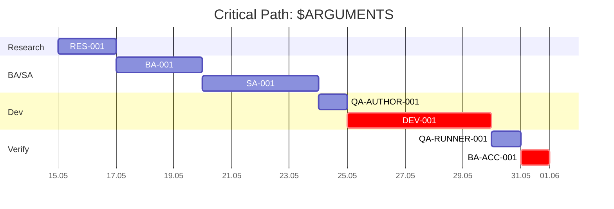

# /pipelines/critical-path <epic>

Анализ зависимостей задач эпика и построение критического пути (mermaid Gantt).

**Аргументы:** `$ARGUMENTS` — slug эпика. Пример: `user-sessions`.

## Алгоритм

### Шаг 1. Прочитать план эпика

```bash
cat content/00-project/plans/$ARGUMENTS.md
```

Извлеки задачи (RES-XXX / BA-XXX / SA-XXX / DEV-XXX / QA-AUTHOR-XXX / DEV-XXX / QA-RUNNER-XXX / OPS-XXX), их зависимости (явные `depends-on:` или подразумеваемые из канонического flow).

### Шаг 2. Построить DAG

Граф зависимостей:
- Researcher (опц.) → BA
- BA → SA
- SA → QA-author
- QA-author → Dev (TDD-связь)
- Dev → QA-runner
- QA-runner → BA-acceptance
- (опц.) DevOps depends-on Dev (для deploy-задач)
- DevSecOps embedded в Dev (parallel)

Если в плане есть несколько Dev-задач (распараллеленные части фичи) — учитывай явные `depends-on:`.

### Шаг 3. Найти критический путь

Алгоритм:
1. Для каждой задачи оцени duration (если в задаче есть estimate — используй; иначе спроси автора плана)
2. Топологическая сортировка → longest path (DAG critical path)
3. Помеченные задачи на критическом пути — приоритетны

### Шаг 4. Сгенерировать mermaid Gantt

Формат:



Помечай задачи на критическом пути как `:crit` (mermaid встроенный синтаксис).

### Шаг 5. Записать в файл

Артефакт: `content/00-project/critical-path/$ARGUMENTS.md`

Структура:

```markdown
---
properties:
  - name: Тип контента
    value: [Critical Path]
  - name: Статус
    value: [Draft]
---

# Critical Path: $ARGUMENTS

## Summary
- Critical path duration: N дней
- Tasks on critical path: M
- Earliest possible end date: YYYY-MM-DD

## Gantt

(mermaid block из шага 4)

## Critical-path tasks (приоритет)
- DEV-001: ...
- BA-ACC-001: ...

## Non-critical tasks (буфер)
- RES-001: ...
- (другие)

## Зависимости (DAG)

(текстовое описание основных зависимостей)

## Recommendations

- [ ] Приоритизировать критические задачи
- [ ] Если кто-то выпадает из графика — пересчёт критического пути
```

## Anti-scope

- НЕ генерируй critical path без плана эпика (`content/00-project/plans/<epic>.md`)
- НЕ выдумывай duration без consultation с автором плана
- НЕ помечай критическим путём то, что не на longest path (mermaid `:crit` строго на длиннейшей цепи)
