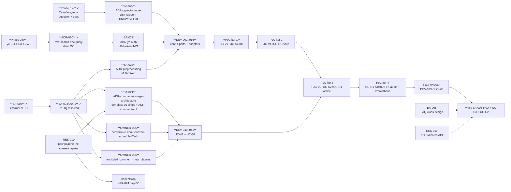

# Roadmap проекта pg_vector_service

## 1. Контекст

`pg_vector_service` — JAR-модуль для Naumen SMP, добавляющий векторизацию SMP-объектов (`knowledgeBase$article`, `issue`, `faq` — для PoC; `problem` — defer to Pilot), семантический поиск похожих и кластерный анализ дублей. Стек, целевые объёмы и red lines зафиксированы в [CLAUDE.md](../../CLAUDE.md). Текущая фаза — **PoC**. Owner / Sponsor — Демьянов (см. [stakeholders](stakeholders.md)). Команда — AI-агенты под управлением PM (Claude Opus): Researcher, BA, SA, Dev, DevOps, **ITSM-аналитик** (7-я роль, добавлена 2026-05-01 после ITSM-ревью UC-S2 в волне BA-002 — см. [roles/itsm-analyst.md](../30-requirements/roles/itsm-analyst.md)); матрица ролей — [AGENTS.md](../../AGENTS.md).

Артефакты, на которых построен этот roadmap (после волн BA-002 / BA-003 / BA-004 / BA-004.1, состояние на 2026-05-02):

- **BA — каталог 9 UC** (см. [README требований](../30-requirements/README.md)):
  - **Векторизация** — [UC-V1 атрибуты](../30-requirements/functional/uc-v1-vectorize-attributes.md), [UC-V2 комментарии](../30-requirements/functional/uc-v2-vectorize-comments.md).
  - **Поиск** — [UC-S1 issue по атрибутам](../30-requirements/functional/uc-s1-find-similar-issues.md), [UC-S2 issue по комментариям](../30-requirements/functional/uc-s2-find-similar-by-comments.md), [UC-S3 FAQ](../30-requirements/functional/uc-s3-find-similar-faq.md), [UC-S4 KB](../30-requirements/functional/uc-s4-find-similar-kb.md).
  - **Кластеризация** — [UC-C1 по описанию](../30-requirements/functional/uc-c1-cluster-by-description.md), [UC-C2 описание+комментарии](../30-requirements/functional/uc-c2-cluster-by-description-comments.md).
  - **NFR** — [nfr-cross-cutting.md](../30-requirements/non-functional/nfr-cross-cutting.md) (NFR-001..062, NFR-070..075), [nfr-preprocessing.md](../30-requirements/non-functional/nfr-preprocessing.md) (Mixed strategy v1.0-mixed).
  - **Роли** — [roles/itsm-analyst.md](../30-requirements/roles/itsm-analyst.md).
  - **Future-задачи внутри BA** — [BA-005 проектирование FAQ-класса](../30-requirements/functional/uc-faq-class-design.md).
- **Historical (Superseded):** UC1, UC2, UC3 — заменены на UC-V*/UC-S*/UC-C* в волне BA-002. Файлы сохранены с пометкой `[SUPERSEDED]` для трассируемости AC.
- **SA** — [принципиальная архитектура](../40-architecture/principal-architecture.md) + 9 ADR в [content/00-project/adr/](adr/) (001 hexagonal, 002 SMP-only → требует апдейта на Hibernate, 003 job-based, 004 vector-schema → требует апдейта под parent_id/chunk_kind, 005 whitelist, 006 composite-text, 007 model-versioning, 008 near-duplicate, 009 embedding-model-decision-frame, 010 embedding-model-selection). Открытые ADR из backlog'а — см. §B [backlog.md](backlog.md): pgvector-index, uc-api-contract, audit-log, job-state, observability, platform-versioning, batch-control, **comment-acl**, **comment-storage-architecture**, **preprocessing**, **yc-auth**.
- **Research** — 8 done + 2 in-flight: [research/sources.md](../10-domain/research/sources.md), новый [itsm-similarity-search-patterns.md](../10-domain/research/itsm-similarity-search-patterns.md), [itsm-knowledge.md](../10-domain/itsm-knowledge.md), плюс будущие RES-010 (распределение комментариев на llm2) и RES-011 (YC FM batch/async API).
- **ITSM-reviews** — [itsm-reviews/ba-002-full-catalog-review.md](../10-domain/itsm-reviews/ba-002-full-catalog-review.md).

Backlog задач этого roadmap'а — [backlog.md](backlog.md).

## 2. Фазы и milestone'ы

| Фаза | Цель | Длительность | GO-критерии («что значит закрыто») | Артефакты |
|------|------|--------------|--------------------------------------|-----------|
| **Phase 0 (pre-flight)** | Снять блокеры до первого `/dev`-таска: подтверждение pgvector + сетевого доступа, рабочий `yc` CLI, метамодель целевых классов, owner-decisions по OQ | 1-2 недели (на стороне owner'а) | 0.4 (Сахабетдинов) ✓; 0.5 (`yc` CLI + сервисный аккаунт) ✓; RES-001 ✓; RES-002/003 closeout ✓; RES-009.1 done; BA-002/003/004/004.1 закрыли ~52 OQ; **2 OQ остаются на Сахабетдинове**: OWNER-005 (системный пользователь scheduledTask), OWNER-006 (список `excluded_comment_meta_classes`) | [research/sources.md](../10-domain/research/sources.md), [research/yc-foundation-models.md](../10-domain/research/yc-foundation-models.md), `.env`, [README требований](../30-requirements/README.md) §«Решения owner'а 2026-05-02» |
| **PoC iter 1 — KB-only baseline (UC-V1 + UC-S4 на `knowledgeBase$article`)** | Первый рабочий JAR на стенде `llm2`: PII-нейтральный класс KB, scheduled-векторизация атрибутов KB (chunked) + UC-S4 parent-document retrieval (GROUP BY parent_id + MIN(dist)). Проверка hexagonal-каркаса, выбранной модели YC FM (`text-search-doc/query`, dim=256), индекса pgvector (disk-resident HNSW/IVFFlat по ADR-pgvector-index), preprocessing-pipeline `v1.0-mixed` для KB.content (markdown). Прогон offline-eval | ~2 недели Dev (после Phase 0) | UC-V1 AC-001..016 на 1k+ KB-статьях; UC-S4 AC parent-document retrieval (BR-005 в UC-S4); **Recall@10 ≥ 0.70** на ground truth `kb-section`-ассоциаций (цель 0.80 после tuning); **p95 ≤ 500 ms** end-to-end (NFR-011); rate-limiter 40 RPS YC FM не превышен (NFR-021); preprocessing `algorithm_version='v1.0-mixed'` инвариант детерминированности (NFR-073); smoke-report на `llm2` зелёный | `src/`, [smoke-reports/](../70-operations/), отчёт offline-eval iter 1 (DEV-033 черновой) |
| **PoC iter 2 — issue (attribute-only baseline, UC-V1 + UC-S1)** | Подключить `issue` с whitelist'ом low+medium PII (sign-off получен в OQ-V1-4 BA-004). UC-V1 на composite_extended (`subject`, `description`, `decisionReport`, `feedback`); UC-S1 — composite issue search (object→object и free-text). Без UC-V2/UC-S2/UC-C* пока. Cross-class similarity `issue ↔ kb-article` — выборочно | ~1.5 недели | UC-V1 AC PII-инвариант (атрибуты вне whitelist не покидают enforcer); UC-S1 AC-001..014; cross-class smoke; smoke-report на `llm2`; whitelist `issue` v2 sign-off в whitelist-конфиге (commit) | smoke-report iter 2, `whitelist-config v2`, отчёт offline-eval iter 2 |
| **PoC iter 3 — comments + UC-V2 + UC-S2 + UC-C1 online** | Векторизовать `comment.text` (UC-V2), запустить UC-S2 (поиск похожих заявок по комментариям, max-similarity aggregation, oversample 5×, без pre-filter по comment_kind в PoC — OQ-S2-5/ITSM-3), активировать UC-C1 online cosine-threshold подсказку дублей (двойной порог Дубль 0.92 / Похожая 0.85, оба уровня — OQ-C1-6); подключить SMP-event trigger для async delete/edit comment (NFR-074, OQ-COMMENT-DELETE/EDIT) | ~2 недели | UC-V2 AC: cap=50 last comments by `creationDate DESC` (NFR-074), исключение `excluded_comment_meta_classes` (NFR-075, после OWNER-006); UC-S2 NFR-072 p95 ≤ 1 000 ms, ACL-наследование через parent_id (NFR-070); UC-C1 online silent-skip при timeout (OQ-C1-5), latency p95 ≤ 2 с; **precision дублей ≥ 0.80** на ground truth `issue.duplicates`/`duplicatesRL` (`issue` — НЕ `serviceCall`); SMP-event trigger проигран (delete/edit comment → async vector remove) | smoke-report iter 3, отчёт offline-eval iter 3 (DEV-033 + DEV-034 черновые) |
| **PoC iter 4 — UC-C1 batch (API only) + audit-log + Prometheus** | Запустить еженедельную джобу `clusters_audit(period)` — **только API**, формат отчёта вынесен **out of scope модуля** (caller's responsibility, пример: SD AI Assistant; OQ-C1-3 / OQ-ITSM-2). Подключить аудит-лог YC FM в `logger.info` (OQ-7, NFR-003); Prometheus-endpoint метрик через Micrometer (NFR-050, OQ-3); алерт по дневному бюджету 1 000 ₽/сутки (NFR-061, OQ-V1-1) | ~1 неделя | UC-C1 batch AC: API `clusters_audit(period)` возвращает группы Дубль/Похожая за окно 90 дней (OQ-C1-2); группы покрытые `issue.duplicates` помечены (KnownGroupMarker); НЕТ автомёрджа; `embedding_model_id`+`whitelist_version`+`algorithm_version`+thresholds в журнале; audit-log пишется по NFR-003 (имена атрибутов, не значения); Prometheus-метрики throughput/RPS/budget/latency собираются на стенде `llm2`; alert-шторм проигран | smoke-report iter 4, первый `clusters_audit` API-вызов, Grafana-dashboard шаблон |
| **PoC closeout** | Tuning порогов, валидация всех AC и сквозных NFR, decision GO / NO-GO для перехода в MVP. **Калибровка порогов UC-C1 (Дубль/Похожая) — decision-by-evidence в DEV-033** | ~1 неделя | Сводный отчёт по всем UC-V1, UC-S1, UC-S4, UC-V2, UC-S2, UC-C1 + NFR-001..062 + NFR-070..075 + NFR-PRE-*; финальные пороги `Дубль`/`Похожая` зафиксированы в обновлении ADR-008; финальные пороги Recall/MRR/p95 — в обновлении ADR-009/010 после offline-eval; финальный выбор preprocessing-стратегии (Mixed vs Plain) — в ADR-preprocessing после DEV-033 (OQ-PRE-1); решение owner'а GO/NO-GO зафиксировано в `poc-closeout-report.md` | [content/70-operations/poc-closeout-report.md](../70-operations/) |
| **MVP** | Расширения post-PoC: подключение `faq` (после BA-005 + создания класса в SMP) и UC-S3 (FAQ search, threshold 0.75, `question_text` only — OQ-S3-1/2/3); подключение `problem` (defer из PoC, OQ-V1-5 / OQ-PROBLEM-DATA); UC-C2 combined cluster (OQ-CL-3 defer to MVP, weights 50/50 — OQ-CL-1, calibrate post-MVP); PII-mask preprocessing для comment.text (OQ-V2-5, OQ-FUTURE-2); расширение SPI; формализация Major Incident filter в UC-S1 (OQ-ITSM-2 backlog) | TBD после PoC closeout | Все объекты целевых классов одного тенанта векторизованы в пределах согласованного бюджета (≤ 1 000 ₽/сутки); recall/precision не хуже PoC; SPI задокументирован и stable (см. ADR-013 эталона `naumen-smp-mcp`); первый внешний consumer SPI на `llm2` (например, SD AI Assistant дёргает `clusters_audit` и формирует отчёт) | `content/40-architecture/spi-contract.md` (новый), новые ADR при изменении модели/индекса, FAQ-класс в SMP |
| **Pilot** | Подключение первого внешнего клиента / отдельного стенда (не `llm2`); ввод multi-tenant (если требуется по результатам наблюдений MVP); on-call процедуры; Production-throughput target (полный пересчёт ≤ 6 ч в ночное окно при медиане 100k–300k — OQ-2 NFR) | TBD | Pilot-стенд развёрнут (gate Сазонова); миграционный runbook апробирован; runbook on-call написан и проиграны учения; full-rescan укладывается в 6-часовое окно при 40 RPS | `content/70-operations/runbooks/`, новый ADR multi-tenancy (если нужен) |
| **Production** | Промышленный rollout, мониторинг, on-call, SLA на основе фактических замеров PoC + Pilot | TBD | uptime ≥ 99.5%; алерт по дневному бюджету YC FM (NFR-061) проигран; runbook миграции при смене embedding-модели опробован вживую (NFR-030, ADR-007); 4-eyes review на правки whitelist; unit economics закрыта (OQ-FUTURE-1) | оперэксплуатационный пакет |

**Лимит итераций PoC:** 4 итерации × 1.5-2 недели + closeout = **7-10 недель Dev** после закрытия Phase 0. Это первая оценка; уточняется после первого smoke на `llm2`.

## 3. Critical path

Зависимости от старта проекта до конца PoC. Жирным — задачи на критическом пути (если они опаздывают, опаздывает всё).

Главные блокеры:
- **Phase 0.4** ✓ закрыт (pgvector 0.8.1 на `llm2`, схема `public`, single-tenant; сетевой доступ к YC FM подтверждён).
- **Phase 0.5** ✓ закрыт (`yc` CLI, SA `pg-vector-poc`, IAM JWT-flow вместо Api-Key — OQ-10).
- **OWNER-005** (системный пользователь scheduledTask на llm2 — OQ-V1-6 / OQ-9 NFR) — внешний блокер на PoC iter 1 (без него джоба не сможет читать PII-атрибуты под правильным контекстом).
- **OWNER-006** (точный список `excluded_comment_meta_classes` через `metamodel_export_class comment` или запрос Сахабетдинову — OQ-V2-2) — блокер для PoC iter 3 (UC-V2 без него реализуем, но NFR-075 и UC-S2 Variant B неполны).
- **SA-021** (per-class vs single table для comment-векторов) — блокер DEV-VectorStoreHibernateAdapter перед UC-V2 (PoC iter 3).
- **SA-022 / ADR-yc-auth** — блокер DEV-021 (`IamTokenCache`) и `YcEmbeddingProviderAdapter` real-mode.
- **SA-023 / ADR-preprocessing** — блокер DEV-010 (`CompositeTextComposer`) и preprocessing-pipeline в core/.

До закрытия SA-021/022/023 разрешено двигать DEV-001..006 (core / ports) на mock `EmbeddingProvider` (DEV-019) — это решение принято в [ADR-009](adr/009-embedding-model-decision-frame.md).

## 4. Известные блокеры (Phase 0 pre-flight + новые)

| ID | Что | Ответственный | Блокирует | Срок / Статус |
|----|-----|---------------|-----------|---------------|
| **0.4** | ✅ Закрыт 2026-05-01. pgvector 0.8.1 на `llm2`, схема `public`, single-tenant, сетевой доступ к YC FM подтверждены. DDL — через bootstrap JAR'а (без отдельного окна работ) | Демьянов / Сахабетдинов | — | done |
| **0.5** | ✅ Закрыт. SA `pg-vector-poc`, API-Key + IAM JWT-flow, smoke-curl зелёный | Демьянов | — | done |
| **0.6 / RES-001** | ✅ Live-выгрузка метамодели `issue` / `knowledgeBase` / `problem` со стенда `llm2` через MCP. См. [smp-metamodel.md](../10-domain/research/smp-metamodel.md) | Researcher | — | done |
| **OWNER-003** (single vs multi-tenant) | ✅ Закрыт 2026-05-01. Решение: **single-схема per стенд** (один тенант на инстанс БД) | Демьянов | — | done |
| **OWNER-004** (auth) | ✅ Закрыт 2026-05-01. Решение: **IAM-token через JWT** (не статический Api-Key). Требует ADR-yc-auth (SA-022) | Демьянов | — | done |
| **RES-002 / RES-003** | ✅ Закрыты 2026-05-01. Embedding 0,0101 ₽ / 1k юнитов; медиана 100k ≈ 200 ₽; верх 10M ≈ 50 500 ₽; LLM-валидация UC3 — out of scope PoC (только embeddings, OQ-V1-1 budget = 1 000 ₽/сутки) | Демьянов / Researcher | — | done |
| **RES-009.1 / RES-009.2** | ✅ Закрыты 2026-05-01: domain & data analysis на корпусе llm2 + сравнение стратегий A-E + рекомендация D (hybrid) | Researcher | — | done |
| **BA-002 / BA-003** | ✅ Закрыты 2026-05-01. Каталог расширен с 3 UC до 9 UC + ITSM-mini-review + 7-я роль ITSM-аналитик | BA + ITSM | — | done |
| **BA-004 / BA-004.1** | ✅ Закрыты 2026-05-02. ~52 owner-decisions по OQ зафиксированы в UC/NFR-файлах | Demянов / BA | — | done |
| **OWNER-005** ⚠️ | Открыт. **Системный пользователь для scheduledTask на стенде llm2** + права на чтение whitelist-атрибутов (low+medium PII по issue/KB). Источник: OQ-V1-6, OQ-9 NFR. Требуется конкретный пресет (логин / FQN / роль) | Сахабетдинов / Киселёва | DEV-023, DEVOPS-002 (UC-V1 scheduledTask), PoC iter 1 GO | **в работе (after PM-008 ping)** |
| **OWNER-006** ⚠️ | Открыт. **Список `excluded_comment_meta_classes`** на стенде llm2 (системные / аудитные подклассы `comment`). Источник: OQ-V2-2, NFR-075. Способ: `metamodel_export_class comment` через MCP `naumen-smp-dev-admin` или прямой запрос Сахабетдинову | Сахабетдинов / SA | DEV-040 (UC-V2 фильтрация), UC-S2 Variant B, PoC iter 3 GO | **в работе (after PM-008 ping)** |

## 5. Ритмика и контрольные точки

- **После каждой Dev-итерации** — smoke на стенде `llm2` через `smps`. Формат отчёта — по образцу эталона `Devel/naumen-smp-mcp/content/70-operations/smoke-reports/2026-04-23-llm2-m33.md`. Артефакт пишет DevOps в `content/70-operations/smoke-reports/<YYYY-MM-DD>-llm2-iter<N>.md` сразу по итогам smoke.
- **`/pm-review` всех содержательных артефактов** перед merge `private → public`: проверка обязательных properties, согласованности JTBD/AC/NFR, отсутствия секретов / PII в текстах. См. [AGENTS.md](../../AGENTS.md).
- **Еженедельный roadmap-snapshot** (PM): обновление колонки «Статус» в этом файле + апдейт backlog'а. Цель — иметь один источник правды о состоянии проекта.
- **PoC closeout** — единый отчёт `content/70-operations/poc-closeout-report.md` с итоговыми метриками (Recall@10, MRR@10 — UC-S1/S4; precision@T — UC-C1; p95 поиска — UC-S1/S2/S4; расход YC FM в ₽; AC-чеклист по всем UC-V/S/C + NFR). На его основе owner принимает решение GO / NO-GO в MVP.
- **PII-gate'ы** — отдельные контрольные точки перед каждым подключением нового класса в whitelist: PoC iter 1 (KB — PII-нейтральный), PoC iter 2 (`issue` low+medium PII — sign-off получен в OQ-V1-4), MVP-вход (`problem`, `comment.text` PII-mask — OQ-V2-5, FAQ — после BA-005). Sign-off owner'а фиксируется в whitelist-конфиге (см. [ADR-005](adr/005-whitelist-pii-default-deny.md)).
- **Ритм ADR-сессий** — открытые ADR (pgvector-index, comment-acl, comment-storage-architecture, preprocessing, yc-auth, observability, batch-control и др.) пишутся в параллели с Dev-итерациями, не блокируют первый прототип. Критический путь — ADR-002 (апдейт), ADR-004 (апдейт под parent_id/chunk_kind), pgvector-index, yc-auth, preprocessing.
- **ITSM-консультации** — на любом этапе по триггерам ITSM-терминологии (см. [roles/itsm-analyst.md](../30-requirements/roles/itsm-analyst.md) §«Триггеры вызова»). Каталог `content/10-domain/itsm-reviews/` для mini-review'ев.

## 6. Open questions

> Реестр после волн BA-002 / BA-003 / BA-004 / BA-004.1. Полный список с локацией решений — в [README требований](../30-requirements/README.md) §«Решения owner'а 2026-05-02».

| Категория | OQ | Заметка | Локация решения |
|-----------|-----|---------|------------------|
| **Resolved (PoC iter 1+)** | OQ-UC1-1 / OQ-3 NFR (single vs multi-tenant) | ✅ single-схема per стенд | OWNER-003 |
| **Resolved (PoC iter 1+)** | OQ-10 NFR (auth) | ✅ IAM-token через JWT | NFR-005, ADR-yc-auth (SA-022) |
| **Resolved (PoC iter 1+)** | OQ-3 NFR (observability stack) | ✅ Prometheus + Grafana через Micrometer | NFR-050, ADR-observability (SA-006) |
| **Resolved (PoC iter 4)** | OQ-C1-3 / OQ-ITSM-2 (формат отчёта batch-аудита) | ✅ **Out of scope модуля** — модуль = API `clusters_audit(period)`; формирование отчёта — caller's responsibility (пример: SD AI Assistant) | UC-C1 |
| **Resolved (PoC iter 3)** | OQ-V1-1 / OQ-6 NFR (бюджет YC FM) | ✅ 1 000 ₽/сутки для PoC; alert при превышении | NFR-061, OQ-FUTURE-1 |
| **Resolved (PoC iter 3)** | OQ-ITSM-3 / OQ-S2-5 (UC-S2 pre-filter) | ✅ В PoC — без pre-filter по comment_kind. Future фича MVP+ | UC-S2 |
| **Resolved (PoC iter 4)** | OQ-V1-6 / OQ-9 NFR (исполнитель scheduledTask) | ✅ Системный пользователь (нужен пресет от Сахабетдинова — OWNER-005) | NFR-001/002, BA-004 |
| **Decision-by-evidence (closeout)** | OQ-C1-1 (пороги Дубль/Похожая) | Defaults Дубль=0.92, Похожая=0.85; калибровка через DEV-033 после offline-eval | UC-C1 |
| **Decision-by-evidence (post-MVP)** | OQ-CL-1 (веса w1/w2 в UC-C2) | Default 50/50; калибровка post-MVP offline-eval | UC-C2 |
| **Decision-by-evidence (closeout)** | OQ-PRE-1 (preprocessing strategy) | Default `v1.0-mixed` (plain для issue/comment, markdown для KB); после offline-eval — фикс в ADR-preprocessing (SA-023) | nfr-preprocessing.md |
| **External blocker (PoC iter 1)** | OQ-V1-6 / OWNER-005 | Системный пользователь scheduledTask — Сахабетдинов | См. §4 |
| **External blocker (PoC iter 3)** | OQ-V2-2 / OWNER-006 | Точный список `excluded_comment_meta_classes` — Сахабетдинов / MCP `metamodel_export_class comment` | См. §4 |
| **In Research (PoC / MVP)** | OQ-5 NFR (YC FM batch/async API) | Передан в **RES-011** (новая задача в backlog'е) — может ускорить bulk-init MVP/Pilot | Researcher |
| **Task-spawned (MVP enrolment)** | BA-005 (FAQ-класс) | Owner-confirmed: вероятный Вариант A `faq$question` — детализация JTBD/AC/atributes scheme + sync с Сахабетдиновым | uc-faq-class-design.md |
| **Task-spawned (PoC iter 3)** | SA-021 (per-class partitioning vs single table для comment-векторов) | Архитектурный анализ перед DEV-040/041 | См. backlog §B |
| **Task-spawned (PoC iter 3)** | RES-010 (распределение числа комментариев на issue/problem) | Пересмотр default `comment_cap=50` (NFR-074) после анализа | См. backlog §A |
| **Future (MVP+)** | OQ-FUTURE-1 (unit economics) | Расчёт стоимости на тенант, точки окупаемости | Owner / PM |
| **Future (MVP+)** | OQ-FUTURE-2 / OQ-V2-5 (URL/PII-mask в preprocessing для comment.text) | PoC: URL остаются; mask откладывается на MVP | BA + SA (MVP фаза) |
| **Future (MVP)** | OQ-ITSM-2 (Major Incident filter в UC-S1) | Не делаем в PoC, в backlog MVP | UC-S1 |

## 7. Связанные артефакты

- [Стейкхолдеры](stakeholders.md)
- [Backlog](backlog.md)
- **BA — функциональные UC:**
  - [UC-V1 (vectorize attributes)](../30-requirements/functional/uc-v1-vectorize-attributes.md)
  - [UC-V2 (vectorize comments)](../30-requirements/functional/uc-v2-vectorize-comments.md)
  - [UC-S1 (similar issues by attributes)](../30-requirements/functional/uc-s1-find-similar-issues.md)
  - [UC-S2 (similar issues by comments)](../30-requirements/functional/uc-s2-find-similar-by-comments.md)
  - [UC-S3 (similar FAQ)](../30-requirements/functional/uc-s3-find-similar-faq.md)
  - [UC-S4 (similar KB)](../30-requirements/functional/uc-s4-find-similar-kb.md)
  - [UC-C1 (cluster by description)](../30-requirements/functional/uc-c1-cluster-by-description.md)
  - [UC-C2 (cluster by description+comments)](../30-requirements/functional/uc-c2-cluster-by-description-comments.md)
  - [BA-005 — FAQ-class design](../30-requirements/functional/uc-faq-class-design.md)
- **BA — нефункциональные:**
  - [NFR cross-cutting](../30-requirements/non-functional/nfr-cross-cutting.md)
  - [NFR preprocessing (Mixed strategy v1.0-mixed)](../30-requirements/non-functional/nfr-preprocessing.md)
- **Роли:** [ITSM-аналитик](../30-requirements/roles/itsm-analyst.md)
- **Historical (Superseded в волне BA-002, сохранены для трассируемости AC):**
  - [SUPERSEDED] `../30-requirements/functional/uc1-scheduled-vectorization.md` → UC-V1 + UC-V2
  - [SUPERSEDED] `../30-requirements/functional/uc2-similarity-search.md` → UC-S1 + UC-S2 + UC-S3 + UC-S4
  - [SUPERSEDED] `../30-requirements/functional/uc3-duplicate-detection.md` → UC-C1 + UC-C2
- **SA:** [Принципиальная архитектура](../40-architecture/principal-architecture.md), [adr/](adr/) (001-010 приняты; новые ADR из backlog'а — pgvector-index, uc-api-contract, audit-log, job-state, observability, platform-versioning, batch-control, comment-acl, comment-storage-architecture, preprocessing, yc-auth)
- **Research:**
  - [sources](../10-domain/research/sources.md)
  - [SMP metamodel](../10-domain/research/smp-metamodel.md)
  - [YC Foundation Models](../10-domain/research/yc-foundation-models.md), [yc-pricing.md](../10-domain/research/yc-pricing.md)
  - [pgvector indexes](../10-domain/research/pgvector-indexes.md)
  - [similarity evaluation](../10-domain/research/similarity-eval.md)
  - [clustering algos](../10-domain/research/clustering-algos.md)
  - [SMP scheduled jobs](../10-domain/research/smp-scheduled-jobs.md)
  - [reference project notes](../10-domain/research/reference-project-notes.md)
  - [vector-storage-domain (RES-009.1)](../10-domain/research/vector-storage-domain.md)
  - [vector-storage-strategies (RES-009.2)](../10-domain/research/vector-storage-strategies.md)
  - **NEW** [itsm-similarity-search-patterns](../10-domain/research/itsm-similarity-search-patterns.md)
- **Domain knowledge:** [itsm-knowledge.md](../10-domain/itsm-knowledge.md), [glossary.md](../10-domain/glossary.md)
- **ITSM-reviews:** [ba-002-full-catalog-review](../10-domain/itsm-reviews/ba-002-full-catalog-review.md)

Внешние ссылки (вне Gramax-каталога): эталонный проект `/Users/mdemyanov/Devel/naumen-smp-mcp` (паттерн hexagonal + smoke-report формат); pgvector https://github.com/pgvector/pgvector.
