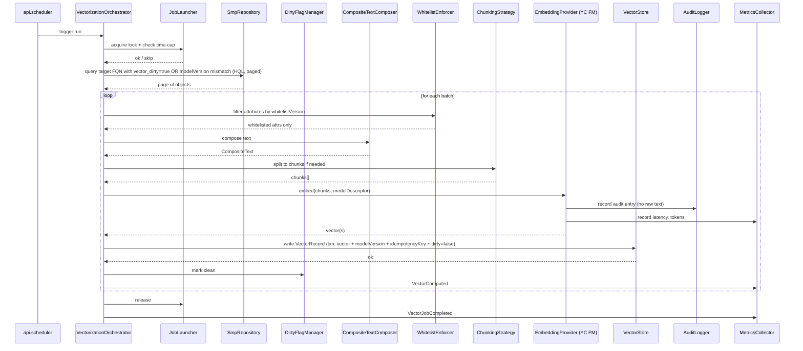
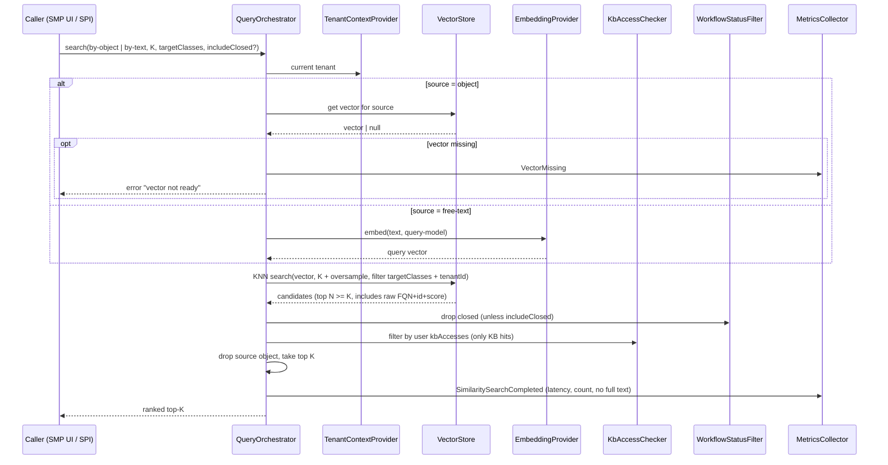

# Принципиальная архитектура pg_vector_service

## 1. Контекст

`pg_vector_service` — JAR-модуль для Naumen SMP, добавляющий три возможности на единой векторной инфраструктуре:

- **UC1** — фоновая векторизация SMP-объектов джобой по расписанию (`content/30-requirements/functional/uc1-scheduled-vectorization.md`).
- **UC2** — top-K семантический поиск похожих объектов (`content/30-requirements/functional/uc2-similarity-search.md`).
- **UC3** — обнаружение дублей: online-подсказка при регистрации заявки + batch-аудит (`content/30-requirements/functional/uc3-duplicate-detection.md`).

Сквозные NFR (PII, наблюдаемость, версионирование, идемпотентность, доступ к БД только через SMP API) — `content/30-requirements/non-functional/nfr-cross-cutting.md`.

Архитектура одного модуля закрывает все три use case'а на общей модели данных и общих outbound-портах. Различия — в inbound-портах и в составе компонентов `core/`. Стек, целевые объёмы и red lines — в `CLAUDE.md`. Эталон hexagonal layout — `/Users/mdemyanov/Devel/naumen-smp-mcp` (см. ADR-001 эталона).

Документ определяет: bounded contexts, hexagonal layout, перечень компонентов и их зон ответственности, поток данных по каждому UC, логическую модель данных, точки интеграции, mapping NFR на архитектурные элементы и список ADR, которые ещё предстоит принять. Реализационные детали (DDL, конкретный SDK YC, размер пула, таймауты) — задача Dev и DevOps на основе ADR.

## 2. Bounded contexts

Модуль — единый bounded module, но внутри `core/` организован по трём смежным контекстам, разделённым по доменному языку и режиму использования. Все три контекста разделяют общую модель «вектор объекта» (см. §6) и общий набор outbound-портов (§3, §7).

### 2.1. Vectorization

Производит векторное представление SMP-объекта. Источник данных — SMP API; sink — векторное хранилище (pgvector через SMP API) и аудит-лог.

- **Aggregate**: `VectorRecord` (один на пару `objectId × modelVersion`).
- **Domain entities**: `VectorizationJobRun`, `EmbeddingPayload`, `CompositeText`, `Whitelist`.
- **Domain events**: `VectorJobStarted`, `VectorJobBatchCompleted`, `VectorComputed`, `VectorComputeFailed`, `VectorJobCompleted`, `VectorJobAborted`, `EmbeddingModelVersionChanged`.
- **Invariants**: запись в pgvector невалидна без `modelVersion` и `whitelistVersion` (BR-cross-2, NFR-030); ни один атрибут вне whitelist не покидает контекст в адаптер YC FM (NFR-001/041).

### 2.2. SimilaritySearch

Принимает запрос «найди похожих» (по объекту-источнику или по free-text), возвращает упорядоченный top-K. Read-only по отношению к SMP.

- **Aggregate**: `SearchQuery` (запрос с параметрами и user-context'ом для ACL).
- **Domain entities**: `SearchResult`, `RankedHit`, `WorkflowFilter`, `KbAccessFilter`.
- **Domain events**: `SimilaritySearchRequested`, `SimilaritySearchCompleted`, `SimilaritySearchFailed`, `VectorMissing`.
- **Invariants**: объект-источник не присутствует в выдаче (BR-003 UC2); ни одна KB-статья без доступа `kbAccesses` не возвращается (BR-002 UC2); тенант-границы не пересекаются (NFR-003 UC2).

### 2.3. DuplicateDetection

Закрывает два режима — online на форме регистрации `issue` и batch-аудит. Использует те же ports что и SimilaritySearch, плюс отдельную логику группировки и threshold-классификации.

- **Aggregate**: `DuplicateCandidateSet` (online), `DuplicateAuditReport` (batch).
- **Domain entities**: `Candidate`, `ConfidenceLabel` (`Дубль` / `Похожая`), `DuplicateGroup`, `KnownGroupMarker`.
- **Domain events**: `SimilarIssuesRequested`, `SimilarIssuesSkipped`, `DuplicateAuditRunStarted`, `DuplicateAuditRunCompleted`, `DuplicateAuditRunFailed`.
- **Invariants**: модуль не пишет в `issue.duplicates` / `duplicatesRL` (BR-001 UC3); в выдачу не попадают объекты без ACL пользователя (BR-003 UC3); за пределы whitelist'а ничего не уходит (BR-006 UC3).

### 2.4. Связи между контекстами

- Vectorization — поставщик; SimilaritySearch и DuplicateDetection — потребители общей таблицы векторов (через одни и те же outbound-порты `VectorStore`).
- DuplicateDetection реиспользует `core/search/` для KNN-поиска, но добавляет threshold-классификацию и группировку.
- Контексты не общаются между собой синхронно: связь идёт через состояние векторного хранилища и через доменные события (для метрик / алертов).

## 3. Hexagonal layout

Раскладка `src/main/groovy/ru/naumen/modules/pgvector/` повторяет эталон `naumen-smp-mcp` (ADR-001 эталона), адаптированно под вектор-домен. Эталонный MCP JSON-RPC handshake / session / transport — out of scope (см. `reference-project-notes.md` §8).

```
src/main/groovy/ru/naumen/modules/pgvector/
├── core/
│   ├── vectorization/
│   │   ├── CompositeTextComposer        — собирает текст из whitelist
│   │   ├── WhitelistEnforcer             — гард PII-инварианта
│   │   ├── EmbeddingPayloadBuilder       — формирует payload для YC FM (без сырых текстов вне whitelist)
│   │   ├── DirtyFlagPolicy               — правила выставления/снятия `vector_dirty`
│   │   ├── IdempotencyKey                — хеш(text, modelVersion, whitelistVersion)
│   │   ├── ChunkingStrategy              — окно + overlap (детали в ADR-006)
│   │   └── ChunkAggregator               — стратегия склейки эмбеддингов чанков (ADR-006)
│   ├── search/
│   │   ├── QueryOrchestrator             — план запроса, выбор индекса/метрики
│   │   ├── TopKRanker                    — ранжирование результата с учётом фильтров
│   │   ├── WorkflowStatusFilter          — отсечь финальные «нерабочие» статусы
│   │   └── SourceExclusion               — выкинуть объект-источник из выдачи
│   ├── duplicates/
│   │   ├── ThresholdClassifier           — `Дубль` / `Похожая` / отсечь
│   │   ├── DuplicateGroupComposer        — батч-группировка пар (cosine-threshold baseline; HDBSCAN — резерв через ADR-008)
│   │   └── KnownGroupMarker              — пометка групп, уже связанных через `issue.duplicates`
│   └── model/
│       ├── EmbeddingModelDescriptor      — id модели + dim + версия + tokenizer-policy
│       ├── ModelVersioningPolicy         — правила перевода векторов в `stale`
│       └── WhitelistVersion              — версионирование per-class whitelist
├── ports/
│   ├── inbound/
│   │   ├── VectorizationJob              — точка входа для scheduler'а
│   │   ├── SimilaritySearchService       — top-K по объекту/тексту (UC2)
│   │   ├── DuplicateDetectionService     — online-подсказка (UC3-А)
│   │   └── DuplicateAuditJob             — batch-аудит (UC3-Б)
│   └── outbound/
│       ├── SmpRepository                 — read SMP-объектов по FQN (HQL `api.db.query`)
│       ├── VectorStore                   — read/write/search векторов (через SMP API)
│       ├── EmbeddingProvider             — клиент YC Foundation Models
│       ├── AuditLogger                   — структурированный аудит вызовов YC FM (NFR-003)
│       ├── MetricsCollector              — счётчики и латентности
│       ├── KbAccessChecker               — проверка `kbAccesses` под пользователем
│       ├── TenantContextProvider         — текущий тенант для изоляции
│       └── ClockProvider                 — детерминированное время (тестируемость)
├── adapters/
│   ├── smp/                              — единственное место с @InjectApi
│   │   ├── SmpRepositoryAdapter          — HQL read для целевых FQN
│   │   ├── VectorStoreSmpAdapter         — write/read pgvector через SMP API
│   │   ├── KbAccessSmpAdapter            — проверка `kbAccesses` оператора
│   │   ├── AuditLogSmpAdapter            — sink аудит-лога (FQN-объект SMP — кандидат, ADR-007 audit-log)
│   │   ├── DirtyTrackingAdapter          — реализация по выбранной в ADR-005 стратегии (атрибут / staging-таблица / mtime)
│   │   └── mappers/                      — ACL: SMP JSON / domain DTO
│   ├── yc/
│   │   ├── YcEmbeddingProviderAdapter    — REST-клиент к YC FM
│   │   ├── IamTokenCache                 — кеш IAM-токена ≤ 11 ч (NFR-005)
│   │   └── RateLimitedHttpClient         — экспоненциальный backoff на 429/5xx (NFR-021)
│   └── scheduler/
│       └── ApiSchedulerEntry             — Groovy-обвязка `api.scheduler` для VectorizationJob и DuplicateAuditJob
├── config/
│   └── VectorModuleBootstrap             — DI-сборка, загрузка whitelist-конфига
└── spi/                                  — публичный контракт модуля для других SMP-модулей (минимально для PoC)
    ├── SimilaritySearchSpi               — внешним модулям SMP — поиск похожих
    └── VectorEventListener               — подписка на доменные события (опционально, MVP)
```

**Архитектурные правила**:

- `core/` не импортирует `ru.naumen.*` (кроме `core.*` и `ports.*`). Доменное ядро тестируется без SMP-runtime.
- `@InjectApi` — только в `adapters/smp/` и `config/` (NFR-044).
- HQL — только параметризованный, через `setParameter` (NFR-043).
- Нарушение boundary ловится архитектурным тестом `CoreBoundarySpec` (см. §10).
- SPI минимизирован для PoC: один интерфейс на UC2-поиск + опциональная подписка на события. Расширение — в MVP по запросу, по контракту ADR-013 эталона (SemVer).

## 4. Компоненты

| Компонент | Bounded context | Ответственность | Входы | Выходы | Зависимости |
|-----------|-----------------|-----------------|-------|--------|-------------|
| `ApiSchedulerEntry` | Vectorization, DuplicateDetection-Б | Triggered `api.scheduler`, диспетчеризует на `VectorizationJob` или `DuplicateAuditJob` | Расписание, конфиг класса/whitelist | Вызов inbound-порта | `api.scheduler` |
| `VectorizationOrchestrator` (impl `VectorizationJob`) | Vectorization | Управляет батчами, lock, transaction-границы, прогресс | Список dirty FQN+id | `VectorJobBatchCompleted`, события на объект | `SmpRepository`, `WhitelistEnforcer`, `CompositeTextComposer`, `EmbeddingProvider`, `VectorStore`, `AuditLogger`, `MetricsCollector`, `DirtyFlagPolicy` |
| `WhitelistEnforcer` | Vectorization | Гард PII-инварианта: фильтрует исходящие атрибуты по версии whitelist | Объект SMP DTO | Whitelisted-attributes set | `WhitelistVersion` |
| `CompositeTextComposer` | Vectorization | Конкатенация атрибутов в фиксированном порядке + нормализация richtext (HTML→plain — детали в ADR-006) | Whitelisted-attributes | `CompositeText` (строка + длина в символах/токенах rough) | — |
| `EmbeddingPayloadBuilder` | Vectorization | Формирование payload для YC FM (только whitelisted-текст), отсечение PII окончательно перед отправкой | `CompositeText`, `EmbeddingModelDescriptor` | Payload (text + model URI) | — |
| `ChunkingStrategy` + `ChunkAggregator` | Vectorization | Разбить длинный текст на чанки, склеить эмбеддинги в один вектор / решить хранить несколько | `CompositeText`, лимит модели | Список чанков → один вектор | ADR-006 |
| `IdempotencyKey` | Vectorization | Хеш(`compositeText`, `modelVersion`, `whitelistVersion`); сравнивается с записью в pgvector для решения «нужно ли пересчитывать» | Composite text + версии | hash | NFR-020 |
| `EmbeddingClient` (impl `EmbeddingProvider`) | shared outbound | Унифицированный вызов YC FM с retry, backoff, IAM-токеном, метриками расхода | Payload | Vector | `IamTokenCache`, `RateLimitedHttpClient`, `AuditLogger`, `MetricsCollector` |
| `VectorStoreWriter` (часть `VectorStore`) | Vectorization | Атомарная запись `(VectorRecord, modelVersion, whitelistVersion, idempotencyKey, dirty=false)` через SMP API | `VectorRecord` | OK / fail | `VectorStoreSmpAdapter` |
| `VectorStoreReader` (часть `VectorStore`) | Search, DuplicateDetection | Чтение векторов и top-K KNN-запрос через SMP API | Query vector + filter | Список `RankedHit` | `VectorStoreSmpAdapter` |
| `QueryOrchestrator` (impl `SimilaritySearchService`) | Search | План запроса: формирование query-вектора (по объекту / free-text), вызов `VectorStore.search`, применение фильтров, ранжирование | Запрос UC2 | `SearchResult` | `EmbeddingProvider` (для free-text), `VectorStore`, `KbAccessChecker`, `WorkflowStatusFilter`, `SourceExclusion`, `TenantContextProvider` |
| `DuplicateDetector` (impl `DuplicateDetectionService`) | DuplicateDetection-А | Вычисляет cosine similarity, применяет двойной порог `Дубль`/`Похожая`, исключает self-match, фильтрует по ACL | Источник (новая заявка) | Список кандидатов с лейблом | `EmbeddingProvider` (опц. ad-hoc — решение в ADR-009), `VectorStore`, `ThresholdClassifier`, `KbAccessChecker` |
| `DuplicateAudit` (impl `DuplicateAuditJob`) | DuplicateDetection-Б | Batch-проход по корпусу, группировка пар (cosine-threshold baseline), маркировка «известных групп» через `issue.duplicates`, формирование отчёта | Окно, FQN-список | `DuplicateAuditReport` | `VectorStore`, `DuplicateGroupComposer`, `KnownGroupMarker`, `MetricsCollector` |
| `JobLauncher` | shared | Управляет lock'ом, time-budget cap'ом, восстановлением прогресса прерванной джобы (NFR-022) | Описание джобы | Старт/skip/abort | `api.scheduler` (lock через `getStatus`) |
| `DirtyFlagManager` (impl `DirtyTrackingAdapter`) | Vectorization | Маркирует объекты как «требуют пересчёта» при изменении whitelist-атрибутов; способ — выбор в ADR-005 | Событие изменения объекта SMP / периодическое сравнение | Маркеры `vector_dirty` | SMP API |
| `AuditLogger` (impl `AuditLogSmpAdapter`) | shared outbound | Структурированная запись: timestamp, correlationId, FQN, objectId, имена атрибутов (НЕ значения), длина текста, modelUri, HTTP-status, длительность | Метаданные вызова YC FM | Запись в sink (SMP-объект / лог) | NFR-003, ADR-007 audit-log |
| `MetricsCollector` | shared outbound | Счётчики throughput, success-rate YC FM, частота поиска, p50/p95/p99 латентности, расход токенов | Точки замера | Метрики (стек — открытый вопрос, ADR-012 observability) | NFR-050/060 |

## 5. Поток данных

### 5.1. UC1 — Vectorization job (sequence)



Ключевые моменты:

- Каждый батч обёрнут в `api.tx.call()` (NFR-023). Падение N+1 батча не откатывает уже зафиксированные.
- Запись `VectorRecord` и снятие `vector_dirty` — в одной транзакции (NFR-UC1-004). Промежуточного состояния «вектор сохранён, версии нет» не существует.
- На 429/5xx YC FM — retry с backoff внутри `EmbeddingClient` (NFR-021); при исчерпании retry объект остаётся `vector_dirty=true` и попадает в следующий запуск (FR-012 UC1).
- На deprecated-модель — `EmbeddingClient` бросает специальное исключение, `VectorizationOrchestrator` ловит, абортит джобу, шлёт `VectorJobAborted` (FR-013 UC1).
- Прогресс-маркер (NFR-022): хранится в выбранном по ADR-005 sink (на старте — recovery через `vector_dirty` сам по себе, прогресс не нужен; cap по времени — отдельный механизм).

### 5.2. UC2 — Similarity search (sequence)



Ключевые моменты:

- Вариант «pre-filter по `kbAccesses` в HQL» vs «post-filter с oversample» — Q5 UC2, решение в ADR-014 (kb-access-filter). Архитектура поддерживает оба пути через `KbAccessChecker` (порт): adapter может реализовать pre- или post-filter без изменения core.
- Тенант-изоляция (NFR-003 UC2) — обязательный фильтр в `VectorStore.search`; конкретный механизм (отдельная таблица / discriminator) — ADR-002 vector-storage.
- Метрика расстояния (cosine / IP) — ADR-003 (pgvector-index); core принимает её как параметр через `EmbeddingModelDescriptor`.
- Free-text запросы НЕ логируются полностью (BR-004 UC2, NFR-004): в логе только длина и хеш префикса.

### 5.3. UC3 — Online duplicate hint (sequence)

```mermaid
sequenceDiagram
    participant UI as SMP issue-form
    participant DD as DuplicateDetector
    participant YC as EmbeddingProvider
    participant VS as VectorStore
    participant KB as ACL filter
    participant TH as ThresholdClassifier
    participant MET as MetricsCollector

    UI->>DD: hint(subject, description-draft, op-context)
    Note over DD: timeout watcher (NFR-001 UC3 = 2s)
    alt UC1 уже посчитал вектор для этой заявки
        DD->>VS: get vector by id
    else cold path (ad-hoc, решение ADR-010)
        DD->>YC: embed(composite-text from whitelist)
        YC-->>DD: vector
    end
    DD->>VS: KNN top-K (K=5, FQN=issue, tenantId)
    VS-->>DD: candidates
    DD->>TH: classify by similarity (>=0.92 Дубль; 0.85..0.92 Похожая; <0.85 drop)
    DD->>KB: drop candidates without ACL
    DD->>DD: drop self-match by id
    DD->>MET: SimilarIssuesRequested (latency, count)
    DD-->>UI: top<=5 with labels (only id, FQN, subject, label, score — no description)
    Note over UI,DD: timeout-fallback: silent skip, log SimilarIssuesSkipped
```

Ключевые моменты:

- Decision frame «ad-hoc embedding vs lazy» — ADR-010 (sync-vs-job-embedding-for-uc3). Пока не закрыт — поддерживаем оба пути конфигурацией.
- Silent skip по таймауту (FR-008 UC3) — не ошибка, не висящий спиннер, в лог `SimilarIssuesSkipped` с причиной.
- В ответ — только `subject` и метаданные (NFR-006 UC3, BR-004 UC3); полный текст не покидает SMP-границу.

### 5.4. UC3 — Batch duplicate audit (sequence)

```mermaid
sequenceDiagram
    participant SCH as api.scheduler
    participant DA as DuplicateAudit
    participant VS as VectorStore
    participant DGC as DuplicateGroupComposer
    participant KGM as KnownGroupMarker
    participant SMP as SmpRepository
    participant MET as MetricsCollector

    SCH->>DA: trigger weekly (config window e.g. last 90 days)
    DA->>VS: stream all vectors in window for FQN ∈ {issue, problem}
    VS-->>DA: vectors
    DA->>DGC: pairwise threshold + transitive grouping
    DGC-->>DA: groups[]
    DA->>SMP: load issue.duplicates for groups
    DA->>KGM: mark groups already covered
    KGM-->>DA: annotated groups
    DA->>MET: DuplicateAuditRunCompleted (group-count, pair-count, threshold-set, modelVersion)
    DA->>(report-sink): publish DuplicateAuditReport
    Note over DA: cap window, on overflow: DuplicateAuditRunFailed, no partial report
```

Ключевые моменты:

- Алгоритм: cosine-threshold с группировкой пар как baseline (ADR-008). Резервный путь HDBSCAN+UMAP — отдельный ADR при провале baseline на росте корпуса.
- Стенд `llm2` — где исполняется группировка: либо in-process на стенде (если объёмы PoC позволяют), либо через server-side `pgvector` + транзитивное замыкание; решение в ADR-008.
- Канал доставки отчёта — Q8 UC3, открытый вопрос (KB-статья / шара / ручной просмотр).

## 6. Модель данных

### 6.1. VectorRecord (логическая)

| Поле | Тип | Назначение | Источник правила |
|------|-----|------------|------------------|
| `objectId` | UUID SMP | FK к объекту SMP | FR-010 UC1 |
| `metaClass` | string (FQN) | Дискриминатор класса | UC2-фильтр targetClasses |
| `tenantId` | string (либо `null` при single-tenant) | Тенант-изоляция | NFR-003 UC2, BR-008 UC1, ADR-002 |
| `vector` | float[dim] / `halfvec[dim]` | Эмбеддинг (или несколько при per-chunk хранении — ADR-006) | NFR-013 |
| `modelUri` | string | `emb://<folder>/<model>/<version>` (NFR-030/042) | BR-003/004 UC1, NFR-030 |
| `modelVersion` | string (parsed из `modelUri`) | Денорм для индекса по версии | NFR-030 |
| `whitelistVersion` | string | Версия whitelist'а атрибутов (NFR-032) | NFR-032 |
| `compositeHash` | string (sha256) | Идемпотентность: hash от composite-text + whitelistVersion | NFR-020 |
| `idempotencyKey` | string | Производный от `(objectId, modelVersion, whitelistVersion, compositeHash)` | NFR-020 |
| `vectorizedAt` | timestamp | Когда посчитан | AC-014 UC1 |
| `chunkIndex` | int (опц.) | При per-chunk-хранении (если выбрано в ADR-006) | FR-006 UC1 |
| `dirty` | bool | Маркер «требует пересчёта» (если стратегия dirty-tracking — атрибут, ADR-005) | FR-007 UC1 |

Конкретный DDL (`CREATE TABLE`, имена колонок, тип `vector` vs `halfvec`, индексы) — в ADR-002 (vector-storage-schema) и ADR-003 (pgvector-index). Запись через SMP API (FQN-объект-обёртка / script-метод / иное) — ADR-002.

### 6.2. AuditEntry (логическая)

| Поле | Тип | Назначение |
|------|-----|------------|
| `correlationId` | string | Сквозная трассировка (NFR-051) |
| `timestamp` | timestamp | Время вызова |
| `objectFqn` | string | FQN объекта-источника (если применимо) |
| `objectId` | UUID | id объекта-источника |
| `attributeNames` | string[] | Имена whitelisted-атрибутов (НЕ значения) |
| `compositeLengthChars` | int | Длина композитного текста |
| `compositeLengthTokens` | int (опц.) | Если YC API отдаёт |
| `modelUri` | string | Полный URI модели |
| `httpStatus` | int | Статус ответа YC FM |
| `latencyMs` | int | Длительность вызова |
| `outcome` | enum | `success`/`rate-limited`/`server-error`/`network-error`/`deprecated-model` |

Сырые тексты, сами эмбеддинги — **запрещены** в этой записи (NFR-004). Sink аудит-лога (отдельный FQN SMP / лог-файл / внешний канал) — ADR-007 (audit-log).

### 6.3. JobRun (логическая)

| Поле | Тип | Назначение |
|------|-----|------------|
| `runId` | UUID | Идентификатор запуска |
| `kind` | enum | `vectorization` / `duplicate-audit` |
| `startedAt` / `finishedAt` | timestamp | Окно выполнения |
| `targetFqns` | string[] | Список FQN, обработанных в запуске |
| `whitelistVersion` | string | Версия whitelist'а |
| `modelUri` | string | Версия модели |
| `processedCount` / `skippedCount` / `errorCount` | int | Метрики батча |
| `outcome` | enum | `completed` / `aborted` / `interrupted` / `failed` |
| `abortReason` | string (опт.) | Причина abort'а |

Sink — выбираемый в ADR-005 / ADR-011 (jobs-state). Кандидаты: `subject`-объект `scheduledTask`, отдельный FQN `vectorJobRun` SMP, лог-сценарий.

### 6.4. WhitelistConfig (логическая)

| Поле | Тип | Назначение |
|------|-----|------------|
| `version` | string | Версия конфига |
| `entries[]` | per-class | `{metaClass, attributeName, piiLevel, includedFromVersion}` |

Хранение: либо resource в JAR + версия в `pom.xml`, либо отдельный SMP-объект конфигурации, либо properties-файл в SMP-инстансе. Решение — ADR-004 (config-whitelist).

## 7. Интеграционные точки

| Точка | Протокол | Контракт | Auth | Rate limit | Error handling |
|-------|----------|----------|------|------------|----------------|
| **SMP API — read объектов** | HQL через `api.db.query` | Параметризованные запросы по target FQN, фильтр по `vector_dirty` или сравнению `modelVersion`, paging | Через `@InjectApi` в `adapters/smp/`; контекст пользователя джобы (открытый вопрос OQ-9) | На стороне SMP; нет специального лимита для модуля | Try/catch (Throwable) → log + throw (NFR-052); пустая выдача — нормальный кейс |
| **SMP API — write VectorRecord** | REST `/edit`/`/create` или script-метод модуля | Атомарная запись `(VectorRecord, modelVersion, whitelistVersion)` в одной транзакции с `vector_dirty=false` (NFR-UC1-004) | `@InjectApi` | На стороне SMP | Rollback батча → объект остаётся `dirty=true`, попадает в следующий run |
| **SMP API — search vectors** | Параметризованный HQL с pgvector-операторами через `api.db.query` (write через score-DSL невозможен) или wrapper-script-метод | KNN по cosine/IP/L2, фильтр по metaClass/tenantId, опционально pre-filter `kbAccesses` | Контекст пользователя запроса | На стороне SMP | Ошибка индекса → 500 наружу без stack-trace (NFR-052, AC-14 UC2) |
| **SMP API — `kbAccesses`** | REST или HQL под пользователя | Проверка доступа к разделу/статье | Контекст пользователя UC2-запроса | На стороне SMP | Отрицательный ответ — drop кандидата из выдачи |
| **SMP `api.scheduler`** | Groovy API | Регистрация джобы по `code`, `setTriggerPeriod` / `setTriggerInterval`, lock через `getStatus`, `interruptJob` | Контекст scheduledTask | — | Конфликт-запуск (FR-015 UC1) → log + skip; interrupt (NFR-022) → следующий run возобновляет |
| **YC Foundation Models — embeddings** | HTTPS REST к `*.api.cloud.yandex.net` | `POST /foundationModels/v1/textEmbedding`, `modelUri`, `text`, `Authorization: Bearer <IAM>` или `Authorization: Api-Key <key>` (ADR-006 yc-auth) | IAM-токен с TTL ≤ 11ч (NFR-005); резерв — статический Api-Key (ADR-006) | YC default RPS (OQ-4 NFR-cross-cutting) — без подтверждения; стратегия — RateLimitedHttpClient | 429/5xx/network → exp backoff с jitter, лимит retry (ADR-yc-retry); deprecated-model → fail-fast `VectorJobAborted`; success → метрика `tokens_used` |
| **YC IAM (token exchange)** | HTTPS REST | JWT-flow через `iam.api.cloud.yandex.net` или `yc iam create-token` | Авторизованный ключ (`sa-key.json`) сервисного аккаунта — secret SMP | — | Refresh за 1ч до истечения; 5xx → retry, иначе → перейти в degrade-режим (NFR-061) |

## 8. NFR mapping

> Покрытие сквозных NFR (`nfr-cross-cutting.md`) и UC-специфичных. Каждое требование — где закрывается архитектурой; ссылки на ADR — как номера, тела ADR пишутся в параллельных задачах SA.

| NFR | Закрытие в архитектуре | ADR |
|-----|------------------------|-----|
| NFR-001 (whitelist default-deny) | `WhitelistEnforcer` в `core/vectorization/` — единственный путь к `EmbeddingProvider`; адаптер YC принимает только результат `EmbeddingPayloadBuilder` | ADR-004 (config-whitelist) |
| NFR-002 (PII-категоризация) | `Whitelist.entries[].piiLevel`; в PoC high-PII атрибуты исключены конфигом | ADR-004 |
| NFR-003 (audit YC FM) | `AuditLogger` (порт) + `AuditLogSmpAdapter`; ни одного вызова YC FM без записи аудита (тест) | ADR-007 (audit-log) |
| NFR-004 (no raw text in logs) | `MetricsCollector`/loggers ограничены DTO без полей `value`; `BR-004 UC2` — usecase-level guard | ADR-012 (observability) |
| NFR-005 (IAM rotation) | `IamTokenCache` с TTL; `sa-key.json` — secret SMP | ADR-006 (yc-auth) |
| NFR-006/040 (no JDBC) | Архитектурный тест `CoreBoundarySpec` запрещает `java.sql`/JDBC-зависимости в `core/` и `adapters/yc/`; `VectorStore` всегда — adapter `adapters/smp/` | ADR-001 (hexagonal), ADR-002 (vector-storage) |
| NFR-010 (throughput vectorization) | Параллелизм батчей конфигурируется; `RateLimitedHttpClient` уважает RPS-квоту YC | ADR-003 (pgvector-index), ADR-005 (job-state) |
| NFR-011 (p95 search latency) | Параметры HNSW (`m`, `ef_search`) в ADR-003; `QueryOrchestrator` — без собственных тяжёлых проходов | ADR-003 |
| NFR-012 (memory pgvector) | Выбор `vector` vs `halfvec`; HNSW vs IVFFlat в ADR-003 | ADR-003 |
| NFR-013 (chunking) | `ChunkingStrategy` + `ChunkAggregator` в `core/vectorization/` | ADR-006 (text-chunking-and-aggregation) |
| NFR-020 (idempotence) | `IdempotencyKey` = sha256(composite-text + modelVersion + whitelistVersion); проверка перед вызовом YC FM | ADR-002 (vector-storage) |
| NFR-021 (retry transient) | `RateLimitedHttpClient` в `adapters/yc/` | ADR-006 (yc-auth) + ADR-yc-retry (опц. отдельный) |
| NFR-022 (job recovery) | Прогресс выводится из состояния `vector_dirty` (NFR-020 даёт идемпотентность → safe restart); cap — `JobLauncher` | ADR-005 (job-state) |
| NFR-023 (tx batch) | Батч обёрнут в `api.tx.call()`; запись `VectorRecord` + `dirty=false` в одной транзакции | ADR-005 |
| NFR-030 (model versioning) | `modelUri` + `modelVersion` — обязательные колонки `VectorRecord`; смена модели → `EmbeddingModelVersionChanged` → массовая инвалидация (`stale=true`) → пересчёт через UC1 | ADR-009 (embedding-model), ADR-002 |
| NFR-031 (SemVer) | Эталонная схема (ADR-013 эталона), MAJOR — слом SPI/DDL | ADR-013 (platform-versioning), копия-аналог из эталона |
| NFR-032 (whitelist versioning) | `whitelistVersion` в `VectorRecord`; смена whitelist'а → `stale=true` → пересчёт | ADR-004 |
| NFR-041 (only whitelisted to YC) | См. NFR-001; адаптер YC не имеет прямого доступа к SMP-объекту | ADR-001, ADR-004 |
| NFR-042 (modelUri pinned) | `EmbeddingModelDescriptor` загружается из конфигурации; смена — новый ADR с `supersedes` | ADR-009 |
| NFR-043 (HQL parameterized) | `SmpRepositoryAdapter` использует только `setParameter`; CodeNarc-правило (как в эталоне) | ADR-001 |
| NFR-044 (`@InjectApi` isolation) | Архитектурный тест + раскладка `adapters/smp/` | ADR-001 |
| NFR-050 (metrics) | `MetricsCollector` (порт); реализация — стек открытый вопрос (OQ-3) | ADR-012 (observability) |
| NFR-051 (structured logs) | Все логи модуля — JSON/KV с `correlationId`; точка инициализации `correlationId` — inbound-port | ADR-012 |
| NFR-052 (exception logging) | Try/catch (Throwable) + `logger.error(msg, e) + throw e` обязательно во всех handler-методах модуля; CodeNarc-правило | ADR-001 |
| NFR-060 (YC FM cost metric) | `MetricsCollector.recordEmbedding(tokens, modelUri, fqn, opType)` — суточная агрегация | ADR-012 |
| NFR-061 (daily limit alert) | `EmbeddingClient` проверяет дневной счётчик; превышение → алёрт + degrade (пауза джобы) | ADR-012, ADR-batch-control |
| NFR-062 (one-shot batch limit) | `JobLauncher` запрашивает confirmation от оператора при run > N | ADR-batch-control |
| NFR-UC1-001 (PII filter) | Покрыт NFR-001 + AC-008 (smoke с `description` issue) | ADR-004 |
| NFR-UC1-002 (YC budget) | NFR-060/061; конкретный потолок — open question | ADR-batch-control |
| NFR-UC1-003 (stand impact) | Time-cap `JobLauncher`, batch-size в конфиге | ADR-005 |
| NFR-UC1-004 (atomicity) | NFR-023 + одна транзакция «vector + dirty=false + modelVersion»  | ADR-002, ADR-005 |
| NFR-UC2-001 (latency p95 ≤ 200ms) | HNSW + параметры из ADR-003 | ADR-003 |
| NFR-UC2-002 (recall/MRR) | Offline-eval методология (`similarity-eval.md`); архитектура поддерживает воспроизводимый прогон через одни и те же `EmbeddingProvider`+`VectorStore` | ADR-009 |
| NFR-UC2-003 (tenant isolation) | NFR-003 в адаптере + фильтр в `VectorStore.search` | ADR-002 |
| NFR-UC2-004 (no raw text in response) | Контракт `SearchResult` содержит только id/FQN/score/status (NFR-006 UC3) | ADR-014 (uc-api-contract) |
| NFR-UC3-001 (online ≤ 2s) | `DuplicateDetector` имеет timeout-watcher; на overflow — silent skip | ADR-010 (sync-vs-job-uc3) |
| NFR-UC3-003 (batch ≤ 4ч) | Cap по времени в `DuplicateAudit` + резервный путь HDBSCAN+UMAP при провале baseline | ADR-008 (dup-algorithm) |
| NFR-UC3-004/005 (precision/recall) | Offline-eval, фиксация порогов в ADR-008 | ADR-008 |
| NFR-UC3-006 (PII в выдаче) | Контракт DuplicateDetectionService — только `subject`+метаданные, как в `SearchResult` | ADR-014 |
| NFR-UC3-007 (idempotence batch) | Детерминизм threshold-алгоритма + `random_state` для HDBSCAN при включении | ADR-008 |
| NFR-UC3-008 (audit batch run) | `JobRun.modelUri + thresholds` обязательны | ADR-008, ADR-005 |

## 9. Архитектурные ограничения

> Эти ограничения — формализация red lines из `CLAUDE.md` и `nfr-cross-cutting.md` §5. Нарушение любого пункта — блокер на ревью PM.

1. **SMP-only data access** (NFR-006/040, BR-006 UC1, ADR-002). Прямой JDBC, отдельный connection pool к pgvector, любое подключение в обход SMP API — запрещено. Архитектурный тест: запрет `java.sql.*`, `org.postgresql.*` и аналогов в `core/`, `ports/`, `adapters/yc/`, `adapters/scheduler/`. В `adapters/smp/` — допустимы только SMP API-зависимости.
2. **`core/` не импортирует `ru.naumen.*`** кроме `core.*` и `ports.*` (NFR-044). Архитектурный тест `CoreBoundarySpec`.
3. **`@InjectApi` — только в `adapters/smp/` и `config/`** (NFR-044). Архитектурный тест.
4. **HQL — только параметризованный** (NFR-043). CodeNarc-правило (по образцу эталона).
5. **Whitelist-инвариант на выходе в YC FM** (NFR-001/041, BR-005 UC1). `EmbeddingClient` не имеет публичного API, принимающего «весь объект»; вход — только `EmbeddingPayload` от `EmbeddingPayloadBuilder`. Архитектурный тест: классы из `adapters/yc/` не зависят от `SmpObjectDto`.
6. **Запись в pgvector без `modelUri` и `whitelistVersion`** запрещена (BR-cross-2, NFR-030/032). Гард — в `VectorStoreWriter`; non-null контракт SQL — в DDL (ADR-002).
7. **Авто-мёрдж дублей в SMP запрещён в PoC** (BR-001 UC3). Адаптер `adapters/smp/` не содержит метода `setDuplicates`/`addToDuplicatesRL`. Архитектурный тест: запрет вызовов `utils.edit` для атрибутов `issue.duplicates*`.
8. **Сырые тексты и эмбеддинги — никогда не в логе** (NFR-004). DTO логирования не содержит полей `value`/`text`/`embedding`. Логирующий аспект — структурированный, проверяется на тестах.
9. **Stack traces — только в логах с `correlationId`, не в наружных ответах** (NFR-052, AC-14 UC2). Контракт ошибок — фиксируется в ADR-014 (uc-api-contract); в адаптере исходящих ответов — единая точка маппинга exception → public error code.
10. **Нет sync-векторизации по событиям SMP в PoC** (out of scope UC1). Action handler на change/create — не реализуется в PoC; UC3-online cold-path использует ad-hoc embedding только если выбрано в ADR-010.

## 10. Декомпозиция на ADR

> Предварительная нумерация — для удобства ссылок. Финальный номер фиксируется при принятии каждого ADR. Тела пишут другие SA-сессии параллельно. Список не закрытый: при появлении значимого решения — новый ADR.

| Номер | Тема | Связи NFR / FR / BR |
|-------|------|---------------------|
| ADR-001 | Hexagonal architecture layout (`core` / `ports` / `adapters` / `spi`) — копия паттерна эталона `naumen-smp-mcp` ADR-001 с адаптацией под вектор-домен | NFR-043/044, §3 этого документа |
| ADR-002 | Vector storage schema (DDL pgvector-таблицы, тенант-изоляция, способ записи через SMP API) | NFR-006/030/040, BR-008 UC1, BR-006 UC1 |
| ADR-003 | Pgvector index (HNSW vs IVFFlat) + метрика расстояния (cosine vs IP) + параметры | NFR-011/012, NFR-UC2-001, OQ-IDX-1..7 `pgvector-indexes.md` |
| ADR-004 | Whitelist + PII default-deny: формат конфига, версионирование, режим medium-PII | NFR-001/002/032, BR-001/005 UC1 |
| ADR-005 | Job-based vectorization: dirty-tracking стратегия, job lock, time-cap, прогресс-маркер, транзакционность батча | NFR-020/022/023, NFR-UC1-003/004, FR-007/011/015/016 UC1 |
| ADR-006 | Text composition: нормализация richtext (HTML→plain), чанкинг, агрегация эмбеддингов чанков (mean-pool / per-chunk хранение) | NFR-013, FR-005/006 UC1 |
| ADR-007 | Audit-log sink: где хранится журнал вызовов YC FM (FQN-объект SMP / лог-файл / внешний sink) | NFR-003 |
| ADR-008 | Near-duplicate algorithm: cosine-threshold для PoC + резервный HDBSCAN+UMAP; финальные пороги `Дубль`/`Похожая`; деривация для `problem` | UC3 FR-003/009/016/017, NFR-UC3-003..007 |
| ADR-009 | Embedding model decision frame: выбор модели (asymmetric `text-search-doc`/`-query` baseline), pinned версия, миграция при смене | NFR-030/042, BR-003/004 UC1, открытый вопрос до Phase 0.5 |
| ADR-010 | Sync vs job-based embedding для UC3-online: ad-hoc через YC vs lazy от UC1 | UC3 BR-005/006, NFR-UC3-001 |
| ADR-011 | Job locking + scheduling defaults (период, strategy `from_start`/`from_last_execution`, конфликт-runs) | FR-001/015 UC1, FR-009/010 UC3 |
| ADR-012 | Observability: стек метрик, формат лога, correlationId, metric-registry для расхода YC FM, daily limit alert | NFR-050/051/060/061 |
| ADR-013 | Platform-versioning: SemVer JAR + матрица совместимости с SMP-версиями (по аналогии с эталонным ADR-013) | NFR-031 |
| ADR-014 | UC-API contract (SimilaritySearchService / DuplicateDetectionService / SPI): запрос/ответ/коды ошибок без stack-trace | UC2 FR-001..011, AC-09/14 UC2, UC3 FR-006 |

ADR-008 (dup-algorithm) — не зависит от модели; стартовый baseline (cosine-threshold) можно реализовать без ожидания ADR-009. ADR-002, ADR-003, ADR-005, ADR-009 — критический путь к первому коду UC1; ADR-014 — критический путь к первому коду UC2.

## 11. Открытые вопросы

> Вопросы, без ответов на которые ADR не закрывается. Дублирует и агрегирует open questions из BA-артефактов и research.

| ID | Вопрос | Адресат | Блокирует |
|----|--------|---------|-----------|
| OA-1 | Версия pgvector на `llm2`. Поддерживается ли HNSW (≥ 0.5.0) и `halfvec`/binary quantization (≥ 0.7.0)? | DevOps (Сахабетдинов) | ADR-003 |
| OA-2 | Допустимая стратегия DDL через SMP API (DBA-procedure / script-метод / stored proc / smps + миграции) | DevOps | ADR-002, ADR-003, runbook миграций |
| OA-3 | На стенде `llm2` — один тенант или несколько? Влияет на схему (отдельная таблица / discriminator) | Owner / DevOps | ADR-002, BR-008 UC1 |
| OA-4 | `maintenance_work_mem` ≥ 2 GB на построение HNSW — кто и как выставляет | DBA через DevOps | ADR-003, runbook |
| OA-5 | Точный `modelUri` и dim модели YC `text-search-doc` / `text-search-query`; есть ли batch API; реальные RPS-квоты | Owner после Phase 0.5 (`yc` CLI) | ADR-009, NFR-010, NFR-021 |
| OA-6 | Реальный прайс YC FM на 2026-05-01 и дневной лимит расхода | Owner + RES-003 | NFR-061, ADR-batch-control |
| OA-7 | Auth-режим YC: IAM-токен через JWT или статический Api-Key для PoC | Owner | ADR-006 (yc-auth) |
| OA-8 | Sink аудит-лога (FQN SMP / лог-файл / внешний канал) | DevOps + SA | ADR-007 |
| OA-9 | Sink прогресса джобы и canonical place хранения JobRun | DevOps + SA | ADR-005 |
| OA-10 | Стек метрик на `llm2` (встроенный SMP / Prometheus / лог-парсинг) | DevOps | ADR-012 |
| OA-11 | Канал доставки отчёта batch-аудита UC3 (KB-статья / шара / письмо) | BA + аналитик качества | ADR-008, runbook |
| OA-12 | Ad-hoc embedding для UC3-online или lazy от UC1 | SA после первого smoke | ADR-010 |
| OA-13 | Алгоритм фильтрации `kbAccesses` (pre-filter в HQL vs post-filter с oversample) | SA + DevOps | ADR-014 |
| OA-14 | Пользователь scheduled-джобы (System User vs указанный) и его права на чтение PII-атрибутов | DevOps (Сахабетдинов / Киселёва) | NFR-001/002, ADR-005 |
| OA-15 | Cap времени работы джобы UC1 (минут / часов) и сценарий «без cap'а с ручным `interruptJob`» | Owner | ADR-005 |
| OA-16 | Метрика «не деградировать стенд» NFR-UC1-003 — что измеряем и какой порог | Owner / DevOps | NFR-UC1-003 валидация |

## 12. Бриф для Dev

**Архитектура:** этот документ.
**Требования:** `content/30-requirements/functional/uc1-…`, `…/uc2-…`, `…/uc3-…`, `content/30-requirements/non-functional/nfr-cross-cutting.md`.
**Фаза:** PoC.

**Реализовать (порядок строгий — fixtures → core → ports → adapters → integration tests → smoke):**

1. **Fixtures и тестовая инфраструктура.**
    - JUnit 5 + Mockito (паттерн эталона `reference-project-notes.md` §1).
    - Архитектурный тест `CoreBoundarySpec`: запрет `ru.naumen.*` в `core/`; запрет `java.sql.*`/`org.postgresql.*` повсюду кроме `adapters/smp/` (где их и так быть не должно — только SMP API).
    - Fake `EmbeddingProvider` (детерминированные вектора по hash от текста), fake `VectorStore` (in-memory KNN), fake `SmpRepository` (фикстуры из метамодели — `smp-metamodel.md`).
2. **`core/model/`.** Простые value-object'ы: `EmbeddingModelDescriptor`, `WhitelistVersion`, `VectorRecord` (без поведения), `IdempotencyKey`-вычислитель.
3. **`core/vectorization/`.** `WhitelistEnforcer`, `CompositeTextComposer`, `EmbeddingPayloadBuilder`, `ChunkingStrategy` (baseline — окно + overlap), `ChunkAggregator` (baseline — mean-pool, опц. one-vector-per-chunk по ADR-006). Юнит-тесты на каждый — без SMP/YC.
4. **`core/search/`.** `QueryOrchestrator`, `WorkflowStatusFilter`, `SourceExclusion`, `TopKRanker`. Юнит-тесты с fake `VectorStore`+`KbAccessChecker`.
5. **`core/duplicates/`.** `ThresholdClassifier`, `DuplicateGroupComposer` (baseline pairwise + транзитивное замыкание), `KnownGroupMarker`. Юнит-тесты на cosine-threshold.
6. **`ports/`.** Чистые интерфейсы. Никакой реализации. Каждый порт — с javadoc'ом и контрактным тестом-чек-листом.
7. **`adapters/smp/`.** `SmpRepositoryAdapter` (HQL для целевых FQN), `VectorStoreSmpAdapter` (read/write/search через SMP API — конкретный механизм по ADR-002), `KbAccessSmpAdapter`, `DirtyTrackingAdapter` (по выбранной в ADR-005 стратегии), mappers SMP JSON ↔ DTO. Интеграционные тесты — на стенде `llm2` через `smps`.
8. **`adapters/yc/`.** `YcEmbeddingProviderAdapter` + `IamTokenCache` + `RateLimitedHttpClient`. Интеграционный тест — против sandbox/stage YC или mock-сервера.
9. **`adapters/scheduler/`.** `ApiSchedulerEntry` для UC1 и UC3-batch.
10. **`config/VectorModuleBootstrap`.** DI-сборка, загрузка whitelist-конфига, инициализация модели через `EmbeddingModelDescriptor`.
11. **Смок на `llm2`.** Сценарии S1..Sn в формате эталона (`reference-project-notes.md` §7): UC1 батч на `kb-article` (start), AC-004/005/006/008/011/013, UC2 happy path, UC3 online + batch dry-run. Отчёт — `content/70-operations/smoke-reports/`.

**Acceptance Criteria из BA (для проверки реализации):**

- UC1: AC-001..AC-014 (`uc1-scheduled-vectorization.md`).
- UC2: AC-1..AC-14 (`uc2-similarity-search.md`).
- UC3: AC-001..AC-010 (`uc3-duplicate-detection.md`).
- NFR: § «Acceptance criteria для проверки архитектуры» в `nfr-cross-cutting.md`.

**Что НЕ делать в PoC-реализации:**

- Sync-векторизация на event'ах SMP (out of scope UC1).
- Авто-мёрж дублей (BR-001 UC3).
- HDBSCAN+UMAP (резерв до провала baseline в ADR-008).
- KB-кластеризация и cross-class duplicate detection (out of scope UC3).
- Online clustering (BIRCH-семейство).

**Зависимости от ADR (без них Dev не стартует):**

- ADR-001 (hexagonal layout) — вход.
- ADR-002 (vector-storage) — без неё нет `VectorStoreSmpAdapter`.
- ADR-003 (pgvector-index + метрика) — без неё нет KNN-запроса.
- ADR-004 (whitelist) — без неё нет `WhitelistEnforcer`.
- ADR-005 (job-state) — без неё нет `DirtyTrackingAdapter` и `JobLauncher`.
- ADR-006 (chunking + composition) — без неё нет `CompositeTextComposer`.
- ADR-009 (embedding-model) — без неё нет `EmbeddingModelDescriptor` (но baseline `text-search-doc` можно ставить параметром конфига).
- ADR-014 (uc-api-contract) — без неё нет `SimilaritySearchService` сигнатур наружу.

ADR-007/010/011/012/013 — могут принимать в параллели с Dev, не блокируют первый прототип.

## 13. Бриф для DevOps

**Архитектура:** этот документ.
**NFR из BA для подготовки инфры:** см. § «Бриф для SA» в `nfr-cross-cutting.md` + UC-специфичные NFR.

**Подготовить до первого `/dev`-таска:**

1. **Pgvector на `llm2`** (OA-1, OA-2, OA-4):
    - Подтвердить версию pgvector установленного расширения.
    - Согласовать стратегию DDL: DBA-procedure / script-метод / stored proc / smps-миграции — выбрать одно для PoC (см. `pgvector-indexes.md` §7).
    - Подготовить runbook: «создание векторной таблицы под модель X (dim=N) с HNSW-индексом по `vector_cosine_ops`»; параметры `m`, `ef_construction` берём из ADR-003.
    - Согласовать `maintenance_work_mem` ≥ 2 GB на время DDL.
2. **YC сервисный аккаунт и доступ к Foundation Models** (OA-5, OA-7):
    - `yc iam service-account create --name pg-vector-service-poc`.
    - Роль `ai.languageModels.user` на нужную folder'у.
    - `yc iam key create --service-account-id <sa> --output sa-key.json` — авторизованный ключ для JWT-обмена.
    - Положить `sa-key.json` в SMP secret store (механизм — открытый вопрос на стороне DevOps).
    - Альтернатива (PoC-shortcut): API-ключ через `yc iam api-key create` — выбор фиксируется в ADR-006.
    - Сетевой доступ из `llm2` в `*.api.cloud.yandex.net` (TCP 443) — подтвердить.
3. **Расписание `scheduledTask`** (OA-9, OA-15):
    - Создать `scheduledTask` для UC1 (по умолчанию — ручной запуск или ночной cron, конкретику закрепляет ADR-011).
    - Создать `scheduledTask` для UC3-batch с недельной периодичностью (FR-009 UC3).
    - Уточнить, какой пользователь исполняет джобу и какие у него права на чтение PII-атрибутов (OA-14).
4. **Метрики и алерты** (OA-10, NFR-050/061):
    - Подтвердить стек: встроенный SMP мониторинг / внешний Prometheus / только логи.
    - Развернуть приёмник для метрики «расход YC FM в токенах за сутки» (NFR-060).
    - Алерт при превышении дневного лимита (NFR-061) — канал, формат — открытый вопрос (OA-11).
5. **Audit-log sink** (OA-8, NFR-003):
    - Решить, где живёт журнал вызовов YC FM: отдельный FQN-объект SMP, лог-файл, внешний канал — фиксируется в ADR-007.
    - Подготовить retention policy.
6. **Smoke-procedure через `smps` на `llm2`**:
    - Команда деплоя JAR.
    - Команда инвокации UC1-джобы (manual trigger через `api.scheduler.run`).
    - Команда инвокации UC2-поиска (через REST или script-end-point — детали в ADR-014).
    - Шаблон smoke-report по образцу эталона (`content/70-operations/smoke-reports/2026-04-23-llm2-m33.md`).
7. **Migration-runbook при смене модели эмбеддинга** (NFR-030, ADR-009):
    - Процедура DROP+CREATE INDEX (под новый dim) либо blue-green с двумя таблицами.
    - Окно работ.
    - Откат.
8. **Secret rotation** (NFR-005):
    - Процедура замены `sa-key.json` без перезапуска модуля (refresh IAM-token cache от нового файла).

**Что НЕ требуется на PoC от DevOps:**

- Multi-tenant routing (OA-3 — пока однопользовательский `llm2`).
- HA / реплики pgvector — до Pilot.
- Внешний sink (S3 / external Prometheus) — если SMP-нативный мониторинг покрывает NFR-050.

---

**Связанные артефакты (внутри Gramax-каталога):**

- [BA UC1](../30-requirements/functional/uc1-scheduled-vectorization.md)
- [BA UC2](../30-requirements/functional/uc2-similarity-search.md)
- [BA UC3](../30-requirements/functional/uc3-duplicate-detection.md)
- [NFR cross-cutting](../30-requirements/non-functional/nfr-cross-cutting.md)
- [Research: SMP metamodel](../10-domain/research/smp-metamodel.md)
- [Research: YC Foundation Models](../10-domain/research/yc-foundation-models.md)
- [Research: pgvector indexes](../10-domain/research/pgvector-indexes.md)
- [Research: clustering algorithms](../10-domain/research/clustering-algos.md)
- [Research: similarity evaluation](../10-domain/research/similarity-eval.md)
- [Research: SMP scheduled jobs](../10-domain/research/smp-scheduled-jobs.md)
- [Research: reference project notes](../10-domain/research/reference-project-notes.md)
- [Glossary](../10-domain/glossary.md)

**Внешние ссылки (вне Gramax-каталога — inline code, не markdown links):**

- Эталонный проект: `/Users/mdemyanov/Devel/naumen-smp-mcp` (см. `content/00-project/adr/001-hexagonal-architecture.md`, `content/00-project/adr/013-platform-versioning.md` эталона).
- pgvector: https://github.com/pgvector/pgvector
- YC Foundation Models / IAM: https://yandex.cloud/ru/docs/iam/concepts/authorization/iam-token (верифицировано 2026-05-01).
