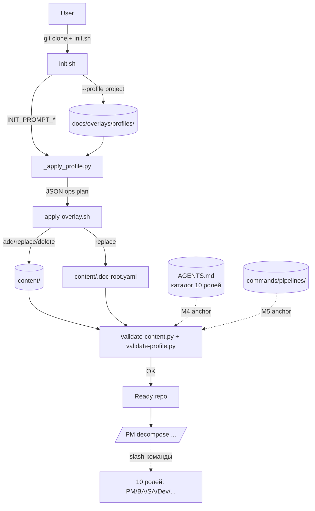
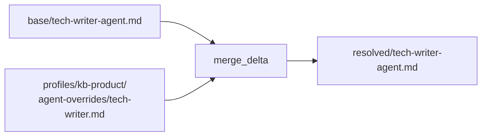

# Architecture Overview — project_template

> High-level карта системы. Для глубоких деталей см. spec'и в `docs/superpowers/specs/`.

## Цель шаблона

`project_template` — мета-шаблон для AI-ассистируемой работы команды. Поддерживает 7 типов проектов (профилей) и 10 ролей. Пользователь клонирует, делает `init.sh --profile <name>`, получает рабочий каталог документации (Gramax) + настроенных AI-агентов.

## Ключевые системы



## Профильная система

7 профилей (`docs/overlays/profiles/`):

| Профиль | Назначение | Status |
|---------|------------|--------|
| project | Delivery (Researcher → BA → SA → Dev → DevOps) | stable |
| kb-team | Internal team KB (onboarding/runbook/role/incident) | stable |
| kb-product | Документация продукта для клиентов | stable |
| product | Разработка продукта/модуля (vision → spec → ADR → release) | stable |
| methodology | Методология / playbook (principles → practices → playbooks) | stable |
| course | Обучающий курс (modules → lessons → assessments) | stable |
| custom | Open-ended catch-all (anti-opinion baseline) | stable |

Каждый профиль = `manifest.yaml` (12 полей schema) + `content-scaffold/` + `doc-root.yaml`.

### Manifest schema (ключевые поля)

```yaml
schema_version: 1            # enum {1}
name: project                # совпадает с именем папки
status: stable               # stable | stub | experimental
subagents:                   # роль → core | optional | disabled
  pm: core
  ba: core
  ...
pipelines:                   # pipeline → enabled | optional | disabled
  project-planning: enabled
  ...
operations:                  # add/replace/delete для apply-overlay
  - op: add ...
init_prompts:                # interactive вопросы на init
  - id: compliance_domain ...
compatible_stacks: [...]     # stack-overlays
```

`init_prompts.<id>.on_value.<value>: { subagents.X: core }` — мутация manifest in-memory при init.

## Каталог ролей

10 ролей (PM в main + 9 subagent'ов через slash-команды):

| Имя | Где | Промпт-файл |
|-----|-----|------------|
| pm | main | (main, не subagent) |
| researcher | subagent | `agents/researcher-agent.md` |
| ba | subagent | `agents/ba-agent.md` (+ `--mode=acceptance`) |
| sa | subagent | `agents/sa-agent.md` |
| dev | subagent | `agents/dev-agent.md` |
| devops | subagent | `agents/devops-agent.md` |
| qa | subagent | `agents/qa-author-agent.md` + `agents/qa-runner-agent.md` |
| tech-writer | subagent | `agents/tech-writer-agent.md` |
| devsecops | subagent | `agents/devsecops-agent.md` |
| compliance | subagent | `agents/compliance-agent.md` |

Полная матрица «роль × профиль» — в `AGENTS.md`.

## Agent overrides

Профили могут переопределять промты базовых ролей через `agent_overrides:` в `manifest.yaml` и delta-файлы в `agent-overrides/<role>.md`. Это позволяет одному и тому же базовому `tech-writer` иметь разные акценты в `kb-team` (internal docs) и `kb-product` (customer-facing docs) без дублирования общих секций.

### Resolution (base + delta merge)



`scripts/_resolve_agents.py` мерджит base + delta:
- **Frontmatter:** scalar/list поля override полностью заменяют base; отсутствующие наследуются
- **Body:** секции `## Heading` в override заменяют одноимённые в base; отсутствующие наследуются; новые добавляются в конец
- **`{{super}}` placeholder** (Jinja2-аналог) — позволяет extending: `## Constraints\n{{super}}\n- new constraint` подставит base-секцию + добавит строку

### Validation (M11)

`validate-profile.py` M11 ловит broken overrides (5 sub-checks):

1. Base prompt существует
2. Override source path существует
3. `extends:` совпадает с именем роли
4. Роль не disabled в `subagents`
5. `{{super}}` только в секциях, существующих в base

Запускается через `scripts/check.sh --fast` в pre-commit hook.

### Resolved file marker

Resolved файл начинается с HTML-комментария:

    <!-- GENERATED by scripts/_resolve_agents.py — do not edit.
         Source: base + docs/overlays/profiles/<profile>/agent-overrides/<role>.md
         Regenerate: bash scripts/apply-overlay.sh --profile <profile> -->

Предотвращает случайное ручное редактирование (которое будет затёрто следующим apply-overlay).

## Pipeline-orchestration

3 pipeline'а (`commands/pipelines/`):

- **project-planning** — декомпозиция эпика на задачи (RES → BA → SA → QA-author → Dev → QA-runner → BA-acceptance)
- **ba-acceptance** — gate проверка AC ↔ реализация
- **critical-path** — DAG зависимостей задач + mermaid Gantt

Pipeline = orchestrator-агент в slash-команде, создаёт worktree (`superpowers:using-git-worktrees`), вызывает subagent'ы последовательно.

## Содержимое (`content/`)

Gramax-каталог:

- **`_index.md` в каждой подпапке** (без `properties:`)
- **Корневой `content/_index.md`** — главная страница
- **`.doc-root.yaml`** — schema свойств (Тип контента, Статус, Аудитория, ...)
- **frontmatter object-нотация:**
  ```yaml
  properties:
    - name: Тип контента
      value: [ADR]
  ```

## Validators

### `validate-content.py` — проверки C1-C7

- C1 — `_index.md` присутствует в каждой подпапке
- C2 — Файлы вне разрешённых расширений отсутствуют
- C3-C7 — frontmatter, properties, placeholders, и т.д.

### `validate-profile.py` — M1-M10 + schema_version enum

- M1 — manifest.yaml присутствует
- M2 — обязательные поля
- M3 — name == имя папки
- M4 — subagents в AGENTS.md (с visibility warning при broken anchor)
- M5 — pipelines в commands/pipelines/
- M6 — enum значений subagents/pipelines
- M7 — content_scaffold/doc_root paths существуют
- M8 — on_value мутации указывают на known keys (warning)
- M9 — compatible_stacks существуют (warning)
- M10 — status vs scaffold mismatch (warning)
- schema_version enum {1} (W3-A4)

### `scripts/check.sh` — single entry-point

```bash
bash scripts/check.sh --fast   # validators только (~3 сек)
bash scripts/check.sh --full   # + tests (~30 сек)
```

## Workflow

Канонический поток:

```
private branch (рабочая)
  ├── /pm decompose <фича> → план задач
  ├── /pipelines/project-planning <epic>
  │     ├── worktree epic-<slug>
  │     ├── /research → /ba → /sa → /qa --mode=author → /dev → /qa --mode=runner
  │     └── /pipelines/ba-acceptance → gate
  ├── /pm-review (читает lessons + memory; checkbox'ы)
  └── PR private → public (merge после review)

public branch (publish)
  └── deployable Gramax catalog
```

## Lessons learned + memory

- `docs/lessons-learned.md` — append-only журнал
- Auto-memory (`~/.claude/projects/.../memory/`) — типы `feedback`, `project`, `reference`
- `/pm-review` синхронизирует lessons + memory с CLAUDE.md / промтами

## Дальше читать

- **Подробнее** — `CLAUDE.md` (root), `AGENTS.md` (роли), `docs/extending.md` (как добавить роль/pipeline/профиль)
- **Spec'и** — `docs/superpowers/specs/` (Wave 1, Wave 2, Wave 3)
- **Validators** — `scripts/_validate_common.py` (shared types)
- **Troubleshooting** — `docs/troubleshooting.md`
