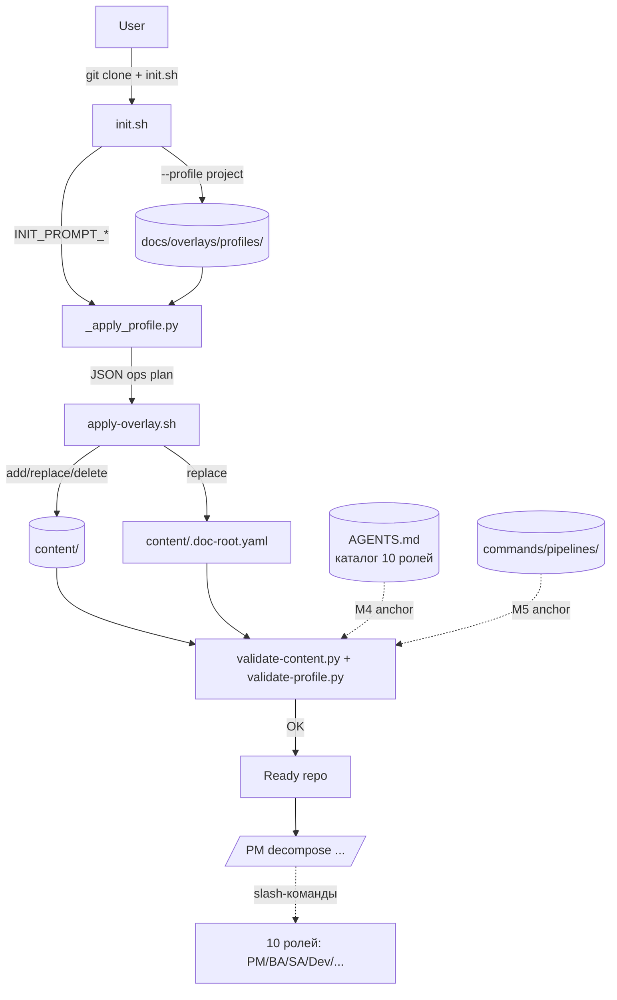

# Wave 3 — Tech-debt closure + DX + docs polish — Implementation Plan

> **For agentic workers:** REQUIRED SUB-SKILL: Use superpowers:subagent-driven-development (recommended) or superpowers:executing-plans to implement this plan task-by-task. Steps use checkbox (`- [ ]`) syntax for tracking.

**Goal:** Закрыть Wave 2 на чистовик (on_value мутации end-to-end + bash→Python helper рефакторинг + 5 small fixes) и добавить базовый DX-обвес (single check entry-point + git pre-commit hook) и documentation polish (architecture-overview + troubleshooting + 2 quick-start examples).

**Architecture:** Главная новая абстракция — `scripts/_apply_profile.py` (Python helper). Читает manifest.yaml + `INIT_PROMPT_*` env vars, применяет on_value мутации к manifest in-memory, эмиттит JSON ops plan на stdout. `apply-overlay.sh` рефакторен на one-shot helper invoke + JSON consume вместо 5×subprocess shells per op. Pre-commit hook через git `.githooks/` (universal), не Claude hook. Backwards compat: Wave 1 markers-based stack-overlays не трогаются; init без `--profile` → fallback на project.

**Tech Stack:** Bash 3.2+ (macOS compat), Python 3.8+ (typing, dataclasses, pathlib, yaml, json), git 2.x, Gramax markdown + YAML frontmatter, mermaid в docs.

**Spec:** `docs/superpowers/specs/2026-05-07-wave-3-design.md`

**Phase plan + dep граф:**

```
Phase 1 (T1-T5): A2 — bash→Python helper           [sequential]
   ↓
Phase 2 (T6-T10): A1 — on_value end-to-end          [sequential]
   ↓
Phase 3 (T11-T13): A3 + A4 + A7                    [(T11→T12 same file) || T13]
   ↓
Phase 4 (T14-T15): F4 — scripts/check.sh           [sequential]
   ↓
Phase 5 (T16-T20): F3 + G1 + G2 + G3                [parallel: 5 subagents]
   ↓
Phase 6 (T21-T23): integration + lessons + memory   [sequential]
```

**Total: 23 задачи. Medium budget (~20-25 задач).**

---

## File Structure

### Создаваемые файлы

| Путь | Назначение | Задача |
|------|------------|--------|
| `scripts/_apply_profile.py` | Python helper: читает manifest, применяет on_value мутации, эмиттит JSON ops plan | T1, T2, T6 |
| `scripts/check.sh` | Single entry-point все валидации (--fast / --full) | T14 |
| `scripts/install-hooks.sh` | Активирует git hooks (`git config core.hooksPath .githooks`) | T16 |
| `.githooks/pre-commit` | Git pre-commit hook вызывает `check.sh --fast` | T16 |
| `docs/architecture-overview.md` | High-level системная карта | T17 |
| `docs/troubleshooting.md` | FAQ-стиль guide | T18 |
| `examples/project-example/` (full tree) | Post-init snapshot project профиля | T19 |
| `examples/kb-team-example/` (full tree) | Post-init snapshot kb-team профиля | T20 |

### Модифицируемые файлы

| Путь | Что | Задача |
|------|-----|--------|
| `scripts/apply-overlay.sh` | Refactor `apply_profile_overlay` на helper invoke + JSON consume; A5 (nullglob dotglob) | T3, T4 |
| `scripts/init.sh` | Export `INIT_PROMPT_<id>` env vars перед apply-overlay | T7 |
| `scripts/validate-profile.py` | A3 (M4 visibility warning), A4 (schema_version enum check) | T11, T12 |
| `scripts/test-template.sh` | + integration tests T-W3-A1, T-W3-A7, T-W3-F4-*, T-W3-F3 | T10, T13, T15, T16 |
| `scripts/test-validate-profile.sh` | + assertions для A3 (M4 warning) и A4 (schema_version) | T11, T12 |
| `docs/overlays/profiles/project/manifest.yaml` | Restore `init_prompts:` block (был удалён в W2-T44b) | T8 |
| `docs/overlays/profiles/kb-team/manifest.yaml` | Add `op:delete content/00-project/` | T13 |
| `.claude/plugins/project/commands/init.md` | Restore mention init_prompts | T9 |
| `README.md` | Mention setup pre-commit hooks | T16 |
| `docs/lessons-learned.md` | Append «Wave 3 итог» | T22 |

---

## Phase 1: A2 — bash→Python helper рефакторинг

Цель: устранить ×5 subprocess shells в `apply-overlay.sh`, перенеся логику парсинга manifest и safety verdict'ов в Python helper. JSON-based plan между helper и bash.

### Task 1: `_apply_profile.py` skeleton — parse manifest, emit JSON plan для add/replace

**Files:**
- Create: `scripts/_apply_profile.py`
- Test: ручной smoke (Python helper не имеет dedicated test-script; unit-тесты через test-template.sh integration)

- [ ] **Step 1.1: Написать `_apply_profile.py` skeleton**

Создать файл `scripts/_apply_profile.py`:

```python
#!/usr/bin/env python3
"""_apply_profile.py — читает profile manifest.yaml, эмиттит JSON ops plan на stdout.

Используется apply-overlay.sh в --profile режиме как one-shot helper
(вместо ×5 subprocess shells per operation в Wave 2).

CLI:
    python3 scripts/_apply_profile.py <profile-dir> [--init]

Output (stdout): JSON {"profile": str, "init": bool, "ops": [{"op": ..., ...}]}
Exit codes: 0 — clean; 1 — error (manifest invalid, mutation failure); 2 — pyyaml missing.
"""
from __future__ import annotations

import argparse
import json
import os
import sys
from pathlib import Path

sys.path.insert(0, str(Path(__file__).parent))
from _validate_common import parse_yaml_file, require_yaml  # noqa: E402

# A6: named constant вместо magic 500
BASELINE_CONTENT_MAX_BYTES = 500


def load_manifest(profile_dir: Path) -> dict:
    """Читает manifest.yaml; exit 1 если parse failed или manifest отсутствует."""
    manifest_path = profile_dir / "manifest.yaml"
    if not manifest_path.exists():
        print(f"ERROR: {manifest_path} не найден", file=sys.stderr)
        sys.exit(1)
    manifest = parse_yaml_file(manifest_path)
    if manifest is None:
        print(f"ERROR: {manifest_path}: invalid YAML", file=sys.stderr)
        sys.exit(1)
    return manifest


def emit_plan(manifest: dict, profile_dir: Path, init: bool) -> dict:
    """Формирует ops plan структуру для последующего вывода JSON."""
    ops = manifest.get("operations") or []
    plan_ops = []
    for op_decl in ops:
        if not isinstance(op_decl, dict):
            continue
        op_type = op_decl.get("op")
        plan_ops.append({
            "op": op_type,
            "source": op_decl.get("source", ""),
            "target": op_decl.get("target", ""),
            "reason": op_decl.get("reason", ""),
            "verdict": "pending",  # placeholder; T2 заполнит
        })
    return {
        "profile": manifest.get("name", ""),
        "init": init,
        "ops": plan_ops,
    }


def main(argv: list[str]) -> int:
    parser = argparse.ArgumentParser(description="Profile apply helper — emits JSON ops plan")
    parser.add_argument("profile_dir", help="Path to docs/overlays/profiles/<name>/")
    parser.add_argument("--init", action="store_true", help="Fresh init mode (relax strict delete check)")
    args = parser.parse_args(argv)

    require_yaml()

    profile_dir = Path(args.profile_dir)
    if not profile_dir.is_dir():
        print(f"ERROR: profile dir не существует: {profile_dir}", file=sys.stderr)
        return 1

    manifest = load_manifest(profile_dir)
    plan = emit_plan(manifest, profile_dir, args.init)

    print(json.dumps(plan, ensure_ascii=False, indent=2))
    return 0


if __name__ == "__main__":
    sys.exit(main(sys.argv[1:]))
```

- [ ] **Step 1.2: Сделать helper executable**

```bash
chmod +x scripts/_apply_profile.py
```

- [ ] **Step 1.3: Smoke test — helper читает project manifest и эмиттит JSON**

```bash
cd /Users/mdemyanov/knowlage/project_template
python3 scripts/_apply_profile.py docs/overlays/profiles/project
```

Ожидаемый stdout:

```json
{
  "profile": "project",
  "init": false,
  "ops": [
    {
      "op": "add",
      "source": "content-scaffold/",
      "target": "content/",
      "reason": "Базовый scaffold project-профиля",
      "verdict": "pending"
    },
    {
      "op": "replace",
      "source": "doc-root.yaml",
      "target": "content/.doc-root.yaml",
      "reason": "Профильная схема properties",
      "verdict": "pending"
    }
  ]
}
```

Exit code должен быть 0.

- [ ] **Step 1.4: Smoke test — kb-team manifest (с deletes)**

```bash
python3 scripts/_apply_profile.py docs/overlays/profiles/kb-team
```

Ожидаемо: 6 ops в plan'е (4 deletes + 1 add + 1 replace), все с `verdict: pending`.

- [ ] **Step 1.5: Smoke test — несуществующий профиль → exit 1**

```bash
python3 scripts/_apply_profile.py docs/overlays/profiles/nonexistent
echo "exit: $?"
```

Ожидаемо: stderr «profile dir не существует»; exit 1.

- [ ] **Step 1.6: Commit**

```bash
git add scripts/_apply_profile.py
git commit -m "feat(wave3): _apply_profile.py skeleton — JSON plan emit [W3-T1]"
```

---

### Task 2: `_apply_profile.py` — safety verdict для op:delete (incl A6: symlink edge + named const)

**Files:**
- Modify: `scripts/_apply_profile.py`

- [ ] **Step 2.1: Добавить `compute_verdict` функцию в `_apply_profile.py`**

Вставить **перед** `emit_plan`:

```python
def is_baseline_file(path: Path) -> bool:
    """Файл считается baseline если: пустой, имеет placeholder, или _index.md < BASELINE_CONTENT_MAX_BYTES.

    A6: symlinks count as content (не baseline) если не _index.md/.gitkeep.
    """
    if not path.exists():
        return True
    if path.is_symlink():
        # A6: symlink — non-baseline (избегаем follow-чужих-указателей)
        return path.name in (".gitkeep",)  # symlink на .gitkeep допустим
    if path.is_file():
        try:
            size = path.stat().st_size
        except OSError:
            return False
        if size == 0:
            return True
        try:
            text = path.read_text(encoding="utf-8")
        except (UnicodeDecodeError, OSError):
            return False
        if "{{" in text:
            return True
        if path.name == "_index.md" and size < BASELINE_CONTENT_MAX_BYTES:
            return True
        return False
    return False


def is_safe_to_delete(target: Path) -> bool:
    """Папка safe to delete если содержит только baseline content (_index.md + .gitkeep)."""
    if not target.exists():
        return True  # уже нет — OK
    if target.is_file():
        return is_baseline_file(target)
    if not target.is_dir():
        return False
    for entry in target.rglob("*"):
        if entry.is_dir():
            continue
        name = entry.name
        if name == ".gitkeep":
            continue
        if name == "_index.md" and is_baseline_file(entry):
            continue
        return False
    return True


def compute_verdict(op: dict, init: bool, profile_dir: Path) -> str:
    """Возвращает verdict: 'safe', 'refuse', 'force-required', или 'add'/'replace'."""
    op_type = op.get("op")
    if op_type in ("add", "replace"):
        return op_type  # просто маркер, без safety check
    if op_type == "delete":
        target = Path(op.get("target", ""))
        if init:
            return "safe"  # init mode skip strict check (передаст --force в op_delete)
        if is_safe_to_delete(target):
            return "safe"
        return "refuse"
    return "unknown"
```

- [ ] **Step 2.2: Обновить `emit_plan` — заменить `"pending"` на реальный verdict**

В функции `emit_plan` заменить:

```python
        "verdict": "pending",  # placeholder; T2 заполнит
```

на:

```python
        "verdict": compute_verdict(op_decl, init, profile_dir),
```

- [ ] **Step 2.3: Smoke test — kb-team plan содержит verdict'ы для deletes**

```bash
cd /Users/mdemyanov/knowlage/project_template
# создать тест-окружение с пустыми scaffold-папками (как после fresh init или в шаблоне)
TMP=$(mktemp -d)
mkdir -p "$TMP/content/30-requirements" "$TMP/content/40-architecture" "$TMP/content/60-implementation" "$TMP/content/70-operations"
touch "$TMP/content/30-requirements/.gitkeep" "$TMP/content/40-architecture/.gitkeep" "$TMP/content/60-implementation/.gitkeep" "$TMP/content/70-operations/.gitkeep"
cd "$TMP"
cp -r /Users/mdemyanov/knowlage/project_template/scripts .
cp -r /Users/mdemyanov/knowlage/project_template/docs .
python3 scripts/_apply_profile.py docs/overlays/profiles/kb-team
cd - && rm -rf "$TMP"
```

Ожидаемо: 4 deletes имеют `"verdict": "safe"` (целевые папки baseline-empty); add+replace имеют `"verdict": "add"` / `"verdict": "replace"`.

- [ ] **Step 2.4: Smoke test — non-empty target → verdict refuse**

```bash
TMP=$(mktemp -d)
mkdir -p "$TMP/content/30-requirements"
echo "real content" > "$TMP/content/30-requirements/real.md"
cd "$TMP"
cp -r /Users/mdemyanov/knowlage/project_template/scripts .
cp -r /Users/mdemyanov/knowlage/project_template/docs .
python3 scripts/_apply_profile.py docs/overlays/profiles/kb-team
cd - && rm -rf "$TMP"
```

Ожидаемо: первый delete (30-requirements) имеет `"verdict": "refuse"`.

- [ ] **Step 2.5: Smoke test — `--init` flag всегда даёт safe verdict для delete**

```bash
python3 scripts/_apply_profile.py docs/overlays/profiles/kb-team --init
```

Ожидаемо: все deletes имеют `"verdict": "safe"` независимо от состояния target'а.

- [ ] **Step 2.6: Commit**

```bash
git add scripts/_apply_profile.py
git commit -m "feat(wave3): safety verdict для op:delete + symlink edge (A6) [W3-T2]"
```

---

### Task 3: A5 — `apply-overlay.sh op_add` использует `shopt -s nullglob dotglob`

**Files:**
- Modify: `scripts/apply-overlay.sh:181-185` (тело `op_add` для directory case)

- [ ] **Step 3.1: Прочитать текущее тело `op_add` (lines 181-188 в `apply-overlay.sh`)**

Текущий код:

```bash
  if [[ -d "$source_path" ]]; then
    cp -r "$source_path"/* "$target"/ 2>/dev/null || true
    cp -r "$source_path"/.[!.]* "$target"/ 2>/dev/null || true  # hidden files
  else
    cp "$source_path" "$target"
  fi
```

Проблема: `cp -r .[!.]*` шумит ошибкой если hidden files отсутствуют (хотя `2>/dev/null || true` глушит, но это hack).

- [ ] **Step 3.2: Заменить на `shopt -s nullglob dotglob`**

Применить Edit:

```
old_string:
  if [[ -d "$source_path" ]]; then
    cp -r "$source_path"/* "$target"/ 2>/dev/null || true
    cp -r "$source_path"/.[!.]* "$target"/ 2>/dev/null || true  # hidden files
  else
    cp "$source_path" "$target"
  fi

new_string:
  if [[ -d "$source_path" ]]; then
    # A5: nullglob+dotglob — без явного отдельного hidden-glob, без шума при отсутствии файлов
    (
      shopt -s nullglob dotglob
      files=("$source_path"/*)
      if (( ${#files[@]} > 0 )); then
        cp -r "${files[@]}" "$target"/
      fi
    )
  else
    cp "$source_path" "$target"
  fi
```

> Обёртка `( ... )` создаёт subshell — `shopt` локален и не влияет на остальной скрипт.

- [ ] **Step 3.3: Verify — apply-overlay project profile в test repo, scaffold копируется**

```bash
cd /Users/mdemyanov/knowlage/project_template
TMP=$(mktemp -d)
rsync -a --exclude='.git' --exclude='.worktrees' . "$TMP/"
cd "$TMP"
git init -q -b main && git add -A && git -c user.email=t@x -c user.name=t commit -q -m baseline
bash scripts/apply-overlay.sh --profile --init --force project
ls -la content/00-project/
cd - && rm -rf "$TMP"
```

Ожидаемо: `content/00-project/` содержит `_index.md`, поддиректории; команда без stderr-шума.

- [ ] **Step 3.4: Verify — все existing test-template ассерты зелёные**

```bash
bash scripts/test-template.sh 2>&1 | tail -5
```

Ожидаемо: «✓ Template smoke test PASSED», `FAIL=0`.

- [ ] **Step 3.5: Commit**

```bash
git add scripts/apply-overlay.sh
git commit -m "fix(apply-overlay): nullglob+dotglob для op_add (A5) [W3-T3]"
```

---

### Task 4: Refactor `apply-overlay.sh` `apply_profile_overlay` — one-shot helper invoke + JSON consume

**Files:**
- Modify: `scripts/apply-overlay.sh:280-340` (функция `apply_profile_overlay`)

- [ ] **Step 4.1: Понять текущий контракт функции `apply_profile_overlay`**

Текущая логика (lines 280-340):
1. Проверяет profile dir + manifest.yaml
2. Запускает `validate-profile.py` (если не --init)
3. Читает `status` через subprocess
4. Печатает status и (если stub) warning
5. Читает `len(operations)` через subprocess
6. **Loop:** для каждого `i` в `seq 0 (count-1)` читает `op`, `source`, `target`, `reason` через ×4 subprocess
7. Вызывает `op_add` / `op_replace` / `op_delete`

**Что меняется:** заменяем шаги 3-6 на один вызов `_apply_profile.py` + JSON parse в bash.

- [ ] **Step 4.2: Заменить тело `apply_profile_overlay` на helper-based version**

Использовать Edit заменить весь блок функции:

```
old_string:
apply_profile_overlay() {
  local name="$1"
  local profile_dir="$PROFILES_ROOT/$name"

  [[ ! -d "$profile_dir" ]] && {
    echo "ERROR: profile '$name' не существует. Доступные:" >&2
    ls "$PROFILES_ROOT/" 2>/dev/null >&2 || echo "(нет профилей)" >&2
    exit 1
  }

  [[ ! -f "$profile_dir/manifest.yaml" ]] && {
    echo "ERROR: $profile_dir/manifest.yaml не найден" >&2
    exit 1
  }

  echo "Profile: $name"

  # validate-profile перед применением
  if [[ "${INIT_MODE:-0}" -ne 1 ]]; then
    python3 scripts/validate-profile.py "$profile_dir" >/dev/null 2>&1 || {
      echo "ERROR: validate-profile.py упал на $name" >&2
      python3 scripts/validate-profile.py "$profile_dir" >&2
      exit 1
    }
  fi

  # Прочитать status
  local status
  status=$(python3 -c "import yaml; m=yaml.safe_load(open('$profile_dir/manifest.yaml')); print(m.get('status', 'unknown'))")
  echo "Status: $status"

  if [[ "$status" == "stub" ]]; then
    echo "⚠ stub-профиль: scaffold не определён, профиль готов к расширению в Wave 3+"
  fi

  # Прочитать operations
  local ops_count
  ops_count=$(python3 -c "import yaml; m=yaml.safe_load(open('$profile_dir/manifest.yaml')); print(len(m.get('operations') or []))")

  if [[ "$ops_count" -eq 0 ]]; then
    echo "No operations defined — done."
    return 0
  fi

  echo "Operations to execute: $ops_count"

  for i in $(seq 0 $((ops_count - 1))); do
    local op source target reason
    op=$(python3 -c "import yaml; m=yaml.safe_load(open('$profile_dir/manifest.yaml')); print(m['operations'][$i].get('op', ''))")
    source=$(python3 -c "import yaml; m=yaml.safe_load(open('$profile_dir/manifest.yaml')); print(m['operations'][$i].get('source', ''))")
    target=$(python3 -c "import yaml; m=yaml.safe_load(open('$profile_dir/manifest.yaml')); print(m['operations'][$i].get('target', ''))")
    reason=$(python3 -c "import yaml; m=yaml.safe_load(open('$profile_dir/manifest.yaml')); print(m['operations'][$i].get('reason', ''))")

    case "$op" in
      add)     op_add "$profile_dir" "$source" "$target" "$reason" ;;
      replace) op_replace "$profile_dir" "$source" "$target" "$reason" ;;
      delete)  op_delete "$target" "$reason" ;;
      *)       echo "ERROR: unknown op '$op'" >&2; exit 1 ;;
    esac
  done
}

new_string:
apply_profile_overlay() {
  local name="$1"
  local profile_dir="$PROFILES_ROOT/$name"

  [[ ! -d "$profile_dir" ]] && {
    echo "ERROR: profile '$name' не существует. Доступные:" >&2
    ls "$PROFILES_ROOT/" 2>/dev/null >&2 || echo "(нет профилей)" >&2
    exit 1
  }

  [[ ! -f "$profile_dir/manifest.yaml" ]] && {
    echo "ERROR: $profile_dir/manifest.yaml не найден" >&2
    exit 1
  }

  echo "Profile: $name"

  # validate-profile перед применением
  if [[ "${INIT_MODE:-0}" -ne 1 ]]; then
    python3 scripts/validate-profile.py "$profile_dir" >/dev/null 2>&1 || {
      echo "ERROR: validate-profile.py упал на $name" >&2
      python3 scripts/validate-profile.py "$profile_dir" >&2
      exit 1
    }
  fi

  # A2: один вызов helper'а — JSON plan на stdout
  local init_flag=""
  [[ "$INIT_MODE" -eq 1 ]] && init_flag="--init"
  local plan_json
  if ! plan_json=$(python3 scripts/_apply_profile.py "$profile_dir" $init_flag); then
    echo "ERROR: _apply_profile.py упал на $name" >&2
    exit 1
  fi

  # Прочитать status (отдельный вызов — helper не эмиттит status, чтобы plan был чисто ops)
  local status
  status=$(python3 -c "import yaml; m=yaml.safe_load(open('$profile_dir/manifest.yaml')); print(m.get('status', 'unknown'))")
  echo "Status: $status"

  if [[ "$status" == "stub" ]]; then
    echo "⚠ stub-профиль: scaffold не определён, профиль готов к расширению в Wave 3+"
  fi

  # Распарсить plan и подсчитать ops
  local ops_count
  ops_count=$(echo "$plan_json" | python3 -c "import json, sys; print(len(json.load(sys.stdin).get('ops', [])))")

  if [[ "$ops_count" -eq 0 ]]; then
    echo "No operations defined — done."
    return 0
  fi

  echo "Operations to execute: $ops_count"

  # Convert JSON plan to TSV для bash-friendly iteration
  local plan_tsv
  plan_tsv=$(echo "$plan_json" | python3 -c '
import json, sys
plan = json.load(sys.stdin)
for op in plan["ops"]:
    print("\t".join([
        op.get("op", ""),
        op.get("source", ""),
        op.get("target", ""),
        op.get("reason", ""),
        op.get("verdict", ""),
    ]))
')

  while IFS=$'\t' read -r op source target reason verdict; do
    [[ -z "$op" ]] && continue
    case "$op" in
      add)     op_add "$profile_dir" "$source" "$target" "$reason" ;;
      replace) op_replace "$profile_dir" "$source" "$target" "$reason" ;;
      delete)  op_delete "$target" "$reason" "$verdict" ;;
      *)       echo "ERROR: unknown op '$op'" >&2; exit 1 ;;
    esac
  done <<< "$plan_tsv"
}
```

Изменилось: ×5 subprocess в loop'е → 1 helper invoke + 1 status read + 1 ops parse. Итого было 5×N, стало 3 (constant).

- [ ] **Step 4.3: Обновить `op_delete` — принимать verdict из helper'а**

Текущая сигнатура: `op_delete "$target" "$reason"`. Helper теперь computes verdict — bash может его использовать вместо повторного вызова `is_safe_to_delete`.

Edit `op_delete` (текущий код в lines 242-278):

```
old_string:
op_delete() {
  local target="$1" reason="$2"

  echo "[DELETE] $target  ($reason)"

  [[ ! -e "$target" ]] && {
    echo "  ✓ already absent"
    return 0
  }

  if [[ "$FORCE" -eq 1 ]]; then
    if [[ "$DRY_RUN" -eq 1 ]]; then
      echo "  [DRY-RUN] would force-delete (force=1)"
      return 0
    fi
    rm -rf "$target"
    echo "  ✓ force-deleted"
    return 0
  fi

  if is_safe_to_delete "$target"; then
    if [[ "$DRY_RUN" -eq 1 ]]; then
      echo "  [DRY-RUN] safe to delete"
      return 0
    fi
    rm -rf "$target"
    echo "  ✓ deleted (was baseline/empty)"
  else
    echo "  ⚠ REFUSED: $target содержит non-baseline content"
    echo "    Use --force to override; use --dry-run to preview"
    if [[ "$DRY_RUN" -eq 1 ]]; then
      echo "  [DRY-RUN] WOULD REFUSE"
      return 0
    fi
    exit 1
  fi
}

new_string:
op_delete() {
  local target="$1" reason="$2" verdict="${3:-}"

  echo "[DELETE] $target  ($reason)"

  [[ ! -e "$target" ]] && {
    echo "  ✓ already absent"
    return 0
  }

  if [[ "$FORCE" -eq 1 ]]; then
    if [[ "$DRY_RUN" -eq 1 ]]; then
      echo "  [DRY-RUN] would force-delete (force=1)"
      return 0
    fi
    rm -rf "$target"
    echo "  ✓ force-deleted"
    return 0
  fi

  # A2: verdict приходит из helper'а; fallback на bash is_safe_to_delete если verdict не передан
  if [[ -z "$verdict" ]]; then
    if is_safe_to_delete "$target"; then
      verdict="safe"
    else
      verdict="refuse"
    fi
  fi

  if [[ "$verdict" == "safe" ]]; then
    if [[ "$DRY_RUN" -eq 1 ]]; then
      echo "  [DRY-RUN] safe to delete"
      return 0
    fi
    rm -rf "$target"
    echo "  ✓ deleted (was baseline/empty)"
  else
    echo "  ⚠ REFUSED: $target содержит non-baseline content"
    echo "    Use --force to override; use --dry-run to preview"
    if [[ "$DRY_RUN" -eq 1 ]]; then
      echo "  [DRY-RUN] WOULD REFUSE"
      return 0
    fi
    exit 1
  fi
}
```

> bash `is_safe_to_delete` функция остаётся как fallback (если кто-то вызвал `op_delete` без verdict). Хотим её сохранить для backwards compat.

- [ ] **Step 4.4: Verify — apply-overlay project profile работает**

```bash
cd /Users/mdemyanov/knowlage/project_template
TMP=$(mktemp -d)
rsync -a --exclude='.git' --exclude='.worktrees' . "$TMP/"
cd "$TMP"
git init -q -b main && git add -A && git -c user.email=t@x -c user.name=t commit -q -m baseline
bash scripts/apply-overlay.sh --profile --init --force project
echo "exit: $?"
cd - && rm -rf "$TMP"
```

Ожидаемо: exit 0; в stdout — операции с verdict'ами.

- [ ] **Step 4.5: Verify — kb-team profile работает (с deletes)**

```bash
TMP=$(mktemp -d)
rsync -a --exclude='.git' --exclude='.worktrees' /Users/mdemyanov/knowlage/project_template/ "$TMP/"
cd "$TMP"
git init -q -b main && git add -A && git -c user.email=t@x -c user.name=t commit -q -m baseline
bash scripts/apply-overlay.sh --profile --init --force kb-team
echo "exit: $?"
ls content/  # должны быть 10-domain, 20-onboarding, 30-runbooks, 40-roles, 50-incidents
cd - && rm -rf "$TMP"
```

Ожидаемо: exit 0; `content/` содержит kb-team scaffold.

- [ ] **Step 4.6: Commit**

```bash
git add scripts/apply-overlay.sh
git commit -m "refactor(apply-overlay): one-shot helper invoke + JSON consume (A2) [W3-T4]"
```

---

### Task 5: Phase 1 regression — все existing tests зелёные

**Files:** только запуск тестов; no code change.

- [ ] **Step 5.1: Запустить test-validate-content.sh**

```bash
cd /Users/mdemyanov/knowlage/project_template
bash scripts/test-validate-content.sh 2>&1 | tail -3
```

Ожидаемо: `✓ Validate-content tests PASSED` или эквивалент с `FAIL=0`.

- [ ] **Step 5.2: Запустить test-validate-profile.sh**

```bash
bash scripts/test-validate-profile.sh 2>&1 | tail -3
```

Ожидаемо: `✓ Validate-profile tests PASSED` с `FAIL=0`.

- [ ] **Step 5.3: Запустить test-template.sh**

```bash
bash scripts/test-template.sh 2>&1 | tail -3
```

Ожидаемо: `✓ Template smoke test PASSED` с `FAIL=0`.

- [ ] **Step 5.4: Если что-то упало — откатить refactor частично, диагностировать, исправить**

При failure:
- Прочитать failed assert'ы.
- Найти причину (например, JSON plan не парсится / verdict не приходит).
- Исправить в `_apply_profile.py` или `apply-overlay.sh`.
- Повторить test runs.

При успехе — переходить к Phase 2 без commit'а (Phase 1 уже закоммичена в T1-T4; T5 — verification).

- [ ] **Step 5.5: (Опционально) Если в ходе исправлений были изменения — commit**

```bash
git status
# Если есть изменения от диагностики:
git add scripts/_apply_profile.py scripts/apply-overlay.sh
git commit -m "fix(wave3): regression fixes after A2 refactor [W3-T5]"
```

---

## Phase 2: A1 — on_value мутации end-to-end

Цель: подключить on_value мутации (init_prompts answers → manifest in-memory mutations → final state). Восстановить init_prompts в project manifest. Integration test.

### Task 6: `_apply_profile.py` — read INIT_PROMPT_* env + apply on_value mutations

**Files:**
- Modify: `scripts/_apply_profile.py`

- [ ] **Step 6.1: Добавить функцию `apply_on_value_mutations` в `_apply_profile.py`**

Вставить **перед** `emit_plan`:

```python
def apply_on_value_mutations(manifest: dict) -> None:
    """Применяет on_value мутации к manifest in-memory.

    Читает INIT_PROMPT_<id> env vars, ищет соответствующий init_prompt,
    проверяет value против choices, применяет mutations (dotted path → value).

    Mutations НЕ персистятся в файл — только in-memory.
    """
    init_prompts = manifest.get("init_prompts") or []
    if not isinstance(init_prompts, list):
        return

    for prompt in init_prompts:
        if not isinstance(prompt, dict):
            continue
        prompt_id = prompt.get("id")
        if not prompt_id:
            continue

        env_key = f"INIT_PROMPT_{prompt_id}"
        value = os.environ.get(env_key)
        if value is None or value == "":
            value = prompt.get("default", "")

        if not value:
            continue

        # Validate enum choices
        prompt_type = prompt.get("type", "string")
        if prompt_type == "enum":
            choices = prompt.get("choices") or []
            if value not in choices:
                print(
                    f"ERROR: {env_key}={value!r} не в choices {choices}",
                    file=sys.stderr,
                )
                sys.exit(1)

        on_value = prompt.get("on_value") or {}
        if not isinstance(on_value, dict):
            continue
        mutations = on_value.get(value)
        if not isinstance(mutations, dict):
            continue

        for dotted_path, new_value in mutations.items():
            apply_dotted_mutation(manifest, dotted_path, new_value)


def apply_dotted_mutation(manifest: dict, dotted_path: str, new_value) -> None:
    """Применяет mutation по dotted-path (например 'subagents.compliance' → 'core').

    Exit 1 если path не существует (защита от typo в manifest).
    """
    parts = dotted_path.split(".")
    if len(parts) < 2:
        print(
            f"ERROR: invalid dotted path '{dotted_path}' (нужно минимум section.key)",
            file=sys.stderr,
        )
        sys.exit(1)
    section_name, key = parts[0], ".".join(parts[1:])
    section = manifest.get(section_name)
    if not isinstance(section, dict):
        print(
            f"ERROR: section '{section_name}' не существует в manifest или не dict",
            file=sys.stderr,
        )
        sys.exit(1)
    if key not in section:
        print(
            f"ERROR: '{dotted_path}' не существует в manifest (нет ключа '{key}' в '{section_name}')",
            file=sys.stderr,
        )
        sys.exit(1)
    section[key] = new_value
```

- [ ] **Step 6.2: Вызвать `apply_on_value_mutations` в `main` перед `emit_plan`**

Найти в `main`:

```python
    manifest = load_manifest(profile_dir)
    plan = emit_plan(manifest, profile_dir, args.init)
```

Заменить на:

```python
    manifest = load_manifest(profile_dir)
    apply_on_value_mutations(manifest)  # T6: env-driven mutations
    plan = emit_plan(manifest, profile_dir, args.init)
```

- [ ] **Step 6.3: Smoke test — без INIT_PROMPT_* env vars, manifest неизменный (mutation пустой)**

```bash
cd /Users/mdemyanov/knowlage/project_template
# Project manifest пока без init_prompts (T8 их вернёт). Sanity check — пустой manifest не падает.
unset INIT_PROMPT_compliance_domain
python3 scripts/_apply_profile.py docs/overlays/profiles/project | python3 -c "import json,sys; print('OK' if json.load(sys.stdin)['profile']=='project' else 'FAIL')"
```

Ожидаемо: `OK`.

- [ ] **Step 6.4: Smoke test — с INIT_PROMPT_* для несуществующего prompt — без эффекта**

```bash
INIT_PROMPT_nonexistent=foo python3 scripts/_apply_profile.py docs/overlays/profiles/project >/dev/null
echo "exit: $?"
```

Ожидаемо: exit 0 (manifest нет init_prompts; env var игнорируется).

- [ ] **Step 6.5: Smoke test — invalid enum value → exit 1**

Подготовка: создать тестовый manifest с init_prompts.

```bash
TMP=$(mktemp -d)
mkdir -p "$TMP/docs/overlays/profiles/test-prof" "$TMP/scripts"
cp scripts/_apply_profile.py scripts/_validate_common.py "$TMP/scripts/"
cat > "$TMP/docs/overlays/profiles/test-prof/manifest.yaml" <<'EOF'
schema_version: 1
name: test-prof
description: test
status: stable
subagents: { pm: core, compliance: optional }
pipelines: {}
content_scaffold: ./
doc_root: ./
operations: []
compatible_stacks: []
init_prompts:
  - id: test_choice
    prompt: "test"
    type: enum
    choices: [a, b]
    default: a
    on_value:
      a: { subagents.compliance: core }
      b: { subagents.compliance: disabled }
EOF
cd "$TMP"
INIT_PROMPT_test_choice=invalid python3 scripts/_apply_profile.py docs/overlays/profiles/test-prof
echo "exit: $?"
cd - && rm -rf "$TMP"
```

Ожидаемо: stderr «INIT_PROMPT_test_choice='invalid' не в choices ['a', 'b']»; exit 1.

- [ ] **Step 6.6: Smoke test — valid enum mutates subagent**

```bash
TMP=$(mktemp -d)
mkdir -p "$TMP/docs/overlays/profiles/test-prof" "$TMP/scripts"
cp scripts/_apply_profile.py scripts/_validate_common.py "$TMP/scripts/"
cat > "$TMP/docs/overlays/profiles/test-prof/manifest.yaml" <<'EOF'
schema_version: 1
name: test-prof
description: test
status: stable
subagents: { pm: core, compliance: optional }
pipelines: {}
content_scaffold: ./
doc_root: ./
operations: []
compatible_stacks: []
init_prompts:
  - id: test_choice
    prompt: "test"
    type: enum
    choices: [a, b]
    default: a
    on_value:
      a: { subagents.compliance: core }
EOF
cd "$TMP"
INIT_PROMPT_test_choice=a python3 -c "
import sys
sys.path.insert(0, 'scripts')
from _apply_profile import load_manifest, apply_on_value_mutations
from pathlib import Path
m = load_manifest(Path('docs/overlays/profiles/test-prof'))
apply_on_value_mutations(m)
print(m['subagents']['compliance'])
"
cd - && rm -rf "$TMP"
```

Ожидаемо: `core` (mutation применилась optional → core).

- [ ] **Step 6.7: Commit**

```bash
git add scripts/_apply_profile.py
git commit -m "feat(wave3): on_value мутации в _apply_profile.py (A1) [W3-T6]"
```

---

### Task 7: `init.sh` — collect init_prompts answers + export INIT_PROMPT_<id>

**Files:**
- Modify: `scripts/init.sh:146` (после profile detection, перед `apply-overlay.sh` вызова)

- [ ] **Step 7.1: Найти место в `init.sh` после строки 146 (`echo "Applying profile overlay '$PROFILE'..."`)**

- [ ] **Step 7.2: Вставить блок «collect init_prompts answers и export» ПЕРЕД вызовом apply-overlay**

В строке 147 (`if ! bash scripts/apply-overlay.sh ...`) вставить **перед** ней:

```bash
  # T7 (W3-A1): Собрать ответы init_prompts из manifest + export как INIT_PROMPT_<id>
  if command -v python3 >/dev/null 2>&1; then
    PROMPTS_JSON=$(python3 -c "
import yaml, json
m = yaml.safe_load(open('docs/overlays/profiles/$PROFILE/manifest.yaml'))
print(json.dumps(m.get('init_prompts') or []))
" 2>/dev/null)

    if [[ -n "$PROMPTS_JSON" ]] && [[ "$PROMPTS_JSON" != "[]" ]]; then
      # Получить количество prompts
      PROMPTS_COUNT=$(echo "$PROMPTS_JSON" | python3 -c "import json,sys; print(len(json.load(sys.stdin)))")

      for i in $(seq 0 $((PROMPTS_COUNT - 1))); do
        PROMPT_ID=$(echo "$PROMPTS_JSON" | python3 -c "import json,sys; p=json.load(sys.stdin)[$i]; print(p.get('id', ''))")
        PROMPT_TEXT=$(echo "$PROMPTS_JSON" | python3 -c "import json,sys; p=json.load(sys.stdin)[$i]; print(p.get('prompt', ''))")
        PROMPT_TYPE=$(echo "$PROMPTS_JSON" | python3 -c "import json,sys; p=json.load(sys.stdin)[$i]; print(p.get('type', 'string'))")
        PROMPT_DEFAULT=$(echo "$PROMPTS_JSON" | python3 -c "import json,sys; p=json.load(sys.stdin)[$i]; print(p.get('default', ''))")
        PROMPT_CHOICES=$(echo "$PROMPTS_JSON" | python3 -c "import json,sys; p=json.load(sys.stdin)[$i]; c=p.get('choices') or []; print('|'.join(c))")

        if [[ -z "$PROMPT_ID" ]]; then continue; fi

        # Если non-interactive (нет TTY) или INIT_SKIP_PROMPTS — использовать default
        if [[ ! -t 0 ]] || [[ "${INIT_SKIP_PROMPTS:-0}" == "1" ]]; then
          ANSWER="$PROMPT_DEFAULT"
        else
          # Показать prompt + choices (если enum)
          if [[ "$PROMPT_TYPE" == "enum" ]] && [[ -n "$PROMPT_CHOICES" ]]; then
            echo "$PROMPT_TEXT (one of: $(echo "$PROMPT_CHOICES" | tr '|' ' '), default: $PROMPT_DEFAULT)"
          else
            echo "$PROMPT_TEXT (default: $PROMPT_DEFAULT)"
          fi
          read -r -p "  → " ANSWER
          ANSWER="${ANSWER:-$PROMPT_DEFAULT}"
        fi

        # Validate enum choice
        if [[ "$PROMPT_TYPE" == "enum" ]] && [[ -n "$PROMPT_CHOICES" ]]; then
          if ! echo "|$PROMPT_CHOICES|" | grep -q "|$ANSWER|"; then
            echo "ERROR: '$ANSWER' не в choices [$PROMPT_CHOICES] для prompt '$PROMPT_ID'" >&2
            exit 1
          fi
        fi

        # Export
        export "INIT_PROMPT_$PROMPT_ID=$ANSWER"
        echo "  ✓ INIT_PROMPT_$PROMPT_ID=$ANSWER"
      done
    fi
  fi

```

- [ ] **Step 7.3: Verify — init.sh без init_prompts (текущий project manifest пока без них) не падает**

```bash
cd /Users/mdemyanov/knowlage/project_template
TMP=$(mktemp -d)
rsync -a --exclude='.git' --exclude='.worktrees' . "$TMP/"
cd "$TMP"
git init -q -b main && git add -A && git -c user.email=t@x -c user.name=t commit -q -m baseline
echo | bash scripts/init.sh --profile project "Test" "TST" "desc" "test@x.com"
echo "exit: $?"
cd - && rm -rf "$TMP"
```

Ожидаемо: exit 0; init проходит как раньше (init_prompts блок пустой, цикл не выполняется).

- [ ] **Step 7.4: Verify — все existing tests зелёные**

```bash
bash scripts/test-template.sh 2>&1 | tail -3
```

Ожидаемо: `FAIL=0`.

- [ ] **Step 7.5: Commit**

```bash
git add scripts/init.sh
git commit -m "feat(init): collect init_prompts + export INIT_PROMPT_* (A1) [W3-T7]"
```

---

### Task 8: Restore `init_prompts:` в `docs/overlays/profiles/project/manifest.yaml`

**Files:**
- Modify: `docs/overlays/profiles/project/manifest.yaml`

- [ ] **Step 8.1: Прочитать текущий project manifest** (см. что уже есть в репо).

- [ ] **Step 8.2: Добавить блок `init_prompts:` после `compatible_stacks`**

Edit:

```
old_string:
compatible_stacks: [naumen-smp]
maintainer: project_template

new_string:
init_prompts:
  - id: compliance_domain
    prompt: "Проект под compliance-надзором?"
    type: enum
    choices: [none, "152-fz", iso27001, other]
    default: none
    on_value:
      "152-fz":
        subagents.compliance: core
      iso27001:
        subagents.compliance: core
      other:
        subagents.compliance: core

compatible_stacks: [naumen-smp]
maintainer: project_template
```

> Поле `init_prompts:` ставится перед `compatible_stacks:` для удобства чтения (чувствительные интерактивные prompt'ы — выше metadata).

- [ ] **Step 8.3: Verify — validate-profile.py зелёный на project**

```bash
cd /Users/mdemyanov/knowlage/project_template
python3 scripts/validate-profile.py docs/overlays/profiles/project
echo "exit: $?"
```

Ожидаемо: exit 0; «Profiles: OK (1 проверено)» или эквивалент. M8 (on_value targets) НЕ должен жаловаться, потому что `subagents.compliance` существует (optional в base).

- [ ] **Step 8.4: Verify — helper читает init_prompts**

```bash
python3 scripts/_apply_profile.py docs/overlays/profiles/project | python3 -c "import json,sys; p=json.load(sys.stdin); print('ops:', len(p['ops']))"
```

Ожидаемо: `ops: 2` (без INIT_PROMPT — mutation не применяется, plan = только operations).

- [ ] **Step 8.5: Verify — с INIT_PROMPT_compliance_domain=152-fz mutation применяется**

```bash
INIT_PROMPT_compliance_domain=152-fz python3 -c "
import sys
sys.path.insert(0, 'scripts')
from _apply_profile import load_manifest, apply_on_value_mutations
from pathlib import Path
m = load_manifest(Path('docs/overlays/profiles/project'))
apply_on_value_mutations(m)
print('compliance:', m['subagents']['compliance'])
"
```

Ожидаемо: `compliance: core` (вместо optional).

- [ ] **Step 8.6: Commit**

```bash
git add docs/overlays/profiles/project/manifest.yaml
git commit -m "feat(wave3): restore init_prompts в project manifest (A1) [W3-T8]"
```

---

### Task 9: Restore mention init_prompts в `commands/init.md`

**Files:**
- Modify: `.claude/plugins/project/commands/init.md`

- [ ] **Step 9.1: Прочитать текущий `commands/init.md`**

```bash
cat .claude/plugins/project/commands/init.md
```

- [ ] **Step 9.2: Найти секцию про Phase 1 и добавить mention init_prompts**

В разделе про Phase 1 (where init.sh interactive flow описан), добавить bullet point:

```
old_string: (зависит от текущего содержимого; найти секцию «Phase 1» или эквивалент про interactive flow и добавить упоминание прямо после описания profile selection)

new_string: (то же место + новый bullet)
- После выбора профиля **init.sh** запрашивает значения для `init_prompts:` манифеста (если они есть). Например, для `project` спрашивает «Проект под compliance-надзором?» — ответ применяется как mutation к manifest in-memory (например `subagents.compliance: optional → core`).
```

> Точное место найти `grep -n "Phase 1\|init.sh\|--profile" .claude/plugins/project/commands/init.md` и решить inline.

- [ ] **Step 9.3: Verify — markdown валиден (нет broken syntax)**

```bash
# Если есть markdown linter — запустить
# Иначе — визуально просмотреть diff
git diff .claude/plugins/project/commands/init.md
```

- [ ] **Step 9.4: Commit**

```bash
git add .claude/plugins/project/commands/init.md
git commit -m "docs(commands): restore mention init_prompts в init.md (A1) [W3-T9]"
```

---

### Task 10: Integration test T-W3-A1 в `test-template.sh`

**Files:**
- Modify: `scripts/test-template.sh` (append новый test block)

- [ ] **Step 10.1: Прочитать конец `test-template.sh` (последние 50 строк)**

```bash
tail -60 scripts/test-template.sh
```

Найти место **перед** `# ===== Summary =====` и вставить новый блок после `T-LEGACY` test'а.

- [ ] **Step 10.2: Добавить test T-W3-A1 (on_value mutation end-to-end)**

Использовать Edit:

```
old_string:
# ===== T-LEGACY: init без --profile fallback на project =====
echo ""
echo "==> T-LEGACY: init без --profile fallback на project"
TMP_LEG=$(mktemp -d)
rsync -a --exclude='.git' --exclude='.worktrees' "$REPO_ROOT/" "$TMP_LEG/"
cd "$TMP_LEG"
git init -q -b main
git -c user.email=t@x -c user.name=t commit --allow-empty -q -m baseline
echo | bash scripts/init.sh "Test" "TST" "desc" "test@x.com" >/dev/null 2>&1
RC=$?
assert "T-LEGACY: exit 0" "[ \"$RC\" = '0' ]"
assert "T-LEGACY: project scaffold применён" "[ -d content/00-project/plans ]"
cd "$REPO_ROOT"
rm -rf "$TMP_LEG"

# ===== Summary =====

new_string:
# ===== T-LEGACY: init без --profile fallback на project =====
echo ""
echo "==> T-LEGACY: init без --profile fallback на project"
TMP_LEG=$(mktemp -d)
rsync -a --exclude='.git' --exclude='.worktrees' "$REPO_ROOT/" "$TMP_LEG/"
cd "$TMP_LEG"
git init -q -b main
git -c user.email=t@x -c user.name=t commit --allow-empty -q -m baseline
echo | bash scripts/init.sh "Test" "TST" "desc" "test@x.com" >/dev/null 2>&1
RC=$?
assert "T-LEGACY: exit 0" "[ \"$RC\" = '0' ]"
assert "T-LEGACY: project scaffold применён" "[ -d content/00-project/plans ]"
cd "$REPO_ROOT"
rm -rf "$TMP_LEG"

# ===== T-W3-A1: on_value mutation end-to-end =====
echo ""
echo "==> T-W3-A1: on_value mutation (compliance_domain=152-fz → subagents.compliance: core)"
TMP_W3A1=$(mktemp -d)
rsync -a --exclude='.git' --exclude='.worktrees' "$REPO_ROOT/" "$TMP_W3A1/"
cd "$TMP_W3A1"
git init -q -b main
git -c user.email=t@x -c user.name=t commit --allow-empty -q -m baseline

# Выполняем helper напрямую с INIT_PROMPT — проверяем mutation в manifest in-memory
RESULT=$(INIT_PROMPT_compliance_domain=152-fz python3 -c "
import sys
sys.path.insert(0, 'scripts')
from _apply_profile import load_manifest, apply_on_value_mutations
from pathlib import Path
m = load_manifest(Path('docs/overlays/profiles/project'))
apply_on_value_mutations(m)
print(m['subagents']['compliance'])
" 2>&1)
assert "T-W3-A1: with 152-fz, compliance → core" "[ \"$RESULT\" = 'core' ]"

# Без INIT_PROMPT — compliance остаётся optional (default = none, none не имеет on_value mapping)
RESULT_NO=$(python3 -c "
import sys
sys.path.insert(0, 'scripts')
from _apply_profile import load_manifest, apply_on_value_mutations
from pathlib import Path
m = load_manifest(Path('docs/overlays/profiles/project'))
apply_on_value_mutations(m)
print(m['subagents']['compliance'])
" 2>&1)
assert "T-W3-A1: без env, compliance → optional (default=none)" "[ \"$RESULT_NO\" = 'optional' ]"

# Проверяем end-to-end через init.sh (non-interactive с INIT_SKIP_PROMPTS=1 default)
INIT_PROMPT_compliance_domain=152-fz INIT_SKIP_PROMPTS=1 bash scripts/init.sh --profile project "TestE2E" "TE" "desc" "t@x.com" >/dev/null 2>&1
RC=$?
assert "T-W3-A1: init.sh с INIT_PROMPT_compliance_domain=152-fz exit 0" "[ \"$RC\" = '0' ]"
cd "$REPO_ROOT"
rm -rf "$TMP_W3A1"

# ===== Summary =====
```

- [ ] **Step 10.3: Запустить test-template.sh и убедиться, что T-W3-A1 ассерты зелёные**

```bash
bash scripts/test-template.sh 2>&1 | grep -E "T-W3-A1|Summary|PASS|FAIL"
```

Ожидаемо: `✓ T-W3-A1: ...` для всех 3 ассертов; общий FAIL=0.

- [ ] **Step 10.4: Commit**

```bash
git add scripts/test-template.sh
git commit -m "test(wave3): integration test T-W3-A1 — on_value e2e (A1) [W3-T10]"
```

---

## Phase 3: A3 + A4 + A7 — small fixes

### Task 11: A3 — M4 visibility warning в `validate-profile.py`

**Files:**
- Modify: `scripts/validate-profile.py:94-114` (функция `collect_known_roles`)
- Modify: `scripts/test-validate-profile.sh` (assertion)

- [ ] **Step 11.1: Изменить `collect_known_roles` на возврат `(roles, m4_skipped_reason)` или эмиссию warning**

Сейчас функция возвращает `set[str]`. Если AGENTS.md есть, но таблица не парсится — silently возвращает пустой set. Делаем возврат отдельного флага.

Edit `validate-profile.py`:

```
old_string:
def collect_known_roles(repo_root: Path) -> set[str]:
    """Парсит AGENTS.md таблицу 'Каталог ролей', возвращает множество role names."""
    agents_md = repo_root / "AGENTS.md"
    if not agents_md.exists():
        return set()
    text = agents_md.read_text(encoding="utf-8")
    # Найти секцию '## Каталог ролей' и таблицу под ней
    match = _re.search(r"##\s*Каталог ролей\s*\n(.*?)(?=\n##|\Z)", text, _re.DOTALL)
    if not match:
        return set()
    table = match.group(1)
    roles = set()
    for line in table.splitlines():
        line = line.strip()
        if not line.startswith("|") or "---" in line or not line.endswith("|"):
            continue
        cells = [c.strip() for c in line.split("|")[1:-1]]
        if not cells or cells[0].lower() in ("имя", "name"):
            continue
        roles.add(cells[0])
    return roles

new_string:
def collect_known_roles(repo_root: Path) -> tuple[set[str], list[Issue]]:
    """Парсит AGENTS.md таблицу 'Каталог ролей'.

    Returns (roles, issues). Issues содержит warning если AGENTS.md exists,
    но '## Каталог ролей' heading не парсится — это сигнал поломанного anchor'а
    (M4 silently skipping — раньше было).
    """
    agents_md = repo_root / "AGENTS.md"
    issues: list[Issue] = []
    if not agents_md.exists():
        return set(), issues  # M4 skipped silently — это OK, AGENTS.md просто нет
    text = agents_md.read_text(encoding="utf-8")
    match = _re.search(r"##\s*Каталог ролей\s*\n(.*?)(?=\n##|\Z)", text, _re.DOTALL)
    if not match:
        # A3: эмит warning — heading anchor сломан, M4 не работает
        issues.append(Issue(
            level="warning",
            path=str(agents_md),
            message="AGENTS.md exists, но '## Каталог ролей' heading не найден; M4 (subagent name validation) skipped",
        ))
        return set(), issues
    table = match.group(1)
    roles = set()
    for line in table.splitlines():
        line = line.strip()
        if not line.startswith("|") or "---" in line or not line.endswith("|"):
            continue
        cells = [c.strip() for c in line.split("|")[1:-1]]
        if not cells or cells[0].lower() in ("имя", "name"):
            continue
        roles.add(cells[0])
    if not roles:
        # Heading нашёлся но table пустая — это тоже сигнал
        issues.append(Issue(
            level="warning",
            path=str(agents_md),
            message="'## Каталог ролей' heading найден, но table пуст или не парсится; M4 skipped",
        ))
    return roles, issues
```

- [ ] **Step 11.2: Обновить `main` — принять (roles, issues) tuple**

Найти в `main`:

```python
    known_roles = collect_known_roles(repo_root)
```

Заменить на:

```python
    known_roles, m4_issues = collect_known_roles(repo_root)
    issues.extend(m4_issues)
```

> Переменная `issues: list[Issue] = []` объявлена ниже строкой; нужно поднять её объявление перед `collect_known_roles`. Edit:

```
old_string:
    repo_root = Path.cwd()  # запуск из корня репо
    known_roles = collect_known_roles(repo_root)
    known_pipelines = collect_known_pipelines(repo_root)

    issues: list[Issue] = []

new_string:
    repo_root = Path.cwd()  # запуск из корня репо
    issues: list[Issue] = []
    known_roles, m4_issues = collect_known_roles(repo_root)
    issues.extend(m4_issues)
    known_pipelines = collect_known_pipelines(repo_root)
```

- [ ] **Step 11.3: Smoke test — обычный запуск зелёный (warning не появляется)**

```bash
cd /Users/mdemyanov/knowlage/project_template
python3 scripts/validate-profile.py
echo "exit: $?"
```

Ожидаемо: exit 0; `Warnings: 0` (current AGENTS.md имеет правильный heading, M4 работает как и раньше).

- [ ] **Step 11.4: Smoke test — broken AGENTS.md → warning emit**

```bash
TMP=$(mktemp -d)
rsync -a --exclude='.git' --exclude='.worktrees' /Users/mdemyanov/knowlage/project_template/ "$TMP/"
cd "$TMP"
# Сломать heading anchor
sed -i.bak 's/## Каталог ролей/## Catalog of roles/' AGENTS.md
python3 scripts/validate-profile.py 2>&1
echo "exit: $?"
cd - && rm -rf "$TMP"
```

Ожидаемо: stdout содержит `AGENTS.md exists, но '## Каталог ролей' heading не найден`; exit 0 (warning, не error).

- [ ] **Step 11.5: Добавить assertion в `test-validate-profile.sh`**

Прочитать `test-validate-profile.sh` — найти подходящее место для нового test'а (рядом с другими M-related ассертами).

```bash
grep -n "^# ===== T-M\|^test_m\|^assert " scripts/test-validate-profile.sh | head -30
```

Edit `scripts/test-validate-profile.sh` — добавить test секцию:

```
old_string: (искать секцию с последним M-test'ом, например M10, и вставить ПЕРЕД Summary)
# ===== Summary =====

new_string:
# ===== T-W3-A3-M4-VISIBILITY: broken AGENTS.md heading → warning =====
echo ""
echo "==> T-W3-A3-M4-VISIBILITY"
TMP_M4V=$(mktemp -d)
rsync -a --exclude='.git' --exclude='.worktrees' "$REPO_ROOT/" "$TMP_M4V/"
cd "$TMP_M4V"
sed -i.bak 's/## Каталог ролей/## Catalog of roles/' AGENTS.md && rm -f AGENTS.md.bak
OUT=$(python3 scripts/validate-profile.py 2>&1)
RC=$?
assert "T-W3-A3: warning emit при broken heading" "echo \"$OUT\" | grep -q \"M4 (subagent name validation) skipped\""
assert "T-W3-A3: exit 0 (warning не error)" "[ \"$RC\" = '0' ]"
cd "$REPO_ROOT"
rm -rf "$TMP_M4V"

# ===== Summary =====
```

- [ ] **Step 11.6: Запустить test-validate-profile.sh — все assertions зелёные**

```bash
bash scripts/test-validate-profile.sh 2>&1 | tail -3
```

Ожидаемо: `FAIL=0`.

- [ ] **Step 11.7: Commit**

```bash
git add scripts/validate-profile.py scripts/test-validate-profile.sh
git commit -m "fix(validate-profile): M4 visibility warning при broken AGENTS.md heading (A3) [W3-T11]"
```

---

### Task 12: A4 — `schema_version` enum check в `validate-profile.py`

**Files:**
- Modify: `scripts/validate-profile.py` (новая функция check_schema_version + вызов в main)
- Modify: `scripts/test-validate-profile.sh` (assertion)

- [ ] **Step 12.1: Добавить функцию `check_schema_version` в `validate-profile.py`**

Вставить **после** `check_m2_required_fields` (около строки 78):

```python
SUPPORTED_SCHEMA_VERSIONS = {1}


def check_schema_version_enum(profile_dir: Path, manifest: dict | None) -> list[Issue]:
    """A4: schema_version должен быть из enum {1}."""
    if manifest is None:
        return []
    sv = manifest.get("schema_version")
    if sv is None:
        return []  # M2 уже сообщил
    if sv not in SUPPORTED_SCHEMA_VERSIONS:
        return [Issue(
            level="error",
            path=str(profile_dir / "manifest.yaml"),
            message=f"schema_version: {sv} не поддерживается (ожидается одно из {sorted(SUPPORTED_SCHEMA_VERSIONS)})",
        )]
    return []
```

- [ ] **Step 12.2: Вызвать `check_schema_version_enum` в `main`**

Найти в `main` блок проверок (строка 330+):

```python
        issues.extend(check_m2_required_fields(pd, manifest))
        issues.extend(check_m3_name_matches_dir(pd, manifest))
```

Заменить на (добавить вызов):

```python
        issues.extend(check_m2_required_fields(pd, manifest))
        issues.extend(check_schema_version_enum(pd, manifest))
        issues.extend(check_m3_name_matches_dir(pd, manifest))
```

- [ ] **Step 12.3: Smoke test — текущие манифесты (schema_version: 1) зелёные**

```bash
cd /Users/mdemyanov/knowlage/project_template
python3 scripts/validate-profile.py
echo "exit: $?"
```

Ожидаемо: exit 0; `Errors: 0`.

- [ ] **Step 12.4: Smoke test — manifest с schema_version: 99 → error**

```bash
TMP=$(mktemp -d)
mkdir -p "$TMP/docs/overlays/profiles/bad-sv" "$TMP/scripts"
cp scripts/_validate_common.py scripts/validate-profile.py "$TMP/scripts/"
cat > "$TMP/docs/overlays/profiles/bad-sv/manifest.yaml" <<'EOF'
schema_version: 99
name: bad-sv
description: bad
status: stub
subagents: { pm: core }
pipelines: {}
content_scaffold: ./
doc_root: ./
operations: []
compatible_stacks: []
EOF
cd "$TMP"
python3 scripts/validate-profile.py docs/overlays/profiles/bad-sv 2>&1 | head -3
echo "exit: $?"
cd - && rm -rf "$TMP"
```

Ожидаемо: stdout содержит «schema_version: 99 не поддерживается»; exit 1.

- [ ] **Step 12.5: Добавить assertion в `test-validate-profile.sh`**

Edit:

```
old_string:
# ===== T-W3-A3-M4-VISIBILITY: broken AGENTS.md heading → warning =====

new_string:
# ===== T-W3-A4-SCHEMA-VERSION: schema_version вне enum → error =====
echo ""
echo "==> T-W3-A4-SCHEMA-VERSION"
TMP_SV=$(mktemp -d)
mkdir -p "$TMP_SV/docs/overlays/profiles/bad-sv" "$TMP_SV/scripts"
cp "$REPO_ROOT/scripts/_validate_common.py" "$REPO_ROOT/scripts/validate-profile.py" "$TMP_SV/scripts/"
cat > "$TMP_SV/docs/overlays/profiles/bad-sv/manifest.yaml" <<'EOFSV'
schema_version: 99
name: bad-sv
description: bad
status: stub
subagents: { pm: core }
pipelines: {}
content_scaffold: ./
doc_root: ./
operations: []
compatible_stacks: []
EOFSV
cd "$TMP_SV"
OUT=$(python3 scripts/validate-profile.py docs/overlays/profiles/bad-sv 2>&1)
RC=$?
assert "T-W3-A4: error при schema_version: 99" "echo \"$OUT\" | grep -q 'schema_version: 99 не поддерживается'"
assert "T-W3-A4: exit 1" "[ \"$RC\" = '1' ]"
cd "$REPO_ROOT"
rm -rf "$TMP_SV"

# ===== T-W3-A3-M4-VISIBILITY: broken AGENTS.md heading → warning =====
```

- [ ] **Step 12.6: Запустить test-validate-profile.sh**

```bash
bash scripts/test-validate-profile.sh 2>&1 | tail -3
```

Ожидаемо: `FAIL=0`.

- [ ] **Step 12.7: Commit**

```bash
git add scripts/validate-profile.py scripts/test-validate-profile.sh
git commit -m "feat(validate-profile): schema_version enum check (A4) [W3-T12]"
```

---

### Task 13: A7 — kb-team manifest `op:delete content/00-project/` + assertion

**Files:**
- Modify: `docs/overlays/profiles/kb-team/manifest.yaml`
- Modify: `scripts/test-template.sh`

- [ ] **Step 13.1: Добавить `op:delete content/00-project/` в kb-team manifest**

Edit `docs/overlays/profiles/kb-team/manifest.yaml`:

```
old_string:
operations:
  - op: delete
    target: content/30-requirements/
    reason: "kb-team не использует функциональные требования"

new_string:
operations:
  - op: delete
    target: content/00-project/
    reason: "kb-team не использует delivery-структуру (нет ADR, plans, critical-path, security)"
  - op: delete
    target: content/30-requirements/
    reason: "kb-team не использует функциональные требования"
```

> `00-project/` удаляется ПЕРВЫМ — перед остальными deletes (порядок не критичен, но чище).

- [ ] **Step 13.2: Verify — kb-team validate-profile зелёный**

```bash
cd /Users/mdemyanov/knowlage/project_template
python3 scripts/validate-profile.py docs/overlays/profiles/kb-team
echo "exit: $?"
```

Ожидаемо: exit 0.

- [ ] **Step 13.3: Verify — apply-overlay kb-team удаляет `content/00-project/`**

```bash
TMP=$(mktemp -d)
rsync -a --exclude='.git' --exclude='.worktrees' . "$TMP/"
cd "$TMP"
git init -q -b main && git add -A && git -c user.email=t@x -c user.name=t commit -q -m baseline
bash scripts/apply-overlay.sh --profile --init --force kb-team
ls content/  # 00-project/ должен отсутствовать
[[ ! -d content/00-project ]] && echo "✓ 00-project deleted" || echo "✗ 00-project still exists"
cd - && rm -rf "$TMP"
```

Ожидаемо: `✓ 00-project deleted`.

- [ ] **Step 13.4: Добавить assertion в `test-template.sh`**

Найти существующий `T-INIT-PROFILE-KB` блок (около строки 320, см. Step 13.4 spec).

Edit:

```
old_string:
assert "T-INIT-PROFILE-KB: 30-requirements удалена" "[ ! -d content/30-requirements ]"

new_string:
assert "T-INIT-PROFILE-KB: 30-requirements удалена" "[ ! -d content/30-requirements ]"
assert "T-W3-A7: 00-project удалена для kb-team" "[ ! -d content/00-project ]"
```

- [ ] **Step 13.5: Запустить test-template.sh**

```bash
bash scripts/test-template.sh 2>&1 | grep -E "T-W3-A7|FAIL=" | head -5
bash scripts/test-template.sh 2>&1 | tail -3
```

Ожидаемо: `✓ T-W3-A7: 00-project удалена для kb-team`; `FAIL=0`.

- [ ] **Step 13.6: Commit**

```bash
git add docs/overlays/profiles/kb-team/manifest.yaml scripts/test-template.sh
git commit -m "fix(kb-team): op:delete content/00-project/ + assertion (A7) [W3-T13]"
```

---

## Phase 4: F4 — `scripts/check.sh`

### Task 14: `scripts/check.sh` implementation

**Files:**
- Create: `scripts/check.sh`

- [ ] **Step 14.1: Создать `scripts/check.sh`**

```bash
#!/usr/bin/env bash
# check.sh — single entry-point для всех валидаций.
#
# Usage:
#   bash scripts/check.sh [--fast | --full]
#
# --fast (default): validate-content + validate-profile (~3 сек total)
# --full: + test-validate-content + test-validate-profile + test-template (~30 сек)

set -euo pipefail

MODE="${1:---fast}"

case "$MODE" in
  --fast|--full|-h|--help) ;;
  *)
    echo "Usage: $0 [--fast | --full]" >&2
    exit 2
    ;;
esac

if [[ "$MODE" == "-h" ]] || [[ "$MODE" == "--help" ]]; then
  cat <<EOF
Usage: $0 [--fast | --full]

Modes:
  --fast (default)  Run validators only (validate-content.py + validate-profile.py).
                    Quick gate (~3 sec). Suitable for pre-commit hook.
  --full            Run validators + full test suite (test-validate-content,
                    test-validate-profile, test-template). Comprehensive
                    smoke (~30 sec). Suitable for CI / pre-merge gate.

Exit codes:
  0  All checks passed
  1  Validator or test failed
  2  Invalid usage
EOF
  exit 0
fi

REPO_ROOT="$(cd "$(dirname "$0")/.." && pwd)"
cd "$REPO_ROOT"

failed=0
run_check() {
  local name="$1" cmd="$2"
  echo "▶ $name"
  if eval "$cmd"; then
    echo "  ✓ $name"
  else
    echo "  ✗ $name FAILED" >&2
    failed=1
  fi
}

run_check "validate-content.py" "python3 scripts/validate-content.py"
run_check "validate-profile.py" "python3 scripts/validate-profile.py"

if [[ "$MODE" == "--full" ]]; then
  run_check "test-validate-content.sh" "bash scripts/test-validate-content.sh"
  run_check "test-validate-profile.sh" "bash scripts/test-validate-profile.sh"
  run_check "test-template.sh" "bash scripts/test-template.sh"
fi

if [[ "$failed" -ne 0 ]]; then
  echo "" >&2
  echo "✗ check.sh $MODE — FAILED" >&2
  exit 1
fi

echo ""
echo "✓ check.sh $MODE — passed"
```

- [ ] **Step 14.2: Сделать executable**

```bash
chmod +x scripts/check.sh
```

- [ ] **Step 14.3: Smoke test — `--fast` exit 0**

```bash
bash scripts/check.sh --fast
echo "exit: $?"
```

Ожидаемо: exit 0; output показывает ✓ для validate-content и validate-profile.

- [ ] **Step 14.4: Smoke test — `--full` exit 0 (займёт ~30 сек)**

```bash
bash scripts/check.sh --full
echo "exit: $?"
```

Ожидаемо: exit 0; все 5 ассертов пройдены.

- [ ] **Step 14.5: Smoke test — invalid mode → exit 2**

```bash
bash scripts/check.sh --invalid 2>&1; echo "exit: $?"
```

Ожидаемо: stderr usage; exit 2.

- [ ] **Step 14.6: Commit**

```bash
git add scripts/check.sh
git commit -m "feat(scripts): check.sh single entry-point (F4) [W3-T14]"
```

---

### Task 15: Integration tests T-W3-F4-fast + T-W3-F4-full

**Files:**
- Modify: `scripts/test-template.sh`

- [ ] **Step 15.1: Добавить test'ы в `test-template.sh` после T-W3-A1**

Edit:

```
old_string:
# ===== T-W3-A1: on_value mutation end-to-end =====
echo ""
echo "==> T-W3-A1: on_value mutation (compliance_domain=152-fz → subagents.compliance: core)"

new_string:
# ===== T-W3-F4: scripts/check.sh =====
echo ""
echo "==> T-W3-F4: scripts/check.sh"
TMP_F4=$(mktemp -d)
rsync -a --exclude='.git' --exclude='.worktrees' "$REPO_ROOT/" "$TMP_F4/"
cd "$TMP_F4"
git init -q -b main && git add -A && git -c user.email=t@x -c user.name=t commit -q -m baseline

# T-W3-F4-fast: --fast exit 0
bash scripts/check.sh --fast >/dev/null 2>&1
RC=$?
assert "T-W3-F4-fast: --fast exit 0" "[ \"$RC\" = '0' ]"

# T-W3-F4-help: --help exit 0
bash scripts/check.sh --help >/dev/null 2>&1
RC=$?
assert "T-W3-F4-help: --help exit 0" "[ \"$RC\" = '0' ]"

# T-W3-F4-invalid: --invalid exit 2
bash scripts/check.sh --invalid >/dev/null 2>&1
RC=$?
assert "T-W3-F4-invalid: --invalid exit 2" "[ \"$RC\" = '2' ]"

# Note: --full запускает test-template.sh recursively; не запускаем здесь
# чтобы избежать infinite loop. Smoke --full делает Phase 6 / T21.

cd "$REPO_ROOT"
rm -rf "$TMP_F4"

# ===== T-W3-A1: on_value mutation end-to-end =====
echo ""
echo "==> T-W3-A1: on_value mutation (compliance_domain=152-fz → subagents.compliance: core)"
```

> Важно: `--full` НЕ тестируем внутри test-template, потому что это вызовет рекурсию (test-template → check.sh --full → test-template). Smoke на --full делается в Phase 6 (T21) вне test harness'а.

- [ ] **Step 15.2: Запустить test-template.sh**

```bash
bash scripts/test-template.sh 2>&1 | grep -E "T-W3-F4|FAIL=" | head -10
bash scripts/test-template.sh 2>&1 | tail -3
```

Ожидаемо: T-W3-F4-* assertions зелёные; общий FAIL=0.

- [ ] **Step 15.3: Commit**

```bash
git add scripts/test-template.sh
git commit -m "test(wave3): T-W3-F4 integration tests для check.sh [W3-T15]"
```

---

## Phase 5: F3 + G1 + G2 + G3 (parallel)

> **Subagent dispatch:** T16 (F3), T17 (G1), T18 (G2), T19 (G3-project), T20 (G3-kb-team) — независимые задачи, разные файлы. Запускать 5 parallel subagents через `superpowers:dispatching-parallel-agents`. Если работа выполняется в одной сессии — последовательно.

### Task 16: F3 — git pre-commit hook setup

**Files:**
- Create: `.githooks/pre-commit`
- Create: `scripts/install-hooks.sh`
- Modify: `README.md`
- Modify: `scripts/test-template.sh` (assertion)

- [ ] **Step 16.1: Создать `.githooks/pre-commit`**

```bash
#!/usr/bin/env bash
# Git pre-commit hook — запускает scripts/check.sh --fast.
# Активация: bash scripts/install-hooks.sh (или git config core.hooksPath .githooks)
# Bypass: git commit --no-verify

set -e

REPO_ROOT="$(git rev-parse --show-toplevel)"
cd "$REPO_ROOT"

if [[ ! -f scripts/check.sh ]]; then
  echo "WARNING: scripts/check.sh не найден; pre-commit skipped" >&2
  exit 0
fi

exec bash scripts/check.sh --fast
```

- [ ] **Step 16.2: Сделать pre-commit executable**

```bash
chmod +x .githooks/pre-commit
```

- [ ] **Step 16.3: Создать `scripts/install-hooks.sh`**

```bash
#!/usr/bin/env bash
# install-hooks.sh — активирует git hooks из .githooks/.
#
# Usage: bash scripts/install-hooks.sh
#
# Disable: git config --unset core.hooksPath

set -euo pipefail

if ! git rev-parse --git-dir >/dev/null 2>&1; then
  echo "ERROR: not a git repository" >&2
  exit 1
fi

if [[ ! -d .githooks ]]; then
  echo "ERROR: .githooks/ не найдена. Запусти из корня репо." >&2
  exit 1
fi

git config core.hooksPath .githooks
echo "✓ Pre-commit hook активирован (core.hooksPath = .githooks)"
echo "  Bypass: git commit --no-verify"
echo "  Disable: git config --unset core.hooksPath"
```

- [ ] **Step 16.4: Сделать install-hooks.sh executable**

```bash
chmod +x scripts/install-hooks.sh
```

- [ ] **Step 16.5: Добавить упоминание в `README.md`**

Прочитать текущий `README.md`, найти секцию «Setup» или «Getting Started». Добавить subsection:

```bash
grep -n "## Setup\|## Getting Started\|## Quick Start\|## Использование" README.md | head -5
```

Edit `README.md` — добавить **после** существующей setup секции:

```
new_string (insertion):

### Setup pre-commit hooks (опционально)

Чтобы валидаторы (`validate-content.py`, `validate-profile.py`) запускались автоматически перед каждым commit'ом:

```bash
bash scripts/install-hooks.sh
```

Это активирует `.githooks/pre-commit` (запускает `bash scripts/check.sh --fast`).

Bypass: `git commit --no-verify`.
Disable: `git config --unset core.hooksPath`.
```

> Точное место insert'а решить inline после grep'а структуры README.md.

- [ ] **Step 16.6: Smoke test — install-hooks.sh активирует hookpath**

```bash
cd /Users/mdemyanov/knowlage/project_template
TMP=$(mktemp -d)
rsync -a --exclude='.git' --exclude='.worktrees' . "$TMP/"
cd "$TMP"
git init -q -b main && git add -A && git -c user.email=t@x -c user.name=t commit -q -m baseline
bash scripts/install-hooks.sh
HOOKS_PATH=$(git config --get core.hooksPath)
echo "hooksPath: $HOOKS_PATH"
[[ "$HOOKS_PATH" == ".githooks" ]] && echo "✓ activated" || echo "✗ not activated"
cd - && rm -rf "$TMP"
```

Ожидаемо: `hooksPath: .githooks`, `✓ activated`.

- [ ] **Step 16.7: Smoke test — pre-commit blocks commit с broken `_index.md`**

```bash
TMP=$(mktemp -d)
rsync -a --exclude='.git' --exclude='.worktrees' /Users/mdemyanov/knowlage/project_template/ "$TMP/"
cd "$TMP"
git init -q -b main && git add -A && git -c user.email=t@x -c user.name=t commit -q -m baseline
bash scripts/install-hooks.sh

# Сломать _index.md (добавить нелегальный frontmatter)
mkdir -p content/test-broken
cat > content/test-broken/_index.md <<'EOF'
---
properties:
  - Тип контента: Invalid Mode
EOF
git add content/test-broken/_index.md
git -c user.email=t@x -c user.name=t commit -m "broken" 2>&1 | tail -5
RC=$?
echo "commit exit: $RC"
cd - && rm -rf "$TMP"
```

Ожидаемо: commit blocked (exit non-zero), validate-content в выводе.

- [ ] **Step 16.8: Добавить assertion в `test-template.sh`**

Edit:

```
old_string:
# ===== T-W3-F4: scripts/check.sh =====

new_string:
# ===== T-W3-F3: pre-commit hook setup =====
echo ""
echo "==> T-W3-F3: pre-commit hook"
TMP_F3=$(mktemp -d)
rsync -a --exclude='.git' --exclude='.worktrees' "$REPO_ROOT/" "$TMP_F3/"
cd "$TMP_F3"
git init -q -b main && git add -A && git -c user.email=t@x -c user.name=t commit -q -m baseline

# Активировать hooks
bash scripts/install-hooks.sh >/dev/null 2>&1
HP=$(git config --get core.hooksPath)
assert "T-W3-F3: install-hooks устанавливает core.hooksPath" "[ \"$HP\" = '.githooks' ]"
assert "T-W3-F3: .githooks/pre-commit executable" "[ -x .githooks/pre-commit ]"

# Test bypass: --no-verify обходит hook
echo "test" > test_bypass.txt
git add test_bypass.txt
git -c user.email=t@x -c user.name=t commit -m "bypass" --no-verify >/dev/null 2>&1
RC=$?
assert "T-W3-F3: --no-verify обходит hook" "[ \"$RC\" = '0' ]"

cd "$REPO_ROOT"
rm -rf "$TMP_F3"

# ===== T-W3-F4: scripts/check.sh =====
```

> Не тестируем «hook blocks broken commit» в test-template (это требует setup specific broken state — лишний complexity); проверяем основное (install + bypass).

- [ ] **Step 16.9: Запустить test-template.sh**

```bash
bash scripts/test-template.sh 2>&1 | grep -E "T-W3-F3|FAIL=" | head -10
bash scripts/test-template.sh 2>&1 | tail -3
```

Ожидаемо: T-W3-F3 ассерты зелёные; FAIL=0.

- [ ] **Step 16.10: Commit**

```bash
git add .githooks/pre-commit scripts/install-hooks.sh README.md scripts/test-template.sh
git commit -m "feat(wave3): git pre-commit hook + install-hooks.sh + README mention (F3) [W3-T16]"
```

---

### Task 17: G1 — `docs/architecture-overview.md`

**Files:**
- Create: `docs/architecture-overview.md`

- [ ] **Step 17.1: Создать `docs/architecture-overview.md` (~150-250 строк)**

```markdown
# Architecture Overview — project_template

> High-level карта системы. Для глубоких деталей см. spec'и в `docs/superpowers/specs/`.

## Цель шаблона

`project_template` — мета-шаблон для AI-ассистируемой работы команды. Поддерживает 7 типов проектов (профилей) и 10 ролей. Пользователь клонирует, делает `init.sh --profile <name>`, получает рабочий каталог документации (Gramax) + настроенных AI-агентов.

## Ключевые системы



## Профильная система

7 профилей (`docs/overlays/profiles/`):

| Профиль | Назначение | Status |
|---------|------------|--------|
| project | Delivery (Researcher → BA → SA → Dev → DevOps) | stable |
| kb-team | Internal team KB (onboarding/runbook/role/incident) | stable |
| product | Разработка продукта | stub (W4) |
| kb-product | Документация продукта для клиентов | stub (W4) |
| methodology | Методология / playbook | stub (W4) |
| course | Обучающий курс | stub (W4) |
| custom | Open-ended | stub (W4) |

Каждый профиль = `manifest.yaml` (12 полей schema) + `content-scaffold/` + `doc-root.yaml`.

### Manifest schema (ключевые поля)

```yaml
schema_version: 1            # enum {1}
name: project                # совпадает с именем папки
status: stable               # stable | stub | experimental
subagents:                   # роль → core | optional | disabled
  pm: core
  ba: core
  ...
pipelines:                   # pipeline → enabled | optional | disabled
  project-planning: enabled
  ...
operations:                  # add/replace/delete для apply-overlay
  - op: add ...
init_prompts:                # interactive вопросы на init
  - id: compliance_domain ...
compatible_stacks: [...]     # stack-overlays
```

`init_prompts.<id>.on_value.<value>: { subagents.X: core }` — мутация manifest in-memory при init.

## Каталог ролей

10 ролей (PM в main + 9 subagent'ов через slash-команды):

| Имя | Где | Промпт-файл |
|-----|-----|------------|
| pm | main | (main, не subagent) |
| researcher | subagent | `agents/researcher-agent.md` |
| ba | subagent | `agents/ba-agent.md` (+ `--mode=acceptance`) |
| sa | subagent | `agents/sa-agent.md` |
| dev | subagent | `agents/dev-agent.md` |
| devops | subagent | `agents/devops-agent.md` |
| qa | subagent | `agents/qa-author-agent.md` + `agents/qa-runner-agent.md` |
| tech-writer | subagent | `agents/tech-writer-agent.md` |
| devsecops | subagent | `agents/devsecops-agent.md` |
| compliance | subagent | `agents/compliance-agent.md` |

Полная матрица «роль × профиль» — в `AGENTS.md`.

## Pipeline-orchestration

3 pipeline'а (`commands/pipelines/`):

- **project-planning** — декомпозиция эпика на задачи (RES → BA → SA → QA-author → Dev → QA-runner → BA-acceptance)
- **ba-acceptance** — gate проверка AC ↔ реализация
- **critical-path** — DAG зависимостей задач + mermaid Gantt

Pipeline = orchestrator-агент в slash-команде, создаёт worktree (`superpowers:using-git-worktrees`), вызывает subagent'ы последовательно.

## Содержимое (`content/`)

Gramax-каталог:

- **`_index.md` в каждой подпапке** (без `properties:`)
- **Корневой `content/_index.md`** — главная страница
- **`.doc-root.yaml`** — schema свойств (Тип контента, Статус, Аудитория, ...)
- **frontmatter object-нотация:**
  ```yaml
  properties:
    - name: Тип контента
      value: [ADR]
  ```

## Validators

### `validate-content.py` — проверки C1-C7

- C1 — `_index.md` присутствует в каждой подпапке
- C2 — Файлы вне разрешённых расширений отсутствуют
- C3-C7 — frontmatter, properties, placeholders, и т.д.

### `validate-profile.py` — M1-M10 + schema_version enum

- M1 — manifest.yaml присутствует
- M2 — обязательные поля
- M3 — name == имя папки
- M4 — subagents в AGENTS.md (с visibility warning при broken anchor)
- M5 — pipelines в commands/pipelines/
- M6 — enum значений subagents/pipelines
- M7 — content_scaffold/doc_root paths существуют
- M8 — on_value мутации указывают на known keys (warning)
- M9 — compatible_stacks существуют (warning)
- M10 — status vs scaffold mismatch (warning)
- schema_version enum {1} (W3-A4)

### `scripts/check.sh` — single entry-point

```bash
bash scripts/check.sh --fast   # validators только (~3 сек)
bash scripts/check.sh --full   # + tests (~30 сек)
```

## Workflow

Канонический поток:

```
private branch (рабочая)
  ├── /pm decompose <фича> → план задач
  ├── /pipelines/project-planning <epic>
  │     ├── worktree epic-<slug>
  │     ├── /research → /ba → /sa → /qa --mode=author → /dev → /qa --mode=runner
  │     └── /pipelines/ba-acceptance → gate
  ├── /pm-review (читает lessons + memory; checkbox'ы)
  └── PR private → public (merge после review)

public branch (publish)
  └── deployable Gramax catalog
```

## Lessons learned + memory

- `docs/lessons-learned.md` — append-only журнал
- Auto-memory (`~/.claude/projects/.../memory/`) — типы `feedback`, `project`, `reference`
- `/pm-review` синхронизирует lessons + memory с CLAUDE.md / промтами

## Дальше читать

- **Подробнее** — `CLAUDE.md` (root), `AGENTS.md` (роли), `docs/extending.md` (как добавить роль/pipeline/профиль)
- **Spec'и** — `docs/superpowers/specs/` (Wave 1, Wave 2, Wave 3)
- **Validators** — `scripts/_validate_common.py` (shared types)
- **Troubleshooting** — `docs/troubleshooting.md`
```

- [ ] **Step 17.2: Verify — markdown валиден, mermaid синтаксис корректен**

```bash
# Visual check (Mermaid рендерится в Gramax/GitHub автоматически)
head -50 docs/architecture-overview.md
wc -l docs/architecture-overview.md
```

Ожидаемо: ~150-250 строк, mermaid блок виден.

- [ ] **Step 17.3: Commit**

```bash
git add docs/architecture-overview.md
git commit -m "docs(wave3): architecture-overview.md (G1) [W3-T17]"
```

---

### Task 18: G2 — `docs/troubleshooting.md`

**Files:**
- Create: `docs/troubleshooting.md`

- [ ] **Step 18.1: Создать `docs/troubleshooting.md` (~50-100 строк)**

```markdown
# Troubleshooting — project_template

FAQ-стиль guide частых проблем и решений.

## apply-overlay.sh

### `apply-overlay.sh` отказывается удалять `content/<dir>/`

**Симптом:**
```
[DELETE] content/30-requirements/  (...)
  ⚠ REFUSED: content/30-requirements/ содержит non-baseline content
    Use --force to override; use --dry-run to preview
```

**Причина:** target содержит файлы с реальным контентом (не плейсхолдеры/baseline `.gitkeep`).

**Решение:**
1. **Preview:** `bash scripts/apply-overlay.sh --profile --dry-run <name>` — посмотреть что было бы удалено.
2. **Принудительно:** `bash scripts/apply-overlay.sh --profile --force <name>` — удалит non-baseline content.
3. **Аккуратно:** просмотри `content/<dir>/`, перенеси что-то нужное в безопасное место, повтори без `--force`.

### `_apply_profile.py` упал — JSON plan не парсится

**Симптом:** `apply-overlay.sh` exit с ошибкой «_apply_profile.py упал».

**Причина:** invalid YAML в manifest, несуществующий on_value path, или invalid INIT_PROMPT value.

**Решение:**
1. Запусти helper напрямую: `python3 scripts/_apply_profile.py docs/overlays/profiles/<name> 2>&1`.
2. Прочитай stderr — там точная причина (какой ключ, какое значение).

## init.sh

### `init.sh` падает после init_prompts с «'X' не в choices [...]»

**Причина:** Ответ на enum-prompt не из `choices` манифеста (например ввели «yes» когда choices=[none, 152-fz, iso27001, other]).

**Решение:** ввести one-of валидное значение, или `INIT_PROMPT_<id>=<value>` через env var.

### `init.sh` отказывается потому что URL ведёт на репозиторий шаблона

**Симптом:** `ERROR: URL ведёт на репозиторий шаблона ('...')`.

**Причина:** Защита от случайного push в шаблон.

**Решение:** Создать новый repo (на GitHub/GitLab) и указать его URL.

## validate-profile.py

### `validate-profile.py` exit 1 «manifest.yaml not found»

**Причина:** Папка профиля без manifest'а.

**Решение:** Скопировать `docs/overlays/profiles/project/manifest.yaml` как template и настроить.

### `validate-profile.py` warning «AGENTS.md exists, но '## Каталог ролей' heading не найден»

**Причина (W3-A3):** `AGENTS.md` существует, но heading «## Каталог ролей» сломан (например переведено в «## Catalog of roles»). Validator ходит к этой секции для M4 — поэтому role validation skipped.

**Решение:** Восстановить точный heading: `## Каталог ролей` (русский, level 2).

### `validate-profile.py` exit 1 «schema_version: X не поддерживается»

**Причина (W3-A4):** Manifest имеет `schema_version` вне поддерживаемого enum (текущий: `{1}`).

**Решение:** Установить `schema_version: 1`. Если используешь новую версию schema — это значит W4+ ещё не релизнут; вернись на v1.

## validate-content.py

### `validate-content.py` exit 1 «orphan content (no _index.md)»

**Причина:** Папка содержит `.md` файлы или поддиректории, но нет `_index.md` — Gramax не покажет раздел в навигации.

**Решение:** Создать `_index.md` в этой папке. Без `properties:`, минимальное содержимое.

### `validate-content.py` exit 1 «{{PLACEHOLDER}} unfilled»

**Причина:** В файле остался template-placeholder типа `{{PROJECT_NAME}}` после init.

**Решение:** Запустить полный init: `bash scripts/init.sh --profile <name> "Name" "CODE" "desc" "email"`. Или заменить placeholder руками.

## Pre-commit hook

### Pre-commit hook блокирует commit

**Симптом:** `git commit` exit non-zero, в выводе validator errors.

**Причина:** `scripts/check.sh --fast` exit non-zero (validate-content или validate-profile failed).

**Решение:**
1. Прочитать ошибку, исправить.
2. **Bypass (если уверен):** `git commit --no-verify`.
3. **Полностью отключить:** `git config --unset core.hooksPath`.

### Pre-commit hook не срабатывает

**Причина:** `core.hooksPath` не установлен.

**Решение:** `bash scripts/install-hooks.sh`.

## Тесты

### `bash scripts/test-template.sh` падает на macOS bash 3.2

**Причина:** Используется bash-функция, требующая 4.x (associative arrays).

**Решение:** Использовать `/usr/bin/env bash` (как в скриптах). Если функция реально 4+ — открыть issue (это W2 контракт — bash 3.2 compat).

## Не нашёл свой случай?

1. Посмотри `docs/lessons-learned.md` — может, было раньше.
2. Запусти `bash scripts/check.sh --full` — full smoke даст направление.
3. Прочитай spec в `docs/superpowers/specs/` — там детали архитектуры.
```

- [ ] **Step 18.2: Verify**

```bash
wc -l docs/troubleshooting.md
head -30 docs/troubleshooting.md
```

Ожидаемо: ~80-120 строк.

- [ ] **Step 18.3: Commit**

```bash
git add docs/troubleshooting.md
git commit -m "docs(wave3): troubleshooting.md FAQ guide (G2) [W3-T18]"
```

---

### Task 19: G3-project — `examples/project-example/`

**Files:**
- Create: `examples/project-example/` (full tree)

- [ ] **Step 19.1: Создать `examples/project-example/` через init на временной копии**

Идея: используем сам init.sh для генерации, потом копируем результат в `examples/project-example/`.

```bash
cd /Users/mdemyanov/knowlage/project_template
TMP=$(mktemp -d)
rsync -a --exclude='.git' --exclude='.worktrees' --exclude='examples' . "$TMP/"
cd "$TMP"
git init -q -b main && git add -A && git -c user.email=t@x -c user.name=t commit -q -m baseline
INIT_SKIP_GIT_RESET=1 INIT_SKIP_PROMPTS=1 bash scripts/init.sh --profile project "Example Project" "EXMP" "Demo project for project-template" "owner@example.com"

# Скопировать результат
mkdir -p /Users/mdemyanov/knowlage/project_template/examples/project-example
rsync -a --exclude='.git' --exclude='.worktrees' --exclude='node_modules' \
  content/ /Users/mdemyanov/knowlage/project_template/examples/project-example/content/
cp .doc-root.yaml /Users/mdemyanov/knowlage/project_template/examples/project-example/.doc-root.yaml 2>/dev/null || \
  cp content/.doc-root.yaml /Users/mdemyanov/knowlage/project_template/examples/project-example/content/.doc-root.yaml
cp CLAUDE.md AGENTS.md README.md /Users/mdemyanov/knowlage/project_template/examples/project-example/

cd - && rm -rf "$TMP"
```

> Note: путь `.doc-root.yaml` — внутри `content/`, не в корне. Адаптируем команду по факту.

- [ ] **Step 19.2: Создать `examples/project-example/README.md` с описанием**

```markdown
# Example: project profile

Этот каталог — пример проекта, инициализированного как `project` профиль.

## Как был создан

```bash
bash scripts/init.sh --profile project "Example Project" "EXMP" "Demo project for project-template" "owner@example.com"
```

## Что внутри

- `content/` — каталог документации (Gramax) с baseline scaffold:
  - `00-project/` — ADR, plans, critical-path, security
  - `30-requirements/` — функциональные / нефункциональные
  - `40-architecture/` — компоненты, интеграции
  - `60-implementation/` — реализация, test-reports
  - `70-operations/` — runbook, мониторинг
- `.doc-root.yaml` — schema свойств для project профиля
- `CLAUDE.md` — конфигурация AI-ассистента
- `AGENTS.md` — каталог 10 ролей

## Профиль project — особенности

Полный delivery-проект: Researcher → BA → SA → Dev → DevOps цепочка. Активные subagent'ы: pm, ba, sa, dev, qa (core); researcher, devops, tech-writer, devsecops, compliance (optional).

## Для чего это пример

Чтобы новый пользователь шаблона видел «вот что получится» без запуска init. Структура заморожена — для актуального состояния запусти init на чистом репо.

> Это **static snapshot**. При изменениях шаблона (W4+) пример может устареть.
```

- [ ] **Step 19.3: Verify — структура есть, размер разумный**

```bash
ls -la examples/project-example/
find examples/project-example/ -type f | wc -l
```

Ожидаемо: ~10-30 файлов; видны content/, CLAUDE.md, AGENTS.md, README.md.

- [ ] **Step 19.4: Verify — Gramax structure валидна (validate-content на этом snapshot)**

```bash
cd examples/project-example
python3 ../../scripts/validate-content.py 2>&1 | tail -3
cd - >/dev/null
```

Ожидаемо: «Content: OK» или эквивалент. Если warnings — допустимо.

- [ ] **Step 19.5: Commit**

```bash
git add examples/project-example/
git commit -m "docs(wave3): examples/project-example/ post-init snapshot (G3) [W3-T19]"
```

---

### Task 20: G3-kb-team — `examples/kb-team-example/`

**Files:**
- Create: `examples/kb-team-example/` (full tree)

- [ ] **Step 20.1: Сгенерировать через init**

Аналогично T19, но `--profile kb-team`:

```bash
cd /Users/mdemyanov/knowlage/project_template
TMP=$(mktemp -d)
rsync -a --exclude='.git' --exclude='.worktrees' --exclude='examples' . "$TMP/"
cd "$TMP"
git init -q -b main && git add -A && git -c user.email=t@x -c user.name=t commit -q -m baseline
INIT_SKIP_GIT_RESET=1 INIT_SKIP_PROMPTS=1 bash scripts/init.sh --profile kb-team "Example Team KB" "EXKB" "Demo team KB for project-template" "owner@example.com"

mkdir -p /Users/mdemyanov/knowlage/project_template/examples/kb-team-example
rsync -a --exclude='.git' --exclude='.worktrees' \
  content/ /Users/mdemyanov/knowlage/project_template/examples/kb-team-example/content/
cp content/.doc-root.yaml /Users/mdemyanov/knowlage/project_template/examples/kb-team-example/content/.doc-root.yaml 2>/dev/null
cp CLAUDE.md AGENTS.md README.md /Users/mdemyanov/knowlage/project_template/examples/kb-team-example/

cd - && rm -rf "$TMP"
```

- [ ] **Step 20.2: Создать `examples/kb-team-example/README.md`**

```markdown
# Example: kb-team profile

Этот каталог — пример проекта, инициализированного как `kb-team` профиль (внутренняя командная KB).

## Как был создан

```bash
bash scripts/init.sh --profile kb-team "Example Team KB" "EXKB" "Demo team KB" "owner@example.com"
```

## Что внутри

- `content/` — каталог KB:
  - `10-domain/` — понятия и контекст
  - `20-onboarding/` — onboarding для новых сотрудников
  - `30-runbooks/` — runbook'и (deploy, monitoring, incident response)
  - `40-roles/` — описание ролей в команде
  - `50-incidents/` — пост-мортемы инцидентов
- `.doc-root.yaml` — kb-team schema (Owner, Эскалация, Тип контента: Onboarding/Runbook/Role/Incident)

## Что отсутствует (vs project)

- ❌ `00-project/` — нет ADR, plans, critical-path (kb-team не управляет delivery)
- ❌ `30-requirements/` — нет функциональных требований
- ❌ `40-architecture/` — нет компонентов
- ❌ `60-implementation/`, `70-operations/` — нет реализации/operations

(Эти папки удалены `op:delete` в kb-team manifest.)

## Профиль kb-team — особенности

Активные subagent'ы: pm, devops, tech-writer (core); researcher, devsecops, compliance (optional). Disabled: ba, sa, dev, qa (kb-team не пишет код).

## Для чего это пример

Static snapshot для новых пользователей шаблона. Контрастирует с `examples/project-example/` — показывает альтернативную структуру.
```

- [ ] **Step 20.3: Verify**

```bash
ls -la examples/kb-team-example/
[[ ! -d examples/kb-team-example/content/00-project ]] && echo "✓ 00-project отсутствует (W3-A7 работает)"
[[ ! -d examples/kb-team-example/content/30-requirements ]] && echo "✓ 30-requirements отсутствует"
[[ -d examples/kb-team-example/content/30-runbooks ]] && echo "✓ 30-runbooks присутствует"
```

Ожидаемо: все три ✓.

- [ ] **Step 20.4: Commit**

```bash
git add examples/kb-team-example/
git commit -m "docs(wave3): examples/kb-team-example/ post-init snapshot (G3) [W3-T20]"
```

---

## Phase 6: integration + lessons + memory

### Task 21: Final smoke — `bash scripts/check.sh --full` зелёный

**Files:** только запуск.

- [ ] **Step 21.1: Запустить full smoke**

```bash
cd /Users/mdemyanov/knowlage/project_template
bash scripts/check.sh --full 2>&1 | tail -10
echo "exit: $?"
```

Ожидаемо: exit 0; все 5 checks passed.

- [ ] **Step 21.2: Если что-то падает — диагностировать и исправить**

При failure:
- Прочитать какой check упал.
- Запустить точечно (`bash scripts/test-template.sh` или `python3 scripts/validate-content.py`).
- Исправить.
- Повторить full smoke.

- [ ] **Step 21.3: Когда зелёный — verify, что нет staged changes**

```bash
git status
```

Ожидаемо: clean working directory.

- [ ] **Step 21.4: (Если были фиксы) Commit**

```bash
git add -A
git commit -m "fix(wave3): final smoke fixes [W3-T21]"
```

---

### Task 22: Append «Wave 3 итог» в `docs/lessons-learned.md`

**Files:**
- Modify: `docs/lessons-learned.md`

- [ ] **Step 22.1: Прочитать конец `lessons-learned.md`**

```bash
tail -10 docs/lessons-learned.md
```

- [ ] **Step 22.2: Append новую запись**

Edit (или Append):

```markdown
| 2026-05-XX | PM | Wave 3 / tech-debt closure | Wave 2 финальный review нашёл 2 Critical + 9 Important + 7 Minor; Critical устранены в W2-T44b, остальное — debt | Wave 3: A1 (on_value e2e) + A2 (bash→Python helper, 5×subprocess → 1×) + A3-A7 (small fixes) + F4 (check.sh) + F3 (git pre-commit) + G1/G2/G3 (architecture-overview, troubleshooting, examples). 23 задачи в 6 фаз; параллельность Phase 5 (5 subagents). on_value мутации работают через INIT_PROMPT_<id> env vars + dotted-path mutation in-memory; project manifest восстановил `init_prompts:` (compliance_domain). Урок: bash subprocess shells на структурированном YAML — antipattern на bash 3.2 (нет ассоциативных массивов); Python helper + JSON plan делает logic тестируемой и устраняет quoting hazards. |
```

> Заменить `2026-05-XX` на актуальную дату завершения wave'а.

- [ ] **Step 22.3: Verify — markdown table well-formed**

```bash
tail -3 docs/lessons-learned.md
```

- [ ] **Step 22.4: Commit**

```bash
git add docs/lessons-learned.md
git commit -m "docs(lessons): запись об итерации Wave 3 [W3-T22]"
```

---

### Task 23: auto-memory updates + final code review request

**Files:**
- Update: auto-memory `~/.claude/projects/-Users-mdemyanov-knowlage-project-template/memory/`

- [ ] **Step 23.1: Обновить auto-memory — feedback и project записи**

Список обновлений:

1. **`feedback_subagent_opus_authorized.md`** — оставить как есть; всё ещё актуально.
2. **`project_wave_state.md`** (NEW) — текущая фаза проекта = Wave 3 завершена; W4 — отложенные группы B (stub→stable), C (overrides), D (scrum-agile impl), E (migration tooling).
3. **`reference_apply_overlay_helper.md`** (NEW) — `_apply_profile.py` теперь central place для on_value мутаций и safety verdict'ов; bash просто исполняет JSON plan.

Создать `~/.claude/projects/-Users-mdemyanov-knowlage-project-template/memory/project_wave_state.md`:

```markdown
---
name: Wave state
description: Текущая фаза project_template; что сделано, что отложено
type: project
---

Wave 3 завершён 2026-05-XX. Скоуп:
- Group A полностью (A1 on_value e2e, A2 bash→Python helper, A3-A7 small fixes)
- Group F (F3 pre-commit hook, F4 check.sh)
- Group G (G1 architecture-overview, G2 troubleshooting, G3 examples × 2)

**Why:** Закрыть Wave 2 на чистовик + базовый DX-обвес перед расширением профилей.

**How to apply:** При новой работе на репо смотри текущее состояние через `git log --oneline -20` и `docs/superpowers/specs/2026-05-07-wave-3-design.md`. Wave 4 кандидаты: B (stub→stable), C (agent overrides), D (scrum-agile pipeline impl), E (migrate-profile.sh, upgrade-template.sh).
```

Создать `~/.claude/projects/-Users-mdemyanov-knowlage-project-template/memory/reference_apply_overlay_helper.md`:

```markdown
---
name: apply-overlay Python helper
description: _apply_profile.py — central place для on_value мутаций и safety verdict'ов
type: reference
---

`scripts/_apply_profile.py` (Wave 3 W3-T1+T2+T6) — Python helper, читает manifest.yaml + INIT_PROMPT_* env vars, применяет on_value мутации к manifest in-memory, эмиттит JSON ops plan на stdout.

`scripts/apply-overlay.sh` (--profile mode) теперь один раз invoke'ит helper, парсит JSON, выполняет cp/rm. Вместо ×5 subprocess shells per op.

При работе с профилями:
- Логика парсинга/мутации manifest'а — в Python helper'е (не в bash)
- Bash отвечает только за file ops (cp, rm, mkdir)
- Тестировать helper можно как Python module: `from _apply_profile import apply_on_value_mutations, compute_verdict`

При добавлении новых operation types — расширять `compute_verdict` и `op_<type>` в bash.
```

Обновить `~/.claude/projects/.../memory/MEMORY.md`:

```bash
cat >> ~/.claude/projects/-Users-mdemyanov-knowlage-project-template/memory/MEMORY.md <<'EOF'
- [Wave state](project_wave_state.md) — текущая фаза project_template; W3 завершён, W4 кандидаты
- [apply-overlay Python helper](reference_apply_overlay_helper.md) — _apply_profile.py central place для mutations и verdicts
EOF
```

- [ ] **Step 23.2: Запустить final code review**

Использовать `superpowers:requesting-code-review` skill для всей ветки. Это main-context PM action; не commit'им результат review (он inline в conversation).

> Если skill не доступен или review даёт критичные находки — фиксить inline до approval.

- [ ] **Step 23.3: Final verification — branch clean, all tests green**

```bash
cd /Users/mdemyanov/knowlage/project_template
git status                    # clean working tree
bash scripts/check.sh --full  # all green
git log --oneline -25         # видны 23 W3-T<N> коммита
```

- [ ] **Step 23.4: (Опционально) Финальный commit с итогами / aggregate**

Если в ходе T23 были fix'ы по review:

```bash
git add -A
git commit -m "fix(wave3): final review fixes + memory updates [W3-T23]"
```

Если нет — Phase 6 завершена без commit'а в T23.

---

## Wave 3 завершён

После всех 23 задач:

- ✅ Group A полностью устранена (A1-A7)
- ✅ Group F (F3, F4) добавлен
- ✅ Group G (G1, G2, G3×2) добавлен
- ✅ Wave 2 контракты НЕ сломаны (все existing 121+ assertions зелёные)
- ✅ `bash scripts/check.sh --full` exit 0
- ✅ `docs/lessons-learned.md` дополнен
- ✅ Auto-memory обновлена (project_wave_state.md, reference_apply_overlay_helper.md)
- ✅ Final code review пройден

**Next:** PR `private` → `public` для публикации (PM решает timing).

**Wave 4 кандидаты (отложены из W3):** Group B (stub→stable), Group C (agent overrides), Group D (scrum-agile pipeline impl), Group E (migration tooling).
