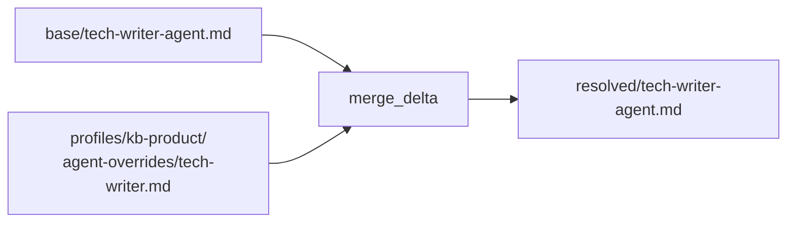

# Wave 4a — Override mechanic core + kb-product pilot — Implementation Plan

> **For agentic workers:** REQUIRED SUB-SKILL: Use superpowers:subagent-driven-development (recommended) or superpowers:executing-plans to implement this plan task-by-task. Steps use checkbox (`- [ ]`) syntax for tracking.

**Goal:** Реализовать механику base + delta merge для агент-промтов, поднять профиль `kb-product` до stable как первого реального consumer'а механики, попутно закрыв 5 W3-minor follow-up'ов.

**Architecture:** Главная новая абстракция — `scripts/_resolve_agents.py` (Python helper). Читает базовые prompts из `.claude/plugins/project/agents/<role>-agent.md` + per-profile overrides из `docs/overlays/profiles/<name>/agent-overrides/<role>.md`, мерджит по правилам base + delta (frontmatter merge, секции `## H` full replace, `{{super}}` placeholder для extending), эмиттит resolved prompts в working tree. Resolver вызывается из `apply-overlay.sh` через JSON ops plan (новый op `resolve_agents` в `_apply_profile.py`). Validator M11 (5 sub-checks) ловит broken overrides до commit'а через `check.sh --fast`. Backwards compat: профили без `agent_overrides:` в manifest — no-op (resolve_agents step не emit'ится); schema_version=1 без bump (additive поле).

**Tech Stack:** Bash 3.2+ (macOS compat), Python 3.8+ (typing, dataclasses, pathlib, yaml, json, re), git 2.x, Gramax markdown + YAML frontmatter, mermaid в docs.

**Spec:** `docs/superpowers/specs/2026-05-07-wave-4a-design.md` (включая §14 refinements after RES-410)

**Research:** `docs/research/2026-05-07-override-mechanics.md` (7 систем + Jinja2/Helm/Kustomize)

**Phase plan + dep граф:**

```
Phase 0 (T1-T3):  W3-minors                          [T1 || T2; T3 после T1]
   ↓
Phase 1 (T4-T6):  RES-410 (done) + BA-411 + BA-412   [T4 done; T5 sequential; T6 параллельно T5]
   ↓
Phase 2 (T7-T9):  SA-420 + SA-421 + SA-422           [T7 → T8; T9 после T6+T8]
   ↓
Phase 3 (T10-T14): DEV core overrides                 [sequential]
   ↓
Phase 4 (T15-T17): DEV kb-product pilot               [sequential]
   ↓
Phase 6 (T18-T21): docs + lessons + smoke             [T18 || T19 → T20 → T21]
```

**Total: 21 задача, 6 фаз. Medium budget (~20-25 задач). Phase 5 (init UX) отложен в W4b.**

---

## File Structure

### Создаваемые файлы

| Путь | Назначение | Задача |
|------|------------|--------|
| `scripts/_resolve_agents.py` | Python helper: base + delta merge resolver, эмиттит resolved prompts | T10 |
| `scripts/test-_resolve-agents.sh` | Bash test harness для unit-тестов merge_delta + frontmatter merge | T10 |
| `docs/overlays/profiles/kb-team/agent-overrides/tech-writer.md` | Demo override (proof-of-concept на stable профиле) | T14 |
| `docs/overlays/profiles/kb-product/doc-root.yaml` | Properties схема для customer docs | T15 |
| `docs/overlays/profiles/kb-product/content-scaffold/_index.md` | Корневой index с дашбордом | T15 |
| `docs/overlays/profiles/kb-product/content-scaffold/getting-started/_index.md` | Раздел onboarding | T15 |
| `docs/overlays/profiles/kb-product/content-scaffold/guides/_index.md` | Раздел how-to guides | T15 |
| `docs/overlays/profiles/kb-product/content-scaffold/reference/_index.md` | Раздел reference | T15 |
| `docs/overlays/profiles/kb-product/content-scaffold/troubleshooting/_index.md` | Раздел troubleshooting | T15 |
| `docs/overlays/profiles/kb-product/agent-overrides/tech-writer.md` | Customer-facing tech-writer override | T16 |
| `examples/kb-product-example/` (full tree) | Post-init snapshot kb-product профиля | T17 |
| `content/00-project/adr/ADR-XXX-agent-overrides.md` | ADR фиксирует base + delta merge выбор | T7 |
| `content/30-requirements/functional/req-override-mechanic.md` | BRQ override mechanic + AC | T5 |
| `content/30-requirements/profile-kb-product.md` | Короткий BRQ профиля kb-product | T6 |
| `content/40-architecture/spec-resolve-agents.md` | Spec `_resolve_agents.py` — CLI, JSON contract, merge algorithm | T8 |
| `content/40-architecture/spec-kb-product-profile.md` | Spec kb-product (manifest + scaffold + overrides) | T9 |

### Модифицируемые файлы

| Путь | Что | Задача |
|------|-----|--------|
| `scripts/_apply_profile.py` | P0: `load_manifest` raise вместо sys.exit; multiline reason guard; убрать unused `profile_dir` param. P3: emit resolve_agents step в JSON plan | T1, T3, T11 |
| `scripts/apply-overlay.sh` | P0: убрать лишний python3 invocation для ops_count; quote `init_flag` через array. P3: `do_resolve_agents` функция | T2, T12 |
| `scripts/validate-profile.py` | M11: 5 sub-checks (base exists, source path, extends match, role не disabled, super-без-base) | T13 |
| `scripts/test-validate-profile.sh` | + ассерты M11.1..M11.5 | T13 |
| `scripts/test-template.sh` | + ассерты T-W4a-P3-demo (kb-team override applied) + T-W4a-P4-* (kb-product end-to-end) | T14, T17 |
| `docs/overlays/profiles/kb-product/manifest.yaml` | Enrichment: status: stable, content_scaffold path, operations, agent_overrides, audience | T15 |
| `docs/architecture-overview.md` | Append раздел «Agent overrides» с mermaid диаграммой resolution | T18 |
| `docs/troubleshooting.md` | Append override edge-cases (FAQ-стиль): heading match, M11 errors, кэш промтов | T19 |
| `docs/lessons-learned.md` | Append «Wave 4a итог» запись | T20 |

---

## Phase 0: W3-minors (tech-debt closure)

Цель: закрыть 3 follow-up'а из Wave 3 памяти. T1 и T2 параллельны (разные файлы); T3 — sequential после T1.

### Task 1: `_apply_profile.py.load_manifest` raise вместо sys.exit + multiline reason guard

**Files:**
- Modify: `scripts/_apply_profile.py` — функции `load_manifest`, `compute_verdict`, `main`
- Test: ручной smoke + integration через `test-template.sh` (regression-only)

**Why:** W3 Minor follow-up. `sys.exit(1)` в `load_manifest` делает функцию untestable как module. Замена на raise + catch в `main` — стандартная Python convention. Multiline `reason` в manifest YAML может содержать `\n`, что ломает TSV separator `\x1f` в emit'е.

- [ ] **Step 1.1: Изучить текущую сигнатуру**

Прочитать `scripts/_apply_profile.py` функции `load_manifest`, `compute_verdict`, `main`. Найти все места `sys.exit(1)`.

- [ ] **Step 1.2: Добавить exception class в начало файла**

В `scripts/_apply_profile.py` после `from pathlib import Path`:

```python
class ManifestError(Exception):
    """Manifest load/parse error — caller should catch and exit cleanly."""
```

- [ ] **Step 1.3: Заменить sys.exit на raise в load_manifest**

Найти `sys.exit(1)` в функции `load_manifest`. Заменить на `raise ManifestError(...)` с тем же сообщением.

Пример (адаптировать под текущий код):

```python
def load_manifest(profile_dir: Path) -> dict:
    manifest_path = profile_dir / "manifest.yaml"
    if not manifest_path.exists():
        raise ManifestError(f"manifest.yaml not found in {profile_dir}")
    try:
        return yaml.safe_load(manifest_path.read_text())
    except yaml.YAMLError as e:
        raise ManifestError(f"manifest.yaml: parse error — {e}")
```

- [ ] **Step 1.4: Добавить strip newlines guard в compute_verdict**

В функции `compute_verdict` (или там где emit'ится `reason` field): перед записью в plan — `reason = (op.get("reason") or "").replace("\n", " ").replace("\r", " ").strip()`. Добавить inline-комментарий: `# Strip newlines: multiline reason ломает \x1f TSV separator в bash consume`.

- [ ] **Step 1.5: Убрать unused `profile_dir` параметр в compute_verdict**

Если `compute_verdict` имеет параметр `profile_dir` (резерв из W3-T6, не используется) — убрать его из сигнатуры и call-sites.

- [ ] **Step 1.6: Добавить try/except в main**

В функции `main()`:

```python
def main() -> int:
    args = parse_args()
    try:
        manifest = load_manifest(args.profile_dir)
    except ManifestError as e:
        print(f"error: {e}", file=sys.stderr)
        return 1
    # ... остальная логика
    return 0
```

- [ ] **Step 1.7: Smoke check**

Run: `bash scripts/check.sh --fast`
Expected: PASS (validate-content + validate-profile зелёные).

Run: `bash scripts/test-template.sh`
Expected: 79 ассертов зелёные (regression-only).

- [ ] **Step 1.8: Commit**

```bash
git add scripts/_apply_profile.py
git commit -m "refactor(apply-profile): ManifestError exception вместо sys.exit + strip newlines guard [W4a-T1]"
```

---

### Task 2: `apply-overlay.sh` — ops_count optimize + quote init_flag

**Files:**
- Modify: `scripts/apply-overlay.sh` — секция парсинга PLAN + invocation `_apply_profile.py`
- Test: `bash scripts/test-template.sh` (regression-only)

**Why:** W3 Minor follow-ups: лишний python3 invocation для подсчёта ops (можно emit в JSON top-level field из `_apply_profile.py`); `$init_flag` без quote (shellcheck SC2086 + correctness при пробелах).

- [ ] **Step 2.1: В `_apply_profile.py` — emit ops_count в JSON top-level**

В функции `main` или там где формируется `plan_dict`, добавить поле `"ops_count": len(plan_dict["ops"])`:

```python
plan = {
    "profile": manifest["name"],
    "init": args.init,
    "ops_count": len(ops),  # NEW: убирает лишний python invocation в bash
    "ops": ops,
}
print(json.dumps(plan))
```

- [ ] **Step 2.2: В `apply-overlay.sh` — заменить `python3 -c '...len...'` на `jq` или single python**

Найти строки в `apply-overlay.sh` где вычисляется `ops_count`:

```bash
# Старое (W3):
OPS_COUNT=$(echo "$PLAN" | python3 -c 'import sys, json; print(len(json.load(sys.stdin)["ops"]))')
```

Заменить на:

```bash
# Новое (W4a-T2): ops_count emit'ится helper'ом
OPS_COUNT=$(echo "$PLAN" | python3 -c 'import sys, json; print(json.load(sys.stdin)["ops_count"])')
```

NB: оставляем один python invocation для парсинга (jq не везде установлен; python3 уже dependency).

- [ ] **Step 2.3: Заменить `$init_flag` на array `init_args`**

Найти строки в `apply-overlay.sh` где вызывается `_apply_profile.py` с `$init_flag`:

```bash
# Старое:
local init_flag=""
if [[ "$INIT_MODE" == "1" ]]; then
    init_flag="--init"
fi
PLAN=$(python3 scripts/_apply_profile.py "$PROFILE_DIR" $init_flag) || exit 1
```

Заменить на:

```bash
# Новое (W4a-T2): array вместо unquoted string (SC2086)
local init_args=()
if [[ "$INIT_MODE" == "1" ]]; then
    init_args+=("--init")
fi
PLAN=$(python3 scripts/_apply_profile.py "$PROFILE_DIR" "${init_args[@]}") || exit 1
```

- [ ] **Step 2.4: Run regression**

Run: `bash scripts/test-template.sh`
Expected: 79 ассертов зелёные.

Run: `bash scripts/check.sh --full`
Expected: 135 ассертов зелёные.

- [ ] **Step 2.5: Commit**

```bash
git add scripts/_apply_profile.py scripts/apply-overlay.sh
git commit -m "fix(apply-overlay): emit ops_count в JSON + quote init_flag через array [W4a-T2]"
```

---

### Task 3: `_apply_profile.py` — финальная очистка после T1

**Files:**
- Modify: `scripts/_apply_profile.py` — review всех use sites раннее использовавшегося `profile_dir` параметра
- Test: regression-only

**Why:** Финальный sanity-check после T1: всех потомков функций, которые получали unused parameter, удостоверить отсутствие. Tests stay green.

- [ ] **Step 3.1: Grep для unused references**

Run:
```bash
grep -n "profile_dir" scripts/_apply_profile.py
```

Expected: только использования где `profile_dir` реально нужен (load_manifest, manifest path resolution). Если есть место где параметр объявлен но не используется — fix.

- [ ] **Step 3.2: Run regression**

Run: `bash scripts/check.sh --full`
Expected: 135 ассертов зелёные.

- [ ] **Step 3.3: Commit (если были правки)**

```bash
git add scripts/_apply_profile.py
git commit -m "chore(apply-profile): cleanup unused profile_dir references [W4a-T3]"
```

Если T3 не нашёл правок — task пропускается (no commit).

---

## Phase 1: Research + BA artifacts

Цель: research завершён до старта плана (RES-410); BA пишет два короткие BRQ — один по override mechanic (~50 строк), один по kb-product профилю (~30 строк). Оба используют subagent `/ba` (методология BA + Gramax-каталог).

### Task 4: RES-410 — research артефакт (ALREADY DONE)

**Files:**
- Existing: `docs/research/2026-05-07-override-mechanics.md` (319 строк, 7 систем + 3 inheritance pattern)

**Status:** ✅ Done before plan.

- [x] **Step 4.1:** Research завершён subagent'ом `project:researcher-agent` 2026-05-07; результаты применены в spec §14.

NB: этот task в плане для трассируемости — research реально завершён до writing-plans.

---

### Task 5: BA-411 — BRQ override mechanic

**Files:**
- Create: `content/30-requirements/functional/req-override-mechanic.md`
- Test: `python3 scripts/validate-content.py` зелёный (frontmatter object-нотация, properties по `.doc-root.yaml`)

**Why:** Финализировать функтребования к override mechanic в формате Gramax-статьи: краткий контекст, AC, edge cases. Это input для SA-420 ADR.

- [ ] **Step 5.1: Прочитать текущую структуру `content/30-requirements/`**

Run:
```bash
ls -la /Users/mdemyanov/knowlage/project_template/content/30-requirements/
cat /Users/mdemyanov/knowlage/project_template/content/.doc-root.yaml
```

Найти существующий пример requirement-статьи (если есть) для copy-paste frontmatter.

- [ ] **Step 5.2: Создать `req-override-mechanic.md`**

Создать файл `content/30-requirements/functional/req-override-mechanic.md`:

```markdown
---
properties:
  - name: Тип контента
    value: [Требование]
  - name: Статус
    value: [Approved]
---

# REQ: Override mechanic для агент-промтов

## Контекст

Профили project_template имеют разные ролевые контексты (kb-product — customer-facing docs, methodology — playbook, course — обучение). Базовые промты в `.claude/plugins/project/agents/<role>-agent.md` generic. Без override-механики либо all promts generic (плохо), либо профиль вынужден копировать base в override (drift).

## Функциональные требования

### FR-1: Override через extends

Профиль может объявить override базовой роли через файл `agent-overrides/<role>.md` с YAML frontmatter `extends: <role-name>`.

**AC-1.1:** Если override содержит frontmatter `extends: tech-writer`, resolver распознаёт связь с base `.claude/plugins/project/agents/tech-writer-agent.md`.

**AC-1.2:** Если `extends:` не совпадает с именем роли (или роли не существует) — validator M11 даёт error до commit'а.

### FR-2: Section-level merge

Секция `## Heading` в override **полностью замещает** одноимённую секцию base. Секции base без override наследуются. Секции override без base добавляются в конец.

**AC-2.1:** Heading match — exact (case + whitespace + punctuation чувствительны).

**AC-2.2:** `{{super}}` placeholder в секции override — resolver подставляет содержимое одноимённой секции base.

**AC-2.3:** `{{super}}` в секции, отсутствующей в base — validator M11.5 даёт error.

### FR-3: Frontmatter merge

Scalar-поля override (`description`, `model`) **заменяют** base. List-поля (`tools`, `disallowedTools`, `skills`) — **полностью заменяют** (по образцу Helm для arrays).

**AC-3.1:** Поля без переопределения наследуются из base.

**AC-3.2:** Override может содержать `description: "..."` — кратко что меняет, опционально.

### FR-4: Resolved file marker

Resolved файл начинается с HTML-комментария `<!-- GENERATED ... -->` указывающего источник + команду для regenerate.

**AC-4.1:** Маркер виден в IDE при открытии resolved файла.

**AC-4.2:** Маркер не нарушает Claude Code subagent loading (frontmatter после маркера парсится корректно).

### FR-5: Validation (M11)

`validate-profile.py` M11 проверяет 5 sub-cases:

- M11.1: base prompt существует
- M11.2: override source path существует
- M11.3: `extends:` совпадает с именем роли
- M11.4: роль не disabled в `subagents`
- M11.5: `{{super}}` только в секциях, существующих в base

**AC-5.1:** Каждое M11 error содержит путь к проблемному файлу + предложение fix'а.

## Anti-scope

- ❌ Multiple inheritance (`extends: [a, b]`)
- ❌ Section reordering (`before:` / `after:`)
- ❌ Heading normalization (case-insensitive)
- ❌ Override без base (override как стандалонный prompt)
```

- [ ] **Step 5.3: Validate**

Run: `python3 scripts/validate-content.py`
Expected: PASS (frontmatter object-нотация валидна, properties match `.doc-root.yaml`).

- [ ] **Step 5.4: Commit**

```bash
git add content/30-requirements/functional/req-override-mechanic.md
git commit -m "docs(req): BRQ override mechanic — FR-1..FR-5 + AC [W4a-T5]"
```

---

### Task 6: BA-412 — BRQ профиля kb-product (короткий)

**Files:**
- Create: `content/30-requirements/profile-kb-product.md`
- Test: `python3 scripts/validate-content.py` зелёный

**Why:** Зафиксировать какие папки в content-scaffold, какие core/optional роли, какой override (один — tech-writer для customer docs).

- [ ] **Step 6.1: Создать `profile-kb-product.md`**

Создать файл `content/30-requirements/profile-kb-product.md`:

```markdown
---
properties:
  - name: Тип контента
    value: [Требование]
  - name: Статус
    value: [Approved]
---

# Профиль kb-product — функтребования

## Контекст

Профиль `kb-product` предназначен для customer-facing документации продукта (отличается от `kb-team` — internal team KB). После init получаем структуру для onboarding конечных пользователей и администраторов.

## Структурные требования

### content-scaffold/

```
content-scaffold/
├── _index.md
├── getting-started/_index.md
├── guides/_index.md
├── reference/_index.md
└── troubleshooting/_index.md
```

Корневой `_index.md` — без `properties:` блока (правило Gramax). Подразделы — без статей, только index.

### subagents

| Роль | Status | Обоснование |
|------|--------|-------------|
| pm | core | always-on |
| tech-writer | core | primary writer для customer docs |
| researcher | optional | для подготовки release notes/глоссария |
| ba | optional | если нужны user requirements |
| compliance | optional | если продукт под compliance-надзором |
| sa, dev, devops, qa, devsecops | disabled | внутренние роли — не нужны для customer-facing |

### agent_overrides

Один override: `tech-writer.md` — customer-facing focus (см. AC ниже).

### .doc-root.yaml properties

| Property | Required | Values |
|----------|----------|--------|
| Тип контента | yes | Getting Started, Guide, Reference, Troubleshooting, Release Notes |
| Версия продукта | yes | string (e.g., "v1.2.3") |
| Аудитория | no | Конечный пользователь, Администратор, Разработчик-интегратор |

## Override AC: tech-writer для kb-product

**AC-tw-1:** Resolved tech-writer prompt содержит секцию «## Роль» с явным «Customer-facing tech writer».

**AC-tw-2:** Resolved prompt содержит секцию «## Domain» с правилами customer journey, screenshot conventions, version pinning.

**AC-tw-3:** Секции `## Constraints` и `## Tools` наследуются из base без изменений.

## Operations

После init kb-product отсутствуют папки delivery-структуры (00-project, 30-requirements, 40-architecture, 60-implementation, 70-operations). См. spec §4.5.
```

- [ ] **Step 6.2: Validate**

Run: `python3 scripts/validate-content.py`
Expected: PASS.

- [ ] **Step 6.3: Commit**

```bash
git add content/30-requirements/profile-kb-product.md
git commit -m "docs(req): BRQ профиля kb-product — структура, subagents, override AC [W4a-T6]"
```

---

## Phase 2: SA artifacts (ADR + 2 specs)

Цель: SA-420 ADR (фиксирует архитектурный выбор base + delta merge), SA-421 spec для `_resolve_agents.py`, SA-422 spec для kb-product. Все три — markdown в `content/00-project/adr/` и `content/40-architecture/`.

### Task 7: SA-420 — ADR agent-overrides

**Files:**
- Create: `content/00-project/adr/ADR-XXX-agent-overrides.md` (XXX — следующий номер последовательности)
- Test: `python3 scripts/validate-content.py`

**Why:** Зафиксировать architectural decision base + delta merge для аудита и trace через git history. Альтернативы рассмотрены: full replace (теряем общую часть), additive concatenation (как Cursor), strategic merge (как Kustomize).

- [ ] **Step 7.1: Найти следующий номер ADR**

Run:
```bash
ls /Users/mdemyanov/knowlage/project_template/content/00-project/adr/
```

Найти максимальный номер `ADR-NNN-*.md` и взять следующий (например, если максимум ADR-007, то новый — ADR-008).

- [ ] **Step 7.2: Создать ADR**

Создать файл `content/00-project/adr/ADR-NNN-agent-overrides.md` (заменить NNN на найденный):

```markdown
---
properties:
  - name: Тип контента
    value: [ADR]
  - name: Статус
    value: [Принято]
---

# ADR-NNN: Agent overrides — base + delta merge

## Контекст

Wave 4a реализует механику per-profile customization промтов агентов. Базовые промты лежат в `.claude/plugins/project/agents/<role>-agent.md`, профили могут override'ить их через `docs/overlays/profiles/<name>/agent-overrides/<role>.md`.

Research (`docs/research/2026-05-07-override-mechanics.md`) показал: ни один AI-tool не делает section-level merge через `extends:`. Cursor/Cline/Copilot — additive concatenation; Claude Code subagents — full-file replace по scope priority. Ближайший зрелый аналог — Jinja2 ``/``.

## Решение

**Base + delta merge** с следующими правилами:

### Frontmatter merge

- Override содержит `extends: <role-name>` (обязательное; mismatch → M11 error)
- Scalar-поля override (`description`, `model`, `name`) полностью заменяют base
- List-поля override (`tools`, `disallowedTools`, `skills`) полностью заменяют base (Helm-style для arrays)
- Поля без override наследуются дословно
- Optional `description` в override — для аудита через git log

### Body (markdown секции)

- Секция = `## Heading` до следующего `## Heading` или EOF
- Heading match — exact (case + whitespace + punctuation чувствительны)
- Секция `## X` в override полностью заменяет одноимённую секцию base
- Секции base без override наследуются дословно
- Секции override без base добавляются в конец
- `{{super}}` placeholder (Jinja2-аналог) — resolver подставляет содержимое одноимённой секции base; позволяет extending без копирования

### Resolved file marker

Resolved файл начинается с `<!-- GENERATED by scripts/_resolve_agents.py — do not edit. Source: ... -->`.

## Альтернативы

| Альтернатива | Почему отвергнута |
|--------------|-------------------|
| Full replace (как Claude Code subagents) | Теряем общую часть; profile должен дублировать всю base |
| Additive concatenation (как Cursor/Cline) | LLM resolver'ит на inference-time → недетерминированно; нет валидации |
| Strategic merge / JSON6902 (Kustomize) | Overkill; markdown секции мерджатся проще чем YAML resources |
| Multiple inheritance (`extends: [a, b]`) | Нет use case в W4a; усложняет resolver и cycle detection |
| Heading normalization (case-insensitive) | Magic без явного контракта; exact match предсказуемее |

## Последствия

- **Новый компонент:** `scripts/_resolve_agents.py` (~150-200 строк Python; см. spec `content/40-architecture/spec-resolve-agents.md`)
- **Новый validator:** M11 в `validate-profile.py` (5 sub-checks)
- **schema_version:** остаётся 1 (`agent_overrides:` — additive поле в manifest)
- **Backwards compat:** профили без `agent_overrides:` — no-op (resolve_agents step не emit'ится)
- **Эффект на пользователя:** kb-product получает customer-facing tech-writer; kb-team — enhanced tech-writer; project — без изменений

## Источники

- Research: `docs/research/2026-05-07-override-mechanics.md`
- Spec: `docs/superpowers/specs/2026-05-07-wave-4a-design.md` (§4.1, §4.4, §14)
- Jinja2 inheritance: <https://jinja.palletsprojects.com/en/stable/templates/>
```

- [ ] **Step 7.3: Validate**

Run: `python3 scripts/validate-content.py`
Expected: PASS.

- [ ] **Step 7.4: Commit**

```bash
git add content/00-project/adr/ADR-*-agent-overrides.md
git commit -m "docs(adr): ADR-NNN agent-overrides — base + delta merge [W4a-T7]"
```

---

### Task 8: SA-421 — spec `_resolve_agents.py`

**Files:**
- Create: `content/40-architecture/spec-resolve-agents.md`
- Test: `python3 scripts/validate-content.py`

**Why:** Зафиксировать CLI, JSON contract с `_apply_profile.py`, merge algorithm — input для DEV-430..432.

- [ ] **Step 8.1: Создать spec**

Создать файл `content/40-architecture/spec-resolve-agents.md`:

```markdown
---
properties:
  - name: Тип контента
    value: [Спецификация]
  - name: Статус
    value: [Approved]
---

# Spec: scripts/_resolve_agents.py

## Назначение

Python helper, читает базовые prompts + per-profile overrides, эмиттит resolved prompts в working tree после init/apply-overlay.

## CLI

```
python3 scripts/_resolve_agents.py <profile-dir> --base-dir <base> --target-dir <target>
```

| Параметр | Описание |
|----------|----------|
| `<profile-dir>` | путь к `docs/overlays/profiles/<name>/` (читает `manifest.yaml` + `agent-overrides/`) |
| `--base-dir` | путь к `.claude/plugins/project/agents/` (источник base prompts) |
| `--target-dir` | куда писать resolved prompts (обычно `.claude/plugins/project/agents/` working tree) |

## Алгоритм

```python
def main(profile_dir, base_dir, target_dir):
    manifest = load_manifest(profile_dir)
    overrides = manifest.get("agent_overrides", {})

    for role, status in manifest["subagents"].items():
        if status == "disabled":
            continue
        base_path = base_dir / f"{role}-agent.md"
        if not base_path.exists():
            error(f"base prompt not found for role: {role}")
            return 1

        if role in overrides:
            override_path = profile_dir / overrides[role]["source"]
            resolved = merge_delta(base_path, override_path)
        else:
            resolved = base_path.read_text()

        # Add GENERATED marker
        marker = build_marker(profile_dir, role, override_path if role in overrides else None)
        (target_dir / f"{role}-agent.md").write_text(marker + resolved)

    return 0
```

## Функция `merge_delta(base_path, override_path) -> str`

```python
def merge_delta(base_path: Path, override_path: Path) -> str:
    base_fm, base_body = parse_frontmatter(base_path)
    override_fm, override_body = parse_frontmatter(override_path)

    # Validate extends
    if "extends" not in override_fm:
        raise OverrideError(f"{override_path}: missing 'extends' frontmatter field")

    # Frontmatter merge: override scalar/list поля полностью заменяют base
    merged_fm = {**base_fm, **override_fm}
    del merged_fm["extends"]  # extends не нужен в resolved

    # Body merge: section-level
    base_sections = parse_sections(base_body)
    override_sections = parse_sections(override_body)

    merged_sections = []
    seen = set()

    # Сначала base sections в их порядке (с возможным override через override_sections)
    for name, content in base_sections:
        if name in override_sections:
            override_content = override_sections[name]
            # Подставить {{super}} если есть
            if "{{super}}" in override_content:
                override_content = override_content.replace("{{super}}", content.strip())
            merged_sections.append((name, override_content))
        else:
            merged_sections.append((name, content))
        seen.add(name)

    # Затем override sections, отсутствующие в base — добавляются в конец
    for name, content in override_sections.items():
        if name not in seen:
            merged_sections.append((name, content))

    return serialize_frontmatter(merged_fm) + "\n\n" + serialize_sections(merged_sections)
```

## JSON contract с `_apply_profile.py`

`_apply_profile.py` эмиттит в JSON ops plan:

```json
{
  "op": "resolve_agents",
  "source": "agent-overrides/",
  "target": ".claude/plugins/project/agents/"
}
```

`apply-overlay.sh` распознаёт `op: resolve_agents` → вызывает `_resolve_agents.py` после `do_add` (когда target dir уже существует).

`_apply_profile.py` НЕ парсит overrides сам — только проверяет наличие `agent_overrides:` в manifest и emit'ит step.

## Resolved file marker

```markdown
<!-- GENERATED by scripts/_resolve_agents.py — do not edit.
     Source: base + docs/overlays/profiles/<profile>/agent-overrides/<role>.md
     Regenerate: bash scripts/apply-overlay.sh --profile <profile> -->
```

Если override отсутствует — маркер указывает только base:

```markdown
<!-- GENERATED by scripts/_resolve_agents.py — do not edit.
     Source: .claude/plugins/project/agents/<role>-agent.md (no override)
     Regenerate: bash scripts/apply-overlay.sh --profile <profile> -->
```

## Error handling

| Ошибка | Поведение |
|--------|-----------|
| Manifest YAML malformed | exit 1 + сообщение через `ManifestError` |
| Override без `extends:` | exit 1 + «{path}: missing 'extends' frontmatter» |
| `extends:` mismatch | exit 1 + «{path}: extends '{X}' but role is '{Y}'» |
| Base prompt отсутствует для активной роли | exit 1 + «base not found: {path}; create base or set subagents.{role}: disabled» |
| `{{super}}` в секции отсутствующей в base | exit 1 + «section '## {name}' uses {{super}} but base has no such section» |
| Target dir не существует | exit 1 (apply-overlay должен был создать через do_add) |

## Зависимости

- Python 3.8+
- PyYAML (опц.; используем shared parser из `_validate_common.py`)
- stdlib: `re` (section parse), `pathlib`, `argparse`, `sys`

## Тесты

См. `scripts/test-_resolve-agents.sh`:

- `merge_delta` корректно мерджит frontmatter (scalar replace + list replace + inheritance)
- `merge_delta`: секция `## X` в override заменяет одноимённую в base
- `merge_delta`: секция в base без override наследуется
- `merge_delta`: секция в override без base добавляется в конец
- `merge_delta`: `{{super}}` подставляется содержимым base-секции
- `merge_delta`: `{{super}}` в секции отсутствующей в base → raise
- `merge_delta`: пустой override (только frontmatter) → body наследуется полностью
- `extends:` mismatch → raise
```

- [ ] **Step 8.2: Validate**

Run: `python3 scripts/validate-content.py`
Expected: PASS.

- [ ] **Step 8.3: Commit**

```bash
git add content/40-architecture/spec-resolve-agents.md
git commit -m "docs(spec): _resolve_agents.py — CLI, JSON contract, merge algorithm [W4a-T8]"
```

---

### Task 9: SA-422 — spec kb-product profile

**Files:**
- Create: `content/40-architecture/spec-kb-product-profile.md`
- Test: `python3 scripts/validate-content.py`

**Why:** Зафиксировать manifest enrichment + scaffold tree + override list для kb-product. Input для DEV-440..442.

- [ ] **Step 9.1: Создать spec**

Создать файл `content/40-architecture/spec-kb-product-profile.md`:

```markdown
---
properties:
  - name: Тип контента
    value: [Спецификация]
  - name: Статус
    value: [Approved]
---

# Spec: профиль kb-product (stable)

## Manifest

`docs/overlays/profiles/kb-product/manifest.yaml`:

```yaml
schema_version: 1
name: kb-product
description: Документация продукта/процесса для внешних читателей
audience: Customer success, технические писатели, продуктовые менеджеры
status: stable

subagents:
  pm: core
  tech-writer: core
  researcher: optional
  ba: optional
  compliance: optional
  sa: disabled
  dev: disabled
  devops: disabled
  qa: disabled
  devsecops: disabled

pipelines: {}

content_scaffold: content-scaffold/
doc_root: doc-root.yaml

operations:
  - op: delete
    target: content/00-project/
    reason: "kb-product не использует delivery-структуру"
  - op: delete
    target: content/30-requirements/
    reason: "customer docs не имеют функциональных требований"
  - op: delete
    target: content/40-architecture/
    reason: "архитектура продукта не публикуется наружу"
  - op: delete
    target: content/60-implementation/
    reason: "нет реализации"
  - op: delete
    target: content/70-operations/
    reason: "operations не для внешнего читателя"
  - op: add
    source: content-scaffold/
    target: content/
    reason: "kb-product scaffold (getting-started, guides, reference, troubleshooting)"
  - op: replace
    source: doc-root.yaml
    target: content/.doc-root.yaml
    reason: "kb-product properties (Тип контента, Версия продукта, Аудитория)"

agent_overrides:
  tech-writer:
    source: agent-overrides/tech-writer.md
    role_status: core

init_prompts: []

compatible_stacks: []
maintainer: project_template
```

## Content scaffold tree

```
docs/overlays/profiles/kb-product/content-scaffold/
├── _index.md                       # корневой index с дашбордом
├── getting-started/
│   └── _index.md
├── guides/
│   └── _index.md
├── reference/
│   └── _index.md
└── troubleshooting/
    └── _index.md
```

Все `_index.md` — без `properties:` блока (правило Gramax).

## doc-root.yaml

```yaml
title: "{{PROJECT_NAME}} — Документация"
properties:
  - name: Тип контента
    type: enum
    values: [Getting Started, Guide, Reference, Troubleshooting, Release Notes]
    required: true
  - name: Версия продукта
    type: string
    placeholder: "v1.2.3"
    required: true
  - name: Аудитория
    type: enum
    values: [Конечный пользователь, Администратор, Разработчик-интегратор]
    required: false
```

## Override: tech-writer

`docs/overlays/profiles/kb-product/agent-overrides/tech-writer.md`:

```markdown
---
extends: tech-writer
description: Технический писатель — документация продукта для внешних читателей
---

## Роль

Customer-facing tech writer. Пишешь документацию **для конечных пользователей и администраторов продукта**, не для команды разработки.

Принципы:
- Не используешь жаргон команды (sprints, tickets, PRs)
- Версионируешь каждую статью под версию продукта
- Каждый guide начинается с «Что вы получите в итоге»

## Domain

- **Customer journey ≠ internal flow.** Структура от задачи пользователя, не от структуры кода.
- **Screenshot conventions:** один скриншот = одна задача; обводка важной кнопки красным; pixel-perfect версия UI.
- **Version pinning:** каждая статья указывает «применимо к версии vX.Y.Z+».
- **Reference material:** API spec / CLI reference генерится автоматически — не пиши руками.
- **Tone:** дружелюбный, но не фамильярный; "вы" а не "ты".
```

NB: остальные секции (Constraints, Tools) наследуются из base.

## Example tree

`examples/kb-product-example/`:

```
README.md                                   # «Это пример проекта на профиле kb-product»
.doc-root.yaml
CLAUDE.md
AGENTS.md
README.md                                   # project-уровень
content/
├── _index.md
├── getting-started/_index.md
├── guides/_index.md
├── reference/_index.md
└── troubleshooting/_index.md
.claude/plugins/project/agents/
└── tech-writer-agent.md                    # resolved version с override applied
```

## AC integration tests

- `T-W4a-P4-init`: `bash scripts/init.sh --profile kb-product "TestProduct" "TP" "desc" "test@x.com"` exit 0
- `T-W4a-P4-scaffold`: `[ -f content/getting-started/_index.md ]` && (для всех 4 разделов)
- `T-W4a-P4-override`: `grep "Customer-facing" .claude/plugins/project/agents/tech-writer-agent.md`
- `T-W4a-P4-noise`: `[ ! -d content/00-project ]` && `[ ! -d content/30-requirements ]` && (для всех 5 удалённых)
```

- [ ] **Step 9.2: Validate**

Run: `python3 scripts/validate-content.py`
Expected: PASS.

- [ ] **Step 9.3: Commit**

```bash
git add content/40-architecture/spec-kb-product-profile.md
git commit -m "docs(spec): kb-product profile — manifest + scaffold + override [W4a-T9]"
```

---

## Phase 3: DEV core overrides

Цель: реализовать resolver + integration в существующих скриптах + validator M11 + demo override на kb-team. Sequential — каждый task зависит от предыдущего.

### Task 10: `_resolve_agents.py` skeleton + base + delta merge logic

**Files:**
- Create: `scripts/_resolve_agents.py`
- Create: `scripts/test-_resolve-agents.sh` (bash test harness)
- Test: unit-тесты через test-_resolve-agents.sh

**Why:** Главный новый компонент. Standalone Python helper, тестируемый изолированно. Spec в `content/40-architecture/spec-resolve-agents.md`.

- [ ] **Step 10.1: Написать failing test для merge_delta — frontmatter scalar replace**

Создать `scripts/test-_resolve-agents.sh`:

```bash
#!/usr/bin/env bash
# Unit tests for scripts/_resolve_agents.py merge_delta function.
set -euo pipefail

ROOT="$(cd "$(dirname "$0")/.." && pwd)"
TMPDIR="$(mktemp -d)"
trap "rm -rf $TMPDIR" EXIT

assert_equal() {
    local actual="$1"
    local expected="$2"
    local msg="$3"
    if [[ "$actual" != "$expected" ]]; then
        echo "FAIL: $msg"
        echo "  actual:   $actual"
        echo "  expected: $expected"
        exit 1
    fi
}

assert_contains() {
    local haystack="$1"
    local needle="$2"
    local msg="$3"
    if ! grep -qF "$needle" <<< "$haystack"; then
        echo "FAIL: $msg"
        echo "  haystack: $haystack"
        echo "  needle:   $needle"
        exit 1
    fi
}

# T1: frontmatter scalar replace
echo "▶ T1: frontmatter scalar replace"
cat > "$TMPDIR/base.md" <<'EOF'
---
name: tech-writer
description: Generic writer
model: opus
---

## Роль
Generic.
EOF

cat > "$TMPDIR/override.md" <<'EOF'
---
extends: tech-writer
description: Customer-facing writer
---

## Роль
Customer-facing.
EOF

RESULT=$(python3 "$ROOT/scripts/_resolve_agents.py" --merge-only "$TMPDIR/base.md" "$TMPDIR/override.md")
assert_contains "$RESULT" "description: Customer-facing writer" "T1: description should be replaced"
assert_contains "$RESULT" "model: opus" "T1: model should inherit from base"
assert_contains "$RESULT" "name: tech-writer" "T1: name should inherit from base"
assert_contains "$RESULT" "Customer-facing." "T1: section content should be from override"
echo "  ✓"

echo "✓ All tests passed"
```

Сделать executable:
```bash
chmod +x scripts/test-_resolve-agents.sh
```

NB: `--merge-only` режим в helper'е (для unit-тестов; main flow без него).

- [ ] **Step 10.2: Run test — должен fail (helper ещё не существует)**

Run: `bash scripts/test-_resolve-agents.sh`
Expected: FAIL — `scripts/_resolve_agents.py: No such file or directory` или `unrecognized arguments: --merge-only`.

- [ ] **Step 10.3: Написать `_resolve_agents.py` skeleton**

Создать файл `scripts/_resolve_agents.py`:

```python
#!/usr/bin/env python3
"""_resolve_agents.py — base + delta merge resolver for agent prompts.

Reads base prompts from .claude/plugins/project/agents/<role>-agent.md and
profile overrides from <profile-dir>/agent-overrides/<role>.md, merges them
according to base + delta rules (frontmatter merge, section-level body merge
with {{super}} placeholder), writes resolved prompts to target-dir.

CLI:
    python3 scripts/_resolve_agents.py <profile-dir> --base-dir <base> --target-dir <target>
    python3 scripts/_resolve_agents.py --merge-only <base.md> <override.md>  # for unit tests

See: docs/superpowers/specs/2026-05-07-wave-4a-design.md §4.1
     content/40-architecture/spec-resolve-agents.md
"""
from __future__ import annotations

import argparse
import re
import sys
from dataclasses import dataclass
from pathlib import Path
from typing import Optional

sys.path.insert(0, str(Path(__file__).parent))

try:
    import yaml
except ImportError:
    print("error: PyYAML is required (pip install pyyaml)", file=sys.stderr)
    sys.exit(2)


class OverrideError(Exception):
    """Override file is malformed or violates contract."""


@dataclass
class Frontmatter:
    """Parsed frontmatter + body."""
    fm: dict
    body: str


FRONTMATTER_RE = re.compile(r"^---\n(.*?)\n---\n(.*)$", re.DOTALL)


def parse_frontmatter(path: Path) -> Frontmatter:
    """Parse YAML frontmatter + markdown body. No frontmatter → fm={}, body=text."""
    text = path.read_text(encoding="utf-8")
    match = FRONTMATTER_RE.match(text)
    if match:
        fm_text, body = match.group(1), match.group(2)
        fm = yaml.safe_load(fm_text) or {}
    else:
        fm, body = {}, text
    return Frontmatter(fm=fm, body=body)


SECTION_RE = re.compile(r"^## (.+)$", re.MULTILINE)


def parse_sections(body: str) -> list[tuple[str, str]]:
    """Split body into (heading, content) pairs. Preamble before first ## → ('', preamble).

    Returns list (preserving order); content includes the heading line.
    """
    parts: list[tuple[str, str]] = []
    matches = list(SECTION_RE.finditer(body))
    if not matches:
        return [("", body)]

    # Preamble before first heading
    if matches[0].start() > 0:
        parts.append(("", body[: matches[0].start()].rstrip() + "\n"))

    for i, match in enumerate(matches):
        heading = match.group(1).strip()
        start = match.start()
        end = matches[i + 1].start() if i + 1 < len(matches) else len(body)
        content = body[start:end].rstrip() + "\n"
        parts.append((heading, content))

    return parts


def merge_delta(base_path: Path, override_path: Path) -> str:
    """Merge override into base according to W4a delta rules.

    Returns merged file as string (frontmatter + body, no GENERATED marker).
    """
    base = parse_frontmatter(base_path)
    override = parse_frontmatter(override_path)

    # Validate extends
    if "extends" not in override.fm:
        raise OverrideError(
            f"{override_path}: missing required 'extends' frontmatter field"
        )

    # Frontmatter merge: override scalars/lists fully replace base; missing → inherit
    merged_fm = {**base.fm, **override.fm}
    merged_fm.pop("extends", None)  # extends not needed in resolved

    # Body merge: section-level
    base_sections = parse_sections(base.body)
    override_sections_dict = {h: c for h, c in parse_sections(override.body) if h}
    base_section_names = {h for h, _ in base_sections if h}

    # Validate {{super}} usage in override sections
    for name, content in override_sections_dict.items():
        if "{{super}}" in content and name not in base_section_names:
            raise OverrideError(
                f"{override_path}: section '## {name}' uses {{{{super}}}} but base has no such section"
            )

    merged_body_parts: list[str] = []
    handled: set[str] = set()

    for heading, content in base_sections:
        if heading == "":
            # Preamble — inherit if override has no preamble
            override_preamble = next(
                (c for h, c in parse_sections(override.body) if h == ""), None
            )
            merged_body_parts.append(override_preamble if override_preamble else content)
        elif heading in override_sections_dict:
            override_content = override_sections_dict[heading]
            # Substitute {{super}} with base section content (without ## heading)
            base_section_content = "\n".join(content.split("\n")[1:]).strip()
            override_content = override_content.replace("{{super}}", base_section_content)
            merged_body_parts.append(override_content)
            handled.add(heading)
        else:
            merged_body_parts.append(content)

    # Append override sections not in base
    for heading, content in override_sections_dict.items():
        if heading not in {h for h, _ in base_sections}:
            merged_body_parts.append(content)

    merged_body = "\n".join(merged_body_parts).strip() + "\n"
    fm_str = yaml.safe_dump(merged_fm, sort_keys=False, allow_unicode=True).strip()
    return f"---\n{fm_str}\n---\n\n{merged_body}"


def build_marker(profile_name: str, role: str, override_path: Optional[Path]) -> str:
    """GENERATED marker prepended to resolved files."""
    if override_path is None:
        source = f".claude/plugins/project/agents/{role}-agent.md (no override)"
    else:
        source = f"base + docs/overlays/profiles/{profile_name}/agent-overrides/{role}.md"
    return (
        f"<!-- GENERATED by scripts/_resolve_agents.py — do not edit.\n"
        f"     Source: {source}\n"
        f"     Regenerate: bash scripts/apply-overlay.sh --profile {profile_name} -->\n\n"
    )


def main() -> int:
    parser = argparse.ArgumentParser()
    parser.add_argument("profile_dir_or_base", nargs="?")
    parser.add_argument("override_path", nargs="?")
    parser.add_argument("--base-dir", type=Path)
    parser.add_argument("--target-dir", type=Path)
    parser.add_argument("--merge-only", action="store_true",
                        help="Test mode: print merge_delta(base, override) to stdout")
    args = parser.parse_args()

    if args.merge_only:
        if not args.profile_dir_or_base or not args.override_path:
            print("error: --merge-only requires <base.md> <override.md>", file=sys.stderr)
            return 1
        try:
            result = merge_delta(Path(args.profile_dir_or_base), Path(args.override_path))
        except OverrideError as e:
            print(f"error: {e}", file=sys.stderr)
            return 1
        print(result)
        return 0

    # Main flow: resolve all roles for profile
    if not args.profile_dir_or_base or not args.base_dir or not args.target_dir:
        print("error: requires <profile-dir> --base-dir <dir> --target-dir <dir>", file=sys.stderr)
        return 1

    profile_dir = Path(args.profile_dir_or_base)
    manifest_path = profile_dir / "manifest.yaml"
    if not manifest_path.exists():
        print(f"error: manifest.yaml not found in {profile_dir}", file=sys.stderr)
        return 1

    manifest = yaml.safe_load(manifest_path.read_text())
    overrides = manifest.get("agent_overrides", {})
    profile_name = manifest.get("name", profile_dir.name)

    args.target_dir.mkdir(parents=True, exist_ok=True)

    for role, status in manifest.get("subagents", {}).items():
        if status == "disabled":
            continue
        base_path = args.base_dir / f"{role}-agent.md"
        if not base_path.exists():
            print(f"error: base prompt not found for role '{role}': {base_path}",
                  file=sys.stderr)
            return 1

        if role in overrides:
            override_path = profile_dir / overrides[role]["source"]
            if not override_path.exists():
                print(f"error: override not found: {override_path}", file=sys.stderr)
                return 1
            try:
                resolved = merge_delta(base_path, override_path)
            except OverrideError as e:
                print(f"error: {e}", file=sys.stderr)
                return 1
            marker = build_marker(profile_name, role, override_path)
        else:
            resolved = base_path.read_text()
            marker = build_marker(profile_name, role, None)

        target_path = args.target_dir / f"{role}-agent.md"
        target_path.write_text(marker + resolved)

    return 0


if __name__ == "__main__":
    sys.exit(main())
```

Сделать executable:
```bash
chmod +x scripts/_resolve_agents.py
```

- [ ] **Step 10.4: Run T1 — должен PASS**

Run: `bash scripts/test-_resolve-agents.sh`
Expected: T1 PASS.

- [ ] **Step 10.5: Расширить test-suite — T2..T8**

Добавить в `scripts/test-_resolve-agents.sh` после T1, перед `echo "✓ All tests passed"`:

```bash
# T2: section in override replaces base section
echo "▶ T2: section override replace"
cat > "$TMPDIR/base.md" <<'EOF'
---
name: r
---

## Роль
Generic role.

## Constraints
Generic constraints.
EOF

cat > "$TMPDIR/override.md" <<'EOF'
---
extends: r
---

## Роль
Specific role.
EOF

RESULT=$(python3 "$ROOT/scripts/_resolve_agents.py" --merge-only "$TMPDIR/base.md" "$TMPDIR/override.md")
assert_contains "$RESULT" "Specific role." "T2: override section should replace"
assert_contains "$RESULT" "Generic constraints." "T2: untouched section should inherit"
echo "  ✓"

# T3: section in override but not in base — appended
echo "▶ T3: section append"
cat > "$TMPDIR/override.md" <<'EOF'
---
extends: r
---

## Domain
Customer-facing only.
EOF

RESULT=$(python3 "$ROOT/scripts/_resolve_agents.py" --merge-only "$TMPDIR/base.md" "$TMPDIR/override.md")
assert_contains "$RESULT" "Generic role." "T3: base sections inherited"
assert_contains "$RESULT" "Customer-facing only." "T3: new section appended"
echo "  ✓"

# T4: empty override body — full inheritance
echo "▶ T4: empty body"
cat > "$TMPDIR/override.md" <<'EOF'
---
extends: r
description: Specialized
---
EOF

RESULT=$(python3 "$ROOT/scripts/_resolve_agents.py" --merge-only "$TMPDIR/base.md" "$TMPDIR/override.md")
assert_contains "$RESULT" "Generic role." "T4: section inherited when override has no body"
assert_contains "$RESULT" "description: Specialized" "T4: frontmatter merged"
echo "  ✓"

# T5: {{super}} substitution
echo "▶ T5: {{super}} substitution"
cat > "$TMPDIR/base.md" <<'EOF'
---
name: r
---

## Constraints
- Be concise.
- Use markdown.
EOF

cat > "$TMPDIR/override.md" <<'EOF'
---
extends: r
---

## Constraints
{{super}}
- Pin product version in every doc.
EOF

RESULT=$(python3 "$ROOT/scripts/_resolve_agents.py" --merge-only "$TMPDIR/base.md" "$TMPDIR/override.md")
assert_contains "$RESULT" "Be concise." "T5: {{super}} substituted with base content"
assert_contains "$RESULT" "Pin product version" "T5: extending content kept"
echo "  ✓"

# T6: {{super}} in section not in base → error
echo "▶ T6: {{super}} without base section"
cat > "$TMPDIR/override.md" <<'EOF'
---
extends: r
---

## NewSection
{{super}}
- something
EOF

if python3 "$ROOT/scripts/_resolve_agents.py" --merge-only "$TMPDIR/base.md" "$TMPDIR/override.md" 2>/dev/null; then
    echo "FAIL: T6 should have errored on {{super}} without base section"
    exit 1
fi
echo "  ✓"

# T7: missing extends → error
echo "▶ T7: missing extends"
cat > "$TMPDIR/override.md" <<'EOF'
---
description: bad override
---

## Роль
Whatever.
EOF

if python3 "$ROOT/scripts/_resolve_agents.py" --merge-only "$TMPDIR/base.md" "$TMPDIR/override.md" 2>/dev/null; then
    echo "FAIL: T7 should have errored on missing extends"
    exit 1
fi
echo "  ✓"

# T8: list-field full replace
echo "▶ T8: list field replace"
cat > "$TMPDIR/base.md" <<'EOF'
---
name: r
tools:
  - Read
  - Write
  - Edit
---

## Роль
Generic.
EOF

cat > "$TMPDIR/override.md" <<'EOF'
---
extends: r
tools:
  - Read
---
EOF

RESULT=$(python3 "$ROOT/scripts/_resolve_agents.py" --merge-only "$TMPDIR/base.md" "$TMPDIR/override.md")
# tools should be exactly [Read], not union
assert_contains "$RESULT" "- Read" "T8: list contains override item"
if grep -q "Write" <<< "$RESULT"; then
    echo "FAIL: T8 list should be replaced, not unioned (Write should be absent)"
    exit 1
fi
echo "  ✓"
```

- [ ] **Step 10.6: Run all tests**

Run: `bash scripts/test-_resolve-agents.sh`
Expected: T1..T8 all PASS.

- [ ] **Step 10.7: Commit**

```bash
git add scripts/_resolve_agents.py scripts/test-_resolve-agents.sh
git commit -m "feat(resolve-agents): base + delta merge resolver + 8 unit-тестов [W4a-T10]"
```

---

### Task 11: `_apply_profile.py` — emit resolve_agents step в JSON plan

**Files:**
- Modify: `scripts/_apply_profile.py` — функция формирования ops
- Test: вручную через test-template.sh integration

**Why:** `_apply_profile.py` детектит наличие `agent_overrides:` в manifest и emit'ит `resolve_agents` op в plan. Bash consumes этот op в `apply-overlay.sh`.

- [ ] **Step 11.1: Найти функцию формирования ops**

В `scripts/_apply_profile.py` найти где собирается список `ops` для plan'а.

- [ ] **Step 11.2: Добавить emit resolve_agents step**

Сразу после loop'а где формируются add/replace/delete ops, добавить:

```python
# W4a: emit resolve_agents step if profile declares agent_overrides
if manifest.get("agent_overrides"):
    ops.append({
        "op": "resolve_agents",
        "source": "agent-overrides/",
        "target": ".claude/plugins/project/agents/",
        "verdict": "safe",
        "reason": "resolve agent prompts (base + delta)",
    })
```

NB: `verdict: safe` — потому что resolve_agents не удаляет content, только пишет в target dir.

- [ ] **Step 11.3: Smoke check helper alone**

Run: `python3 scripts/_apply_profile.py docs/overlays/profiles/kb-product` (kb-product пока не имеет `agent_overrides` — emit'ится без resolve_agents step) → JSON plan валидный.

После этого временно добавить в `kb-product/manifest.yaml`:
```yaml
agent_overrides:
  tech-writer:
    source: agent-overrides/tech-writer.md
    role_status: core
```

Run: `python3 scripts/_apply_profile.py docs/overlays/profiles/kb-product` → plan содержит `resolve_agents` op.

**Откатить временное изменение** (вернуть `kb-product/manifest.yaml` к предыдущему состоянию — оно будет финализировано в T15).

- [ ] **Step 11.4: Run regression**

Run: `bash scripts/check.sh --full`
Expected: 135 ассертов зелёные.

- [ ] **Step 11.5: Commit**

```bash
git add scripts/_apply_profile.py
git commit -m "feat(apply-profile): emit resolve_agents step при agent_overrides в manifest [W4a-T11]"
```

---

### Task 12: `apply-overlay.sh` — `do_resolve_agents` функция

**Files:**
- Modify: `scripts/apply-overlay.sh` — case statement в op-loop + новая функция

**Why:** Bash consume'ит `resolve_agents` op из JSON plan и вызывает `_resolve_agents.py`.

- [ ] **Step 12.1: Найти op-loop в apply-overlay.sh**

В `scripts/apply-overlay.sh` найти строку с `case "$OP" in` (внутри parse JSON plan loop).

- [ ] **Step 12.2: Добавить case `resolve_agents`**

Изменить case statement:

```bash
case "$OP" in
    add)            do_add "$SRC" "$DST" ;;
    replace)        do_replace "$SRC" "$DST" ;;
    delete)         do_delete "$DST" "$VERDICT" ;;
    resolve_agents) do_resolve_agents "$SRC" "$DST" ;;  # NEW W4a-T12
    *)              echo "unknown op: $OP" >&2; exit 1 ;;
esac
```

- [ ] **Step 12.3: Добавить функцию `do_resolve_agents`**

Перед case statement (или там где определены do_add/do_replace/do_delete):

```bash
do_resolve_agents() {
    local src_overrides_dir="$1"
    local target_agents_dir="$2"
    # Note: src_overrides_dir is relative to PROFILE_DIR; we pass full PROFILE_DIR to helper
    # because helper reads manifest.yaml from there.
    python3 scripts/_resolve_agents.py \
        "$PROFILE_DIR" \
        --base-dir ".claude/plugins/project/agents/" \
        --target-dir "$target_agents_dir" \
        || { echo "error: _resolve_agents.py failed" >&2; exit 1; }
}
```

NB: `PROFILE_DIR` — переменная уже определённая в apply-overlay.sh (содержит путь к `docs/overlays/profiles/<name>/`).

- [ ] **Step 12.4: Smoke test через kb-team (без override пока — no-op)**

Run: `bash scripts/test-template.sh`
Expected: 79 ассертов зелёные (kb-team manifest без `agent_overrides` → resolve_agents op не emit'ится → no-op).

- [ ] **Step 12.5: Run full check**

Run: `bash scripts/check.sh --full`
Expected: 135 ассертов зелёные.

- [ ] **Step 12.6: Commit**

```bash
git add scripts/apply-overlay.sh
git commit -m "feat(apply-overlay): do_resolve_agents handler для resolve_agents op [W4a-T12]"
```

---

### Task 13: `validate-profile.py` M11 (5 sub-checks) + test ассерты

**Files:**
- Modify: `scripts/validate-profile.py` — добавить функцию `check_overrides`
- Modify: `scripts/test-validate-profile.sh` — 5 ассертов M11.1..M11.5

**Why:** Validator ловит broken overrides до commit'а (через `check.sh --fast` в pre-commit hook).

- [ ] **Step 13.1: Написать failing test M11.1 (base prompt missing)**

В `scripts/test-validate-profile.sh` добавить test case:

```bash
# M11.1: agent_overrides declared, but base prompt missing
echo "▶ M11.1: base prompt missing"
TMPPROF="$TMPDIR/profiles/m11-1"
mkdir -p "$TMPPROF/agent-overrides"
cat > "$TMPPROF/manifest.yaml" <<'EOF'
schema_version: 1
name: m11-1
status: stable
subagents:
  fakerole: core
agent_overrides:
  fakerole:
    source: agent-overrides/fakerole.md
    role_status: core
operations: []
EOF
cat > "$TMPPROF/agent-overrides/fakerole.md" <<'EOF'
---
extends: fakerole
---
EOF

# Should fail because .claude/plugins/project/agents/fakerole-agent.md doesn't exist
if python3 "$ROOT/scripts/validate-profile.py" --profile-dir "$TMPPROF" 2>&1 | grep -q "M11.*base.*not found"; then
    echo "  ✓"
else
    echo "FAIL: M11.1 should report missing base prompt"
    exit 1
fi
```

NB: предполагается, что validate-profile.py поддерживает `--profile-dir` для тестов. Если нет — добавить флаг или проверять через изоляцию в TMPDIR с тестовой структурой.

- [ ] **Step 13.2: Run test — должен fail**

Run: `bash scripts/test-validate-profile.sh`
Expected: FAIL (M11 не реализован).

- [ ] **Step 13.3: Реализовать `check_overrides` в `validate-profile.py`**

Добавить в `scripts/validate-profile.py` после существующих M1..M10:

```python
import re

OVERRIDE_FRONTMATTER_RE = re.compile(r"^---\n(.*?)\n---\n(.*)$", re.DOTALL)
SECTION_HEADING_RE = re.compile(r"^## (.+)$", re.MULTILINE)


def _parse_override_sections(path):
    """Return set of section heading names (## H) in file."""
    text = path.read_text(encoding="utf-8")
    match = OVERRIDE_FRONTMATTER_RE.match(text)
    body = match.group(2) if match else text
    return {m.group(1).strip() for m in SECTION_HEADING_RE.finditer(body)}


def _parse_override_super_sections(path):
    """Return set of section heading names that contain {{super}}."""
    text = path.read_text(encoding="utf-8")
    match = OVERRIDE_FRONTMATTER_RE.match(text)
    body = match.group(2) if match else text
    sections = []
    last_heading = None
    for line in body.split("\n"):
        m = SECTION_HEADING_RE.match(line)
        if m:
            last_heading = m.group(1).strip()
            sections.append((last_heading, []))
        elif sections:
            sections[-1][1].append(line)
    return {name for name, content_lines in sections if "{{super}}" in "\n".join(content_lines)}


def check_overrides(profile_dir, manifest, repo_root):
    """M11: validate agent_overrides consistency.

    M11.1: base prompt exists for each declared override
    M11.2: override source path exists
    M11.3: extends frontmatter matches role name
    M11.4: role not disabled in subagents
    M11.5: {{super}} only in sections that exist in base
    """
    issues = []
    overrides = manifest.get("agent_overrides", {}) or {}
    base_dir = repo_root / ".claude" / "plugins" / "project" / "agents"

    for role, override_spec in overrides.items():
        manifest_path = profile_dir / "manifest.yaml"

        # M11.1: base exists
        base_path = base_dir / f"{role}-agent.md"
        if not base_path.exists():
            issues.append(_issue(
                "error", manifest_path,
                f"M11: agent_overrides.{role} declared, but base file not found at {base_path}. "
                f"Check role name in extends, or create base prompt."
            ))
            continue

        # M11.2: source path exists
        source_path = profile_dir / override_spec.get("source", "")
        if not override_spec.get("source") or not source_path.exists():
            issues.append(_issue(
                "error", manifest_path,
                f"M11: agent_overrides.{role}.source not found: {source_path}. "
                f"Did you forget to commit the override file?"
            ))
            continue

        # M11.3: extends matches role
        try:
            override_data = yaml.safe_load(
                OVERRIDE_FRONTMATTER_RE.match(source_path.read_text()).group(1)
            ) or {}
        except (AttributeError, yaml.YAMLError):
            issues.append(_issue(
                "error", source_path,
                f"M11: override at {source_path} has malformed frontmatter."
            ))
            continue

        extends_value = override_data.get("extends")
        if extends_value != role:
            issues.append(_issue(
                "error", source_path,
                f"M11: override at {source_path} declares 'extends: {extends_value}', "
                f"but role is '{role}'. Set extends to '{role}' or move file under agent-overrides/{extends_value}.md."
            ))

        # M11.4: role not disabled
        if manifest.get("subagents", {}).get(role) == "disabled":
            issues.append(_issue(
                "error", manifest_path,
                f"M11: agent_overrides.{role} declared, but subagents.{role}=disabled. "
                f"Either remove override or set subagents.{role} to core/optional."
            ))

        # M11.5: {{super}} only in sections that exist in base
        base_sections = _parse_override_sections(base_path)
        super_sections = _parse_override_super_sections(source_path)
        for section_name in super_sections:
            if section_name not in base_sections:
                issues.append(_issue(
                    "error", source_path,
                    f"M11: section '## {section_name}' uses {{{{super}}}} but base has no such section. "
                    f"Either remove {{{{super}}}} or rename heading to match base."
                ))

    return issues
```

NB: использовать существующий helper `_issue` (или эквивалент); если нет — следовать pattern существующих M1..M10 checks.

В функции validate_manifest добавить call:

```python
issues.extend(check_overrides(profile_dir, manifest, repo_root))
```

- [ ] **Step 13.4: Run M11.1 test — должен PASS**

Run: `bash scripts/test-validate-profile.sh`
Expected: M11.1 PASS.

- [ ] **Step 13.5: Добавить M11.2..M11.5 тесты**

В `scripts/test-validate-profile.sh` добавить аналогично M11.1:

```bash
# M11.2: source path missing
echo "▶ M11.2: override source missing"
# ... аналогично M11.1, но override declared в manifest без существующего файла
# Expect: M11 error contains "source not found"

# M11.3: extends mismatch
# Override frontmatter `extends: ba` для role `tech-writer`
# Expect: M11 error contains "declares 'extends: ba'"

# M11.4: role disabled
# subagents.tech-writer: disabled, но agent_overrides.tech-writer declared
# Expect: M11 error contains "subagents.tech-writer=disabled"

# M11.5: {{super}} в секции не существующей в base
# Override содержит ## NewSection с {{super}} (NewSection нет в base)
# Expect: M11 error contains "uses {{super}} but base has no such section"
```

(Pattern повторяется — для брев у плана не дублирую все 4; subagent адаптирует по образцу M11.1)

- [ ] **Step 13.6: Run all M11 tests**

Run: `bash scripts/test-validate-profile.sh`
Expected: M11.1..M11.5 PASS.

- [ ] **Step 13.7: Run full check**

Run: `bash scripts/check.sh --full`
Expected: validate-profile зелёный на всех 7 манифестах (без M11 violations — пока ни один не имеет agent_overrides).

- [ ] **Step 13.8: Commit**

```bash
git add scripts/validate-profile.py scripts/test-validate-profile.sh
git commit -m "feat(validate-profile): M11 override sanity (5 sub-checks) + 5 ассертов [W4a-T13]"
```

---

### Task 14: Demo override `tech-writer` для kb-team + integration test

**Files:**
- Create: `docs/overlays/profiles/kb-team/agent-overrides/tech-writer.md`
- Modify: `docs/overlays/profiles/kb-team/manifest.yaml` — добавить `agent_overrides:`
- Modify: `scripts/test-template.sh` — ассерт T-W4a-P3-demo

**Why:** Proof-of-concept для override mechanic на stable профиле + real value (internal team docs writer). Тестирует end-to-end: init → resolve → resolved file содержит override-секцию.

- [ ] **Step 14.1: Создать override файл**

Создать `docs/overlays/profiles/kb-team/agent-overrides/tech-writer.md`:

```markdown
---
extends: tech-writer
description: Технический писатель — внутренняя командная KB
---

## Роль

Internal team tech writer. Пишешь runbook'и, onboarding, role descriptions для членов команды.

Принципы:
- Краткость > полнота. Команда читает в спешке (инцидент, новый коллега в первый день)
- Один runbook = одна задача (не группируй несколько процедур в один документ)
- Заголовок отвечает на вопрос «что я ищу?»
```

- [ ] **Step 14.2: Обновить kb-team manifest**

В `docs/overlays/profiles/kb-team/manifest.yaml` добавить:

```yaml
agent_overrides:
  tech-writer:
    source: agent-overrides/tech-writer.md
    role_status: core
```

Положить блок после `pipelines:` и перед `content_scaffold:`.

- [ ] **Step 14.3: Validate**

Run: `python3 scripts/validate-profile.py`
Expected: PASS (M11 на kb-team зелёный).

- [ ] **Step 14.4: Smoke test init kb-team**

Run в TMPDIR (или через test-template.sh existing kb-team setup):
```bash
TMP=$(mktemp -d)
cp -r /Users/mdemyanov/knowlage/project_template "$TMP/repo"
cd "$TMP/repo"
bash scripts/init.sh --profile kb-team "TestKB" "TKB" "test description" "test@x.com"
cat .claude/plugins/project/agents/tech-writer-agent.md | head -30
```

Expected: tech-writer-agent.md начинается с `<!-- GENERATED -->` маркера, содержит секцию `## Роль` с «Internal team tech writer».

- [ ] **Step 14.5: Добавить ассерт T-W4a-P3-demo в test-template.sh**

Найти в `scripts/test-template.sh` блок тестов kb-team. Добавить после существующих kb-team ассертов:

```bash
# T-W4a-P3-demo: kb-team override applied end-to-end
echo "▶ T-W4a-P3-demo: kb-team tech-writer override applied"
TW_PATH="$WORKDIR/.claude/plugins/project/agents/tech-writer-agent.md"
[[ -f "$TW_PATH" ]] || { echo "FAIL: tech-writer-agent.md not found"; exit 1; }
grep -qF "GENERATED by scripts/_resolve_agents.py" "$TW_PATH" || { echo "FAIL: GENERATED marker missing"; exit 1; }
grep -qF "Internal team tech writer" "$TW_PATH" || { echo "FAIL: override section content missing"; exit 1; }
echo "  ✓"
```

NB: `$WORKDIR` — переменная теста, указывает на инициализированный TMP-проект kb-team.

- [ ] **Step 14.6: Run integration test**

Run: `bash scripts/test-template.sh`
Expected: 80 ассертов зелёные (79 + T-W4a-P3-demo).

- [ ] **Step 14.7: Run full check**

Run: `bash scripts/check.sh --full`
Expected: все validation + tests зелёные.

- [ ] **Step 14.8: Commit**

```bash
git add docs/overlays/profiles/kb-team/agent-overrides/tech-writer.md \
        docs/overlays/profiles/kb-team/manifest.yaml \
        scripts/test-template.sh
git commit -m "feat(kb-team): demo override tech-writer + T-W4a-P3-demo integration test [W4a-T14]"
```

---

## Phase 4: DEV kb-product pilot

Цель: поднять профиль kb-product до stable end-to-end. Sequential.

### Task 15: kb-product manifest enrichment + doc-root.yaml + content-scaffold

**Files:**
- Modify: `docs/overlays/profiles/kb-product/manifest.yaml`
- Create: `docs/overlays/profiles/kb-product/doc-root.yaml`
- Create: `docs/overlays/profiles/kb-product/content-scaffold/_index.md`
- Create: `docs/overlays/profiles/kb-product/content-scaffold/getting-started/_index.md`
- Create: `docs/overlays/profiles/kb-product/content-scaffold/guides/_index.md`
- Create: `docs/overlays/profiles/kb-product/content-scaffold/reference/_index.md`
- Create: `docs/overlays/profiles/kb-product/content-scaffold/troubleshooting/_index.md`

**Why:** Полная stable-конфигурация per spec §4.5-4.7.

- [ ] **Step 15.1: Обновить manifest.yaml**

Заменить содержимое `docs/overlays/profiles/kb-product/manifest.yaml` на финальную версию (см. spec §4.5):

```yaml
schema_version: 1
name: kb-product
description: Документация продукта/процесса для внешних читателей
audience: Customer success, технические писатели, продуктовые менеджеры
status: stable

subagents:
  pm: core
  tech-writer: core
  researcher: optional
  ba: optional
  compliance: optional
  sa: disabled
  dev: disabled
  devops: disabled
  qa: disabled
  devsecops: disabled

pipelines: {}

content_scaffold: content-scaffold/
doc_root: doc-root.yaml

operations:
  - op: delete
    target: content/00-project/
    reason: "kb-product не использует delivery-структуру"
  - op: delete
    target: content/30-requirements/
    reason: "customer docs не имеют функциональных требований"
  - op: delete
    target: content/40-architecture/
    reason: "архитектура продукта не публикуется наружу"
  - op: delete
    target: content/60-implementation/
    reason: "нет реализации"
  - op: delete
    target: content/70-operations/
    reason: "operations не для внешнего читателя"
  - op: add
    source: content-scaffold/
    target: content/
    reason: "kb-product scaffold (getting-started, guides, reference, troubleshooting)"
  - op: replace
    source: doc-root.yaml
    target: content/.doc-root.yaml
    reason: "kb-product properties (Тип контента, Версия продукта, Аудитория)"

agent_overrides:
  tech-writer:
    source: agent-overrides/tech-writer.md
    role_status: core

init_prompts: []

compatible_stacks: []
maintainer: project_template
```

- [ ] **Step 15.2: Создать doc-root.yaml**

`docs/overlays/profiles/kb-product/doc-root.yaml`:

```yaml
title: "{{PROJECT_NAME}} — Документация"
properties:
  - name: Тип контента
    type: enum
    values: [Getting Started, Guide, Reference, Troubleshooting, Release Notes]
    required: true
  - name: Версия продукта
    type: string
    placeholder: "v1.2.3"
    required: true
  - name: Аудитория
    type: enum
    values: [Конечный пользователь, Администратор, Разработчик-интегратор]
    required: false
```

- [ ] **Step 15.3: Создать content-scaffold/_index.md**

`docs/overlays/profiles/kb-product/content-scaffold/_index.md`:

```markdown
# {{PROJECT_NAME}} — Документация

Документация продукта для конечных пользователей и администраторов.

## Разделы

- **Getting Started** — первое знакомство с продуктом, установка, первые шаги.
- **Guides** — пошаговые инструкции для частых задач.
- **Reference** — справочник API, CLI, конфигурации.
- **Troubleshooting** — типичные проблемы и их решения.
```

NB: без `properties:` блока — это `_index.md` (правило Gramax).

- [ ] **Step 15.4: Создать 4 раздельных _index.md**

`docs/overlays/profiles/kb-product/content-scaffold/getting-started/_index.md`:

```markdown
# Getting Started

Первое знакомство с продуктом: установка, регистрация, первые шаги.

Здесь будут статьи для пользователей, которые впервые открывают продукт.
```

`docs/overlays/profiles/kb-product/content-scaffold/guides/_index.md`:

```markdown
# Guides

Пошаговые инструкции для частых задач: настройка интеграций, импорт данных, типичные сценарии работы.

Каждый guide начинается с «Что вы получите в итоге».
```

`docs/overlays/profiles/kb-product/content-scaffold/reference/_index.md`:

```markdown
# Reference

Справочник: API endpoints, CLI команды, конфигурационные опции, схемы данных.

Reference material генерится автоматически из исходного кода — не редактируется вручную.
```

`docs/overlays/profiles/kb-product/content-scaffold/troubleshooting/_index.md`:

```markdown
# Troubleshooting

Типичные проблемы и их решения. FAQ-стиль: симптом → причина → fix.
```

- [ ] **Step 15.5: Validate**

Run: `python3 scripts/validate-profile.py`
Expected: PASS (kb-product теперь имеет agent_overrides + content-scaffold + ops).

NB: M11 на kb-product даст error, потому что `agent-overrides/tech-writer.md` ещё не создан (пустая директория с .gitkeep). Это будет fixed в T16. Возможно, на этом шаге smoke validate упадёт на M11.2; либо temporally закомментировать `agent_overrides` в manifest и докомитить в T16, либо создать stub override-файл сейчас.

**Решение:** В T15 закомментировать `agent_overrides:` блок в manifest:

```yaml
# agent_overrides:                         # uncomment after T16 creates override file
#   tech-writer:
#     source: agent-overrides/tech-writer.md
#     role_status: core
```

После T16 (override создан) — раскомментировать.

- [ ] **Step 15.6: Run regression**

Run: `bash scripts/test-template.sh`
Expected: 80 ассертов (T15 ещё не добавил kb-product тесты — это в T17).

- [ ] **Step 15.7: Commit**

```bash
git add docs/overlays/profiles/kb-product/manifest.yaml \
        docs/overlays/profiles/kb-product/doc-root.yaml \
        docs/overlays/profiles/kb-product/content-scaffold/
git commit -m "feat(kb-product): manifest enrichment + doc-root + content-scaffold (status: stable) [W4a-T15]"
```

---

### Task 16: kb-product agent-overrides/tech-writer.md

**Files:**
- Create: `docs/overlays/profiles/kb-product/agent-overrides/tech-writer.md`
- Modify: `docs/overlays/profiles/kb-product/manifest.yaml` — раскомментировать `agent_overrides:`

**Why:** Customer-facing tech-writer override (per spec §4.8).

- [ ] **Step 16.1: Создать tech-writer override**

Создать `docs/overlays/profiles/kb-product/agent-overrides/tech-writer.md`:

```markdown
---
extends: tech-writer
description: Технический писатель — документация продукта для внешних читателей
---

## Роль

Customer-facing tech writer. Пишешь документацию **для конечных пользователей и администраторов продукта**, не для команды разработки.

Ключевая разница с internal docs:
- Не используешь жаргон команды (sprints, tickets, PRs)
- Версионируешь каждую статью под версию продукта
- Каждый guide начинается с «Что вы получите в итоге»

## Domain

- **Customer journey ≠ internal flow.** Структура от задачи пользователя, не от структуры кода.
- **Screenshot conventions:** один скриншот = одна задача; обводка важной кнопки красным; pixel-perfect версия UI.
- **Version pinning:** каждая статья указывает «применимо к версии vX.Y.Z+».
- **Reference material:** API spec / CLI reference генерится автоматически — не пиши руками.
- **Tone:** дружелюбный, но не фамильярный; "вы" а не "ты".
```

- [ ] **Step 16.2: Раскомментировать `agent_overrides:` в manifest**

В `docs/overlays/profiles/kb-product/manifest.yaml` убрать `# ` префиксы:

```yaml
agent_overrides:
  tech-writer:
    source: agent-overrides/tech-writer.md
    role_status: core
```

- [ ] **Step 16.3: Validate (M11 должен пройти)**

Run: `python3 scripts/validate-profile.py`
Expected: PASS — kb-product M11 зелёный (override exists, extends matches, role не disabled).

- [ ] **Step 16.4: Smoke init kb-product**

Run в TMPDIR:
```bash
TMP=$(mktemp -d)
cp -r /Users/mdemyanov/knowlage/project_template "$TMP/repo"
cd "$TMP/repo"
bash scripts/init.sh --profile kb-product "TestProduct" "TP" "desc" "test@x.com"
cat .claude/plugins/project/agents/tech-writer-agent.md | head -40
```

Expected: tech-writer-agent.md содержит «Customer-facing tech writer» секцию.

- [ ] **Step 16.5: Run full check**

Run: `bash scripts/check.sh --full`
Expected: 136 ассертов зелёные (135 + T-W4a-P3-demo).

- [ ] **Step 16.6: Commit**

```bash
git add docs/overlays/profiles/kb-product/agent-overrides/tech-writer.md \
        docs/overlays/profiles/kb-product/manifest.yaml
git commit -m "feat(kb-product): agent-overrides/tech-writer.md (customer-facing focus) [W4a-T16]"
```

---

### Task 17: examples/kb-product-example/ + integration ассерты

**Files:**
- Create: `examples/kb-product-example/` (full tree)
- Modify: `scripts/test-template.sh` — ассерты T-W4a-P4-init, T-W4a-P4-scaffold, T-W4a-P4-override, T-W4a-P4-noise

**Why:** Post-init snapshot per W3 G3 pattern + end-to-end integration.

- [ ] **Step 17.1: Сгенерировать example через init.sh**

Run:
```bash
cd /Users/mdemyanov/knowlage/project_template
TMP=$(mktemp -d)
cp -r . "$TMP/kb-product-example"
cd "$TMP/kb-product-example"
bash scripts/init.sh --profile kb-product "Example Product" "EP" "Example documentation for kb-product profile" "example@product.com"
# init.sh wipe'нул .git и сделал свой commit — ОК
ls -la  # видим content/, .doc-root.yaml, CLAUDE.md, AGENTS.md, .claude/plugins/project/agents/
```

- [ ] **Step 17.2: Скопировать как example в репо**

```bash
mkdir -p /Users/mdemyanov/knowlage/project_template/examples/kb-product-example
cd /Users/mdemyanov/knowlage/project_template/examples/kb-product-example
# Копируем нужные артефакты, БЕЗ .git и без scripts/, .claude-plugin/, docs/, profiles/
cp -r "$TMP/kb-product-example/content" .
cp "$TMP/kb-product-example/.doc-root.yaml" . 2>/dev/null || cp "$TMP/kb-product-example/content/.doc-root.yaml" .
cp "$TMP/kb-product-example/CLAUDE.md" .
cp "$TMP/kb-product-example/AGENTS.md" .
cp "$TMP/kb-product-example/README.md" .  # если был сгенерирован
mkdir -p .claude/plugins/project/agents
cp "$TMP/kb-product-example/.claude/plugins/project/agents/tech-writer-agent.md" .claude/plugins/project/agents/
```

- [ ] **Step 17.3: Создать example-specific README.md**

В `examples/kb-product-example/README.md` написать (НЕ перетирая project README, если он там был — заменить на example-specific):

```markdown
# kb-product example

Это пример проекта на профиле `kb-product`. Создан запуском:

```bash
bash scripts/init.sh --profile kb-product "Example Product" "EP" "Example documentation for kb-product profile" "example@product.com"
```

## Что внутри

- `content/` — Gramax-каталог с 4 разделами (getting-started, guides, reference, troubleshooting); все `_index.md` с placeholder-замещёнными значениями.
- `.doc-root.yaml` — properties для customer docs (Тип контента, Версия продукта, Аудитория).
- `CLAUDE.md`, `AGENTS.md` — заполненные шаблоны проекта.
- `.claude/plugins/project/agents/tech-writer-agent.md` — **resolved version** с customer-facing override (демонстрирует override mechanic в действии). Маркер `<!-- GENERATED -->` сверху файла.

## Что отсутствует (по op:delete в kb-product manifest)

- `content/00-project/` — нет delivery-структуры
- `content/30-requirements/` — customer docs не имеют functional requirements
- `content/40-architecture/`, `content/60-implementation/`, `content/70-operations/` — internal-only

## Как обновить пример

После изменения kb-product манифеста или scaffold'а пересоздай example вручную:

```bash
TMP=$(mktemp -d)
cp -r . "$TMP/regenerate" && cd "$TMP/regenerate"
bash scripts/init.sh --profile kb-product "Example Product" "EP" "Example documentation for kb-product profile" "example@product.com"
# Скопируй артефакты обратно в examples/kb-product-example/
```
```

- [ ] **Step 17.4: Validate example**

Run: `python3 scripts/validate-content.py` (с `examples/kb-product-example/content/` в scope, если validate-content поддерживает; или выборочно проверить _index.md).

Expected: PASS (или skip — examples могут быть выключены из validate-content; см. как сделано для kb-team-example в W3).

- [ ] **Step 17.5: Добавить ассерты T-W4a-P4-* в test-template.sh**

Найти место в `scripts/test-template.sh` где тестируется kb-team init (после T-W3-A7), добавить аналогичный блок для kb-product:

```bash
echo "▶ T-W4a-P4: kb-product profile end-to-end"
KP_WORKDIR="$TMPDIR/kb-product-test"
mkdir -p "$KP_WORKDIR"
cp -r "$ROOT"/* "$KP_WORKDIR/"
cp -r "$ROOT"/.claude "$KP_WORKDIR/" 2>/dev/null || true
cp -r "$ROOT"/.githooks "$KP_WORKDIR/" 2>/dev/null || true
cd "$KP_WORKDIR"

# T-W4a-P4-init
bash scripts/init.sh --profile kb-product "TestProduct" "TP" "test description" "test@x.com" \
    || { echo "FAIL: T-W4a-P4-init kb-product init exit non-zero"; exit 1; }

# T-W4a-P4-scaffold
for dir in getting-started guides reference troubleshooting; do
    [[ -f "content/$dir/_index.md" ]] || { echo "FAIL: T-W4a-P4-scaffold content/$dir/_index.md missing"; exit 1; }
done

# T-W4a-P4-override
TW_PATH=".claude/plugins/project/agents/tech-writer-agent.md"
[[ -f "$TW_PATH" ]] || { echo "FAIL: T-W4a-P4-override tech-writer-agent.md missing"; exit 1; }
grep -qF "Customer-facing tech writer" "$TW_PATH" \
    || { echo "FAIL: T-W4a-P4-override Customer-facing section missing"; exit 1; }
grep -qF "GENERATED by scripts/_resolve_agents.py" "$TW_PATH" \
    || { echo "FAIL: T-W4a-P4-override GENERATED marker missing"; exit 1; }

# T-W4a-P4-noise
for dir in 00-project 30-requirements 40-architecture 60-implementation 70-operations; do
    [[ ! -d "content/$dir" ]] || { echo "FAIL: T-W4a-P4-noise content/$dir should be deleted"; exit 1; }
done

cd "$ROOT"
echo "  ✓ T-W4a-P4 (init + scaffold + override + noise) passed"
```

- [ ] **Step 17.6: Run integration tests**

Run: `bash scripts/test-template.sh`
Expected: 84 ассертов зелёные (80 + 4 новых kb-product).

- [ ] **Step 17.7: Run full check**

Run: `bash scripts/check.sh --full`
Expected: все validation + tests зелёные.

- [ ] **Step 17.8: Commit**

```bash
git add examples/kb-product-example/ scripts/test-template.sh
git commit -m "feat(examples): kb-product-example post-init snapshot + 4 ассерта T-W4a-P4-* [W4a-T17]"
```

---

## Phase 6: Docs + lessons + final smoke

Цель: обновить architecture-overview, troubleshooting, lessons; финальный code review. T18 || T19 параллельно (разные файлы); T20 после; T21 финальный.

### Task 18: docs/architecture-overview.md — раздел overrides

**Files:**
- Modify: `docs/architecture-overview.md` — append раздел после «Каталог ролей»

**Why:** Документация механики для следующего пользователя шаблона.

- [ ] **Step 18.1: Найти место для добавления**

Прочитать `docs/architecture-overview.md`, найти раздел «Каталог ролей» (или ближайший по теме).

- [ ] **Step 18.2: Append новый раздел**

Добавить после «Каталог ролей»:

```markdown
## Agent overrides

Профили могут переопределять промты базовых ролей через `agent_overrides:` в `manifest.yaml` и delta-файлы в `agent-overrides/<role>.md`. Это позволяет одному и тому же базовому `tech-writer` иметь разные акценты в `kb-team` (internal docs) и `kb-product` (customer-facing docs) без дублирования общих секций.

### Resolution (base + delta merge)



`scripts/_resolve_agents.py` мерджит base + delta:
- **Frontmatter:** scalar/list поля override полностью заменяют base; отсутствующие наследуются
- **Body:** секции `## Heading` в override заменяют одноимённые в base; отсутствующие наследуются; новые добавляются в конец
- **`{{super}}` placeholder** (Jinja2-аналог) — позволяет extending: `## Constraints\n{{super}}\n- new constraint` подставит base-секцию + добавит строку

### Validation (M11)

`validate-profile.py` M11 ловит broken overrides (5 sub-checks):

1. Base prompt существует
2. Override source path существует
3. `extends:` совпадает с именем роли
4. Роль не disabled в `subagents`
5. `{{super}}` только в секциях, существующих в base

Запускается через `scripts/check.sh --fast` в pre-commit hook.

### Resolved file marker

Resolved файл начинается с HTML-комментария:

```markdown
<!-- GENERATED by scripts/_resolve_agents.py — do not edit.
     Source: base + docs/overlays/profiles/<profile>/agent-overrides/<role>.md
     Regenerate: bash scripts/apply-overlay.sh --profile <profile> -->
```

Предотвращает случайное ручное редактирование (которое будет затёрто следующим apply-overlay).
```

- [ ] **Step 18.3: Validate**

Run: `python3 scripts/validate-content.py` (если architecture-overview.md в scope; иначе ручной markdown lint).

- [ ] **Step 18.4: Commit**

```bash
git add docs/architecture-overview.md
git commit -m "docs(architecture): раздел Agent overrides + mermaid resolution diagram [W4a-T18]"
```

---

### Task 19: docs/troubleshooting.md — override edge-cases

**Files:**
- Modify: `docs/troubleshooting.md` — append override FAQ entries

- [ ] **Step 19.1: Append FAQ entries**

Добавить в конец `docs/troubleshooting.md` (или в подходящий existing section):

```markdown
## Override edge cases

### M11 error: «agent_overrides.X declared, but base file not found»

**Причина:** В `manifest.yaml` объявлен `agent_overrides.X`, но `.claude/plugins/project/agents/X-agent.md` не существует.

**Fix:**
- Проверить имя роли в `extends:` — оно должно совпадать с именем файла base (без `-agent` suffix)
- Если роль действительно новая — создать base prompt в `.claude/plugins/project/agents/`

### M11 error: «extends 'X' but role is 'Y'»

**Причина:** Frontmatter override содержит `extends: X`, но override-файл лежит под именем роли `Y` (например, `agent-overrides/tech-writer.md` с `extends: ba`).

**Fix:**
- Поменять `extends:` на `Y` (имя роли)
- Или переместить файл под именем `agent-overrides/X.md`

### Override не применяется — секция выглядит как в base

**Причина:** Heading override не совпадает byte-в-byte с heading base (whitespace, regular vs. сurly quotes, en-dash vs. hyphen, etc.).

**Fix:**
- Сравнить `## Heading` в base и override через `diff <(grep '^##' base.md) <(grep '^##' override.md)` — выявит mismatch
- Heading match — exact (case + whitespace + punctuation чувствительны)

### `{{super}}` не подставляется

**Причина 1:** `{{super}}` в секции, отсутствующей в base — M11.5 даёт error до commit'а.

**Причина 2:** Опечатка в placeholder. Правильно: `{{super}}` (двойные фигурные скобки, lowercase, no spaces).

### После init resolved tech-writer.md не содержит override

**Причина 1:** Profile manifest не имеет `agent_overrides:` блока. Проверить `cat docs/overlays/profiles/<profile>/manifest.yaml | grep agent_overrides`.

**Причина 2:** Roles в `subagents.X: disabled` — resolver пропускает disabled роли. M11.4 поймает inconsistency.

**Причина 3:** IDE кэширует старую версию prompt. Restart Claude Code session.
```

- [ ] **Step 19.2: Commit**

```bash
git add docs/troubleshooting.md
git commit -m "docs(troubleshooting): override edge-cases (M11 errors, heading match, {{super}}) [W4a-T19]"
```

---

### Task 20: docs/lessons-learned.md — Wave 4a запись

**Files:**
- Modify: `docs/lessons-learned.md` — append новая строка

- [ ] **Step 20.1: Append запись**

В `docs/lessons-learned.md` добавить новую строку в существующую таблицу:

```markdown
| 2026-05-07 | PM | Wave 4a / override mechanic | Реализована per-profile customization агент-промтов (base + delta merge с `extends:` + section-level replace + `{{super}}` extending + 5 validations M11). Pilot на kb-product (customer-facing tech-writer override) + demo на kb-team. Research RES-410 (7 систем + Jinja2/Helm/Kustomize) подтвердил направление: ни один AI-tool не делает section-level merge через `extends:` — наш pattern оригинален; ближайший зрелый аналог — Jinja2 ``/``. Refinements after research добавили `{{super}}` placeholder + list-replace semantics + GENERATED marker + human-readable M11 errors. Уроки: (1) RES-этап с явным research-артефактом перед SDD ловит improvements до того, как они становятся expensive — `{{super}}` дёшево добавить в W4a, дорого retrofit'ить позже. (2) Standalone Python helper (`_resolve_agents.py` отдельно от `_apply_profile.py`) — separation of concerns; helper тестируется как unit (8 tests merge_delta) без mocking apply-overlay flow. (3) Demo override на stable профиле (kb-team) во время Phase 3 — proof-of-concept до создания нового профиля; ловит integration bugs до того как pilot профиль (kb-product) вошёл в работу. |
```

NB: дата записи — 2026-05-07 (актуальная). Если plan выполняется в следующий день — обновить дату.

- [ ] **Step 20.2: Commit**

```bash
git add docs/lessons-learned.md
git commit -m "docs(lessons): запись об итерации Wave 4a [W4a-T20]"
```

---

### Task 21: Final smoke + code review + auto-memory

**Files:**
- Run: `bash scripts/check.sh --full`
- Update: memory `project_wave_state.md`
- Run: `superpowers:requesting-code-review` на всю ветку

**Why:** Закрытие Wave 4a — все ассерты зелёные, code review pass'ed, memory обновлён.

- [ ] **Step 21.1: Run full smoke**

Run: `bash scripts/check.sh --full`
Expected: 140 ассертов зелёные (135 baseline + 8 unit-tests `_resolve_agents` + 5 ассертов M11.1..M11.5 + T-W4a-P3-demo + 4 ассерта T-W4a-P4-*; примерное число 140±2).

Если упало — fix перед T21.2.

- [ ] **Step 21.2: Code review через superpowers:requesting-code-review**

Invoke: `superpowers:requesting-code-review` на всю ветку (от первого commit'а W4a до HEAD).

Review prompt: «Wave 4a — override mechanic core + kb-product pilot. Spec: docs/superpowers/specs/2026-05-07-wave-4a-design.md. Plan: docs/superpowers/plans/2026-05-07-wave-4a.md. Проверь: соответствие spec'у (особенно §4.1 merge semantics, §4.4 M11), TDD-pattern в Phase 3, backwards compat, security/secrets».

Реагировать на findings:
- **Critical** — fix перед merge `private` → `public`
- **Important** — обсудить с owner; либо fix, либо явно отметить как W4b/Wave 5+ debt
- **Minor** — добавить в memory `project_wave_state.md` как known follow-up'ы

- [ ] **Step 21.3: Update memory**

Обновить `~/.claude/projects/-Users-mdemyanov-knowlage-project-template/memory/project_wave_state.md`:

```markdown
**Текущее состояние (2026-05-07 после W4a):** Wave 4a завершён.

- W4a scope: override mechanic core (`_resolve_agents.py` + M11) + kb-product pilot (stable status) + W3-minors closed
- Финальный smoke: ~140 ассертов зелёные
- Известные follow-up'ы (если будут от code review) → перечислить
- Wave 4b кандидаты: 4 stub профиля → stable (product, methodology, course, custom), interactive override toggles в init.sh, profile menu с описаниями
```

- [ ] **Step 21.4: Auto-memory updates per subagent findings**

Если subagent'ы (researcher, BA, SA, dev) сохранили auto-memory entries (`reference`, `project`, `feedback` types) — review их и удалить дубли / обновить.

- [ ] **Step 21.5: Commit**

```bash
git add -A  # любые fixes из code review
git commit -m "chore(wave4a): final smoke + code review + memory updates [W4a-T21]"
```

- [ ] **Step 21.6: Объявить W4a closed**

Сообщить owner'у: «Wave 4a завершён, all GO-criteria checked, готов к merge `private` → `public`. W4b кандидаты — в memory `project_wave_state.md`».

---

## Self-Review

### Spec coverage

Перепроверка: каждый GO-критерий из spec §10 покрыт задачей плана.

| GO-criterion | Task |
|--------------|------|
| P0: load_manifest raise + multiline reason guard + remove unused profile_dir | T1, T3 |
| P0: apply-overlay ops_count + quote init_flag | T2 |
| RES-410 артефакт | T4 (done) |
| BA-411 артефакт | T5 |
| BA-412 артефакт | T6 |
| SA-420 ADR | T7 |
| SA-421 spec | T8 |
| SA-422 spec | T9 |
| `_resolve_agents.py` существует, base + delta merge корректно | T10 |
| `_apply_profile.py` emit'ит resolve_agents step | T11 |
| `apply-overlay.sh` обрабатывает resolve_agents step | T12 |
| `validate-profile.py` M11 (5 sub-checks) | T13 |
| Demo override tech-writer для kb-team applied | T14 |
| kb-product manifest enriched + scaffold + doc-root | T15 |
| kb-product agent-overrides/tech-writer.md | T16 |
| examples/kb-product-example/ + ассерты T-W4a-P4-* | T17 |
| docs/architecture-overview.md раздел overrides + mermaid | T18 |
| docs/troubleshooting.md override edge-cases | T19 |
| docs/lessons-learned.md Wave 4a запись | T20 |
| Финальный smoke + code review + auto-memory | T21 |
| Backwards compatibility | T11 (verdict safe + no-op for profiles без agent_overrides), T2 (regression-only) |

✓ Все 18+ GO-критериев покрыты.

### Placeholder scan

Скан плана:

- ✓ Нет «TBD», «implement later», «add appropriate error handling», «similar to Task N»
- ✓ Каждый шаг кода содержит actual code blocks
- ✓ Все file paths exact (никаких `<filename>` placeholder'ов)
- ✓ Test names exact (T-W4a-P3-demo, T-W4a-P4-init/scaffold/override/noise, M11.1..M11.5, T1..T8 unit)
- ✓ Commit messages exact с tag'ами `[W4a-TN]`

Один placeholder остался намеренно: `ADR-XXX` в T7 (номер вычисляется в Step 7.1 из существующих ADR в `content/00-project/adr/`). Это не bug — это явная инструкция найти next number.

### Type consistency

Проверка имён функций / классов / параметров через все tasks:

- `merge_delta(base_path, override_path) -> str` — везде одинаково (T8, T10, спека)
- `OverrideError` — exception class, везде одинаково (T10)
- `parse_frontmatter(path) -> Frontmatter` (T10) — внутреннее, не используется извне
- `parse_sections(body) -> list[tuple[str, str]]` (T10) — internal
- `build_marker(profile_name, role, override_path)` (T10)
- `check_overrides(profile_dir, manifest, repo_root) -> list[Issue]` (T13)
- `_parse_override_sections`, `_parse_override_super_sections` (T13) — internal helpers
- M11 sub-check naming: M11.1, M11.2, M11.3, M11.4, M11.5 — везде одинаково (spec, plan T13)
- `agent_overrides:` (manifest field) — везде одинаково
- `extends:` (override frontmatter field) — везде одинаково
- `do_resolve_agents` (bash function) — T12
- `resolve_agents` (op name в JSON plan) — T11, T12

✓ Type consistency clean.

### Готовность к execution

- ✓ TDD pattern в Phase 3 / Phase 4 (failing test → impl → pass → commit)
- ✓ Phase 0 / Phase 1 / Phase 2 / Phase 6 — non-TDD (artifact writing): write → validate → commit
- ✓ Каждый task — атомарный commit с tag `[W4a-TN]`
- ✓ Backwards compat ассерт: regression suite (test-template.sh 79 baseline) проверяется в T1, T2, T3, T11, T12 — каждый раз когда меняется существующий код

---

## Execution Handoff

Plan complete and saved to `docs/superpowers/plans/2026-05-07-wave-4a.md`. Two execution options:

**1. Subagent-Driven (recommended)** — Я диспатчу fresh subagent per task, two-stage review между задачами, fast iteration. Используется методология Wave 3 (одобренная owner'ом per memory `feedback_subagent_opus_authorized.md` — Opus для implementer'ов и reviewer'ов).

**2. Inline Execution** — Tasks выполняются inline в этой сессии через `superpowers:executing-plans` с checkpoints для review.

**Рекомендация:** **Subagent-Driven**. Phase 3 (DEV core) и Phase 4 (kb-product) — TDD-heavy с code reviews между задачами; subagent-driven давал хороший signal в Wave 2 и Wave 3 (ловит latent footguns на каждой phase).

Какой подход? (1) Subagent-Driven или (2) Inline Execution?
